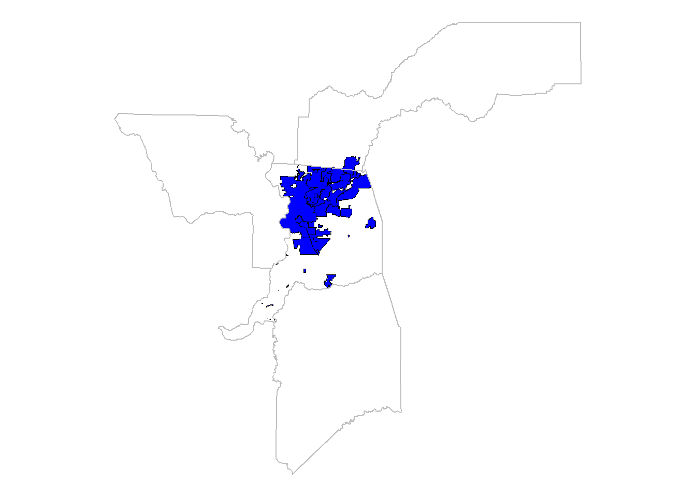
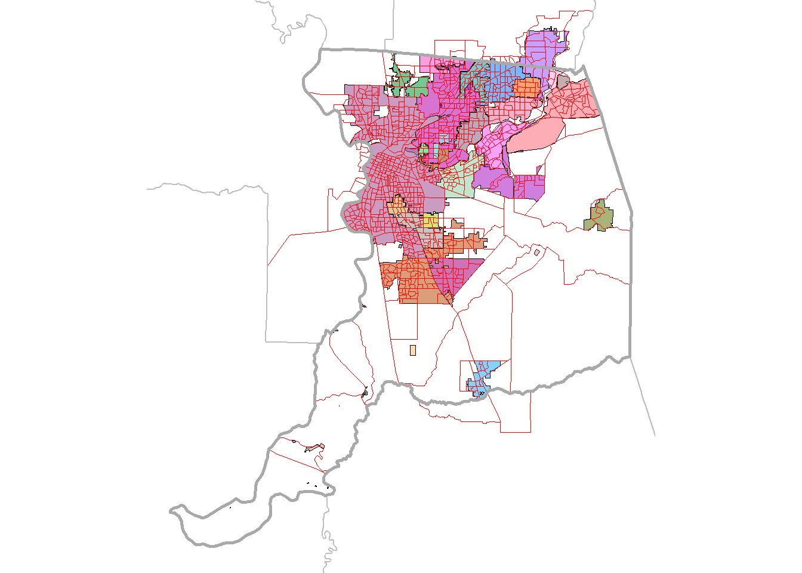
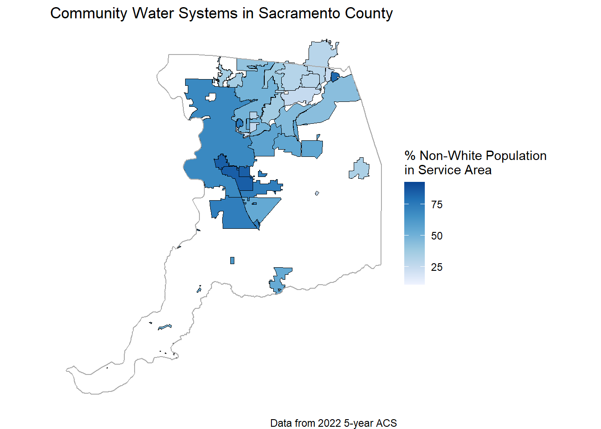
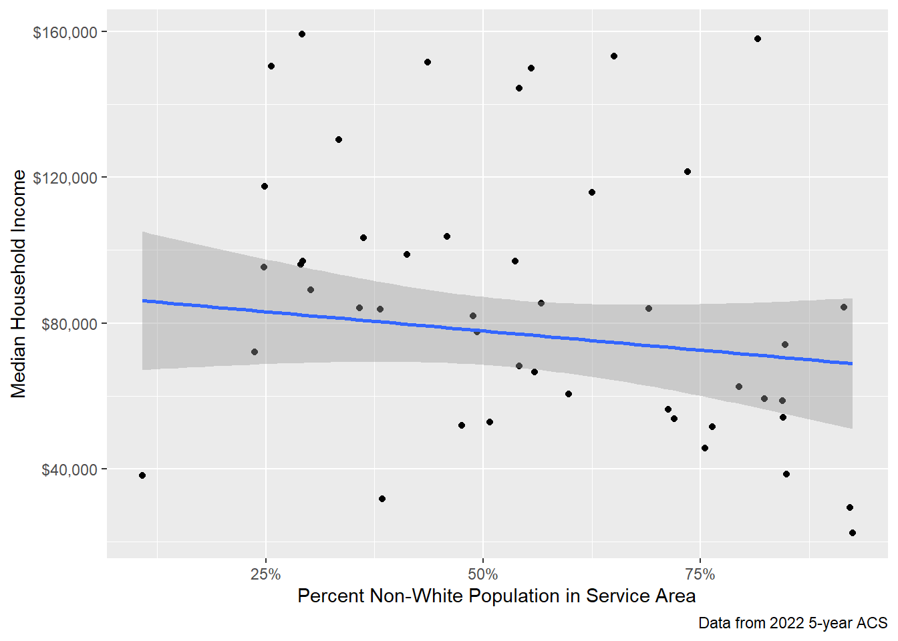

```{=html}
<!-- NOTE: this makes table captions left aligned - needed because centered caption wasn't visible for tables with lots of columns --> 
<style type="text/css">
caption, .table-caption {
text-align: left;
}
</style>
```


## Background {#sec-background}

This document is intended to provide an example of how to use tools available from the [R programming language](https://www.R-project.org/) to estimate characteristics of any given 'target' spatial area(s) (e.g., neighborhoods, project boundaries, water supplier service areas, etc.), based on data from a source dataset containing the characteristic data of interest (e.g., census data, CalEnvrioScreen scores, etc.) whose boundaries overlap but don't necessarily align with the target area(s). It also provides some brief background on the various types of data available from the U.S Census Bureau, and links to a few places to find more in-depth information.

This particular example estimates demographic characteristics of community water systems in the Sacramento County area. It uses the [`tidycensus`](https://walker-data.com/tidycensus/index.html) R package to access selected demographic data from the U.S. Census Bureau for census units whose spatial extent covers those water systems' service areas, then uses the [`areal`](https://chris-prener.github.io/areal/) R package to estimate some demographic characteristics of each water system based on that census data. It also relies on a number of other R packages, such as the [`tidyverse`](https://www.tidyverse.org/) collection of packages for general data management and analysis, and the [`sf`](https://r-spatial.github.io/sf/) package for working with spatial data.

This example is just intended to be a simplified demonstration of a possible workflow. For a real analysis, additional steps and considerations -- that aren't covered here -- may be needed to deal with data inconsistencies (e.g., missing or incomplete data), required level of precision and acceptable assumptions (e.g. more fine-grained datasets or more sophisticated techniques could be used to estimate/model population distributions), or other project-specific issues that might arise.

## Setup {#sec-setup}

The code block below loads required packages for this analysis, and sets some user-defined options and defaults.


::: {.cell}

```{.r .cell-code}
# packages ----
library(tidycensus)
library(tigris)
library(tidyverse)
library(sf)
library(janitor)
library(here)
library(units)
library(areal)
library(Polychrome)
library(knitr)
library(kableExtra)
library(tmap)
library(scales)

# options ----
options(scipen = 999) # turn off scientific notation

# reference system ----
crs_projected <- 3310 # set a common projected coordinate reference system to be used throughout this analysis - see: https://epsg.io/3310
```
:::


## Water System Boundaries (Target Data) {#sec-system-boundaries}

In this section, we'll get the service area boundaries for Community Water Systems within the Sacramento County area. This will serve as the 'target' dataset -- i.e., the set of areas which we'll be estimating the characteristics of. We'll also get a dataset of county boundaries which overlap the water service areas in this study, which will help with accessing the census data and with making maps/visualizations.

### Read Water System Data

In this case, we'll get the water system dataset from a shapefile that's saved locally, then transform that dataset into a common coordinate reference system for mapping and analysis (which is defined above in the variable `crs_projected`).

This water system dataset is a subset of the [California Drinking Water System Area Boundaries dataset](https://gispublic.waterboards.ca.gov/portal/home/item.html?id=fbba842bf134497c9d611ad506ec48cc). I created the subset used here by filtering the full dataset for systems within Sacramento County (by selecting records where the `COUNTY` field is "SACRAMENTO") and filtering for Community Water Systems (by selecting records where the `STATE_CLAS` field is "COMMUNITY"). I also dropped some un-needed fields from the dataset and reordered some columns.


::: {.cell}

```{.r .cell-code}
water_systems_sac <- st_read(here('01_data_input', 
                                  'water_supplier_boundaries_sac', 
                                  'System_Area_Boundary_Layer_Sac.shp')) %>% 
    st_transform(crs_projected) # transform to common coordinate system
```
:::


We can use the `glimpse` function (below) to take get a sense of what type of information is available in the water system dataset and how it's structured.

Note that this dataset already includes a `POPULATION` variable that indicates the population served by each water system. However, for this analysis we'll be making our own estimate of the population within each system's service area based on U.S. Census Bureau data and the spatial representation of the system boundaries. I don't know exactly how the `POPULATION` variable was derived in this dataset, and it likely will not exactly match the population estimates from this analysis, but may serve as a useful check to make sure our estimates are reasonable.


::: {.cell}

```{.r .cell-code}
glimpse(water_systems_sac)
```

::: {.cell-output .cell-output-stdout}
```
Rows: 62
Columns: 12
$ WATER_SY_1 <chr> "HOOD WATER MAINTENCE DIST [SWS]", "MC CLELLAN MHP", "MAGNO…
$ WATER_SYST <chr> "CA3400101", "CA3400179", "CA3400130", "CA3400135", "CA3400…
$ GLOBALID   <chr> "{36268DB3-9DB2-4305-A85A-2C3A85F20F34}", "{E3BF3C3E-D516-4…
$ BOUNDARY_T <chr> "Water Service Area", "Water Service Area", "Water Service …
$ OWNER_TYPE <chr> "L", "P", "P", "P", "P", "P", "P", "P", "P", "P", "P", "P",…
$ COUNTY     <chr> "SACRAMENTO", "SACRAMENTO", "SACRAMENTO", "SACRAMENTO", "SA…
$ REGULATING <chr> "LPA64 - SACRAMENTO COUNTY", "LPA64 - SACRAMENTO COUNTY", "…
$ FEDERAL_CL <chr> "COMMUNITY", "COMMUNITY", "COMMUNITY", "COMMUNITY", "COMMUN…
$ STATE_CLAS <chr> "COMMUNITY", "COMMUNITY", "COMMUNITY", "COMMUNITY", "COMMUN…
$ SERVICE_CO <dbl> 82, 199, 34, 64, 128, 83, 28, 50, 164, 5684, 14798, 115, 33…
$ POPULATION <dbl> 100, 700, 40, 150, 256, 150, 32, 100, 350, 18005, 44928, 20…
$ geometry   <MULTIPOLYGON [m]> MULTIPOLYGON (((-132703 403..., MULTIPOLYGON (…
```
:::
:::


### Get County Boundaries {#sec-county-boundaries}

To determine what data to pull from the U.S. Census Bureau, and to create some maps later, we need to get a dataset of county boundaries. These are available from the [TIGER dataset](https://www.census.gov/geographies/mapping-files/time-series/geo/tiger-line-file.html) and can be accessed using the [`tigris`](https://github.com/walkerke/tigris) R package.


::: {.cell}

```{.r .cell-code}
counties_ca <- counties(state = 'CA', 
                        cb = TRUE) %>% # simplified
    st_transform(crs_projected) # transform to common coordinate system
```
:::


Then, we can get a list of counties that overlap with the boundaries of the Sacramento area community water systems obtained above. This list will be used when getting the census data (below) -- it is needed because there are some systems whose boundaries extend into neighboring counties (or at least have boundaries that intersect the edge of neighboring counties).


::: {.cell}

```{.r .cell-code}
counties_list <- st_filter(counties_ca, 
                           water_systems_sac, 
                           .predicate = st_overlaps) %>% 
    pull(NAME)
```
:::


The counties in the `counties_list` variable are: Yolo, Placer, San Joaquin, Sacramento.

### Plot Water Systems and County Boundaries {#sec-plot-systems}

As a check, @fig-sys-bounds plots the water systems (in blue) and the county boundaries (in grey):


::: {.cell}

```{.r .cell-code}
# make plot
plot_boundaries <- ggplot() +
    geom_sf(data = water_systems_sac, 
            fill = alpha('blue', 1),
            color = 'black', 
            linewidth = 0.1) + 
    geom_sf(data = counties_ca %>% 
                filter(NAME %in% counties_list), 
            fill = NA,
            color = 'grey', 
            linewidth = 0.5) +
    theme_void()

# show plot
plot_boundaries
```

::: {.cell-output-display}
{#fig-sys-bounds width=672}
:::
:::


## Census Data (Source Data) {#sec-census-data}

This section provides some brief background on the various types of data available from the U.S. Census Bureau, and demonstrates how to retrieve data from the U.S. Census Bureau using the [`tidycensus`](https://walker-data.com/tidycensus/index.html) R package. Most of the information covered here comes from the book [Analyzing US Census Data: Methods, Maps, and Models in R](https://walker-data.com/census-r/index.html), which is a great source of information if you'd like more detail about any of the topics below.

### Census Data Overview {#sec-census-overview}

Different census products/surveys contain data on different variables, at different geographic scales, over varying periods of time, and with varying levels of certainty. Therefore, there are a number of judgement calls to make when determining which type of census data to use for an analysis -- e.g., which data product to use (Decennial Census or American Community Survey), which geographic scale to use (e.g., Block, Block Group, Tract, etc.), what time frame to use, which variables to assess, etc.

More detailed information about U.S. Census Bureau's data products and other topics mentioned below is available [here](https://walker-data.com/census-r/the-united-states-census-and-the-r-programming-language.html#the-united-states-census-and-the-r-programming-language).

#### Census Geography / Hierarchy {#sec-census-hierarchy}

Data from the U.S. Census Bureau is aggregated to census units which are available at different geographic scales. Some of these units are nested and can be neatly aggregated (e.g., each census tract is composed of a collection of block groups, and each block group is composed of a collection of blocks), while other census units are outside this hierarchy (e.g., Zip Code Tabulation Areas don't coincide with any other census unit). @fig-census-hierarchies shows the relationship of all of the various census units.

{#fig-census-hierarchies}

For a list of the different geographic units available for each of the different census products/surveys (see @sec-census-datasets) that can be accessed via the `tidycensus` package, go [here](https://walker-data.com/tidycensus/articles/basic-usage.html#geography-in-tidycensus).

#### Census Datasets / Surveys {#sec-census-datasets}

The Decennial Census is conducted every 10 years, and is intended to provide a complete count of the US population and assist with political redistricting. As a result, it collects a relatively limited set of basic demographic data, but (should) provide a high degree of precision (i.e., in general it should provide exact counts). It is available for geographic units down to the census block (the smallest census unit available -- see @sec-census-hierarchy). For information about existing and planned future releases of 2020 census data products, go [here](https://www.census.gov/programs-surveys/decennial-census/decade/2020/planning-management/release/about-2020-data-products.html).

The American Community Survey (ACS) provides a much larger array of demographic information than the Decennial Census, and is updated more frequently. The ACS is based on a sample of the population (rather than a count of the entire population, as in the Decennial Census), so it represents estimated values rather than precise counts, therefore each data point is available as an estimate (typically labeled with an 'E' in census variable codes, which are discussed in @sec-census-variables ) along with an associated margin of error (typically labeled with 'MOE' in census variable codes) around its estimated value.

The ACS is available in two formats. The 5-year ACS is a rolling average of 5 years of data (e.g., the 2021 5-year ACS dataset is an average of the ACS data from 2017 through 2021), and is generally available for geographic units down to the census block group (though some 5-year ACS data may only be available at less granular levels). The 1-year ACS provides data for a single year, and is only available for geographies with population greater than 65,000 (e.g., large cities and counties). Therefore, only the 5-year ACS will be useful for any analysis at a relatively fine scale (e.g., anything that requires data at or more detailed than the census tract level, or any analysis that considers smaller counties/cities -- by definition, census tracts always contain significantly fewer than 65,000 people).

In addition to the Decennial Census and ACS data, a number of other census data products/surveys are also available. For example, see the `censusapi` R package ([here](https://github.com/hrecht/censusapi) or [here](https://www.hrecht.com/censusapi/index.html)) for access to over 300 census API endpoints. For historical census data, see the discussion [here](https://walker-data.com/census-r/other-census-and-government-data-resources.html?q=API%20endpoint#other-census-and-government-data-resources) on using NHGIS, IPUMS, and the `ipumsr` package.

#### Census Variables / Codes {#sec-census-variables}

Each census product collects data for many different demographic variables, and each variable is generally associated with an identifier code. In order to access census data programmatically, you often need to know the code associated with each variable of interest. When determining which variables to use, you need to consider what census product contains those variables (see @sec-census-datasets) and how they differ in terms of time frame, precision, spatial granularity (see @sec-census-hierarchy), etc.

The `tidycensus` package offers a convenient generic way to search for variables across different census products using the `load_variables()` function, as described [here](https://walker-data.com/tidycensus/articles/basic-usage.html#searching-for-variables).

The following websites may also be helpful for exploring the various census data products and finding the variable names and codes they contain:

-   Census Reporter (for ACS data): <https://censusreporter.org/> (especially <https://censusreporter.org/topics/table-codes/>)

-   Census Bureau's list of variable codes, e.g.:

    -   2020 Census codes: <https://api.census.gov/data/2020/dec/pl/variables.html>

    -   2021 ACS 5 year codes: <https://api.census.gov/data/2021/acs/acs5/variables.html>

-   Census Bureau's data interface (for Decennial Census and ACS, and other census datasets): <https://data.census.gov/cedsci/>

-   National Historical Geographic Information System (NHGIS) (for ACS data and historical decennial Census data): <https://www.nhgis.org/>

### Accessing Census Data {#sec-accessing-census}

The following sections demonstrate how to retrieve census data from the Decennial Census and the ACS using the [`tidycensus`](https://walker-data.com/tidycensus/index.html) R package.

In order to use the `tidycensus` R package, you'll need to obtain a personal API from the US Census Bureau (which is free and available to anyone) by signing up here: <http://api.census.gov/data/key_signup.html>. Once you have your API key, you'll need to register it in R by entering the command `census_api_key(key = "YOUR API KEY", install = TRUE)` in the console. Note that the `install = TRUE` argument means that the key is saved for all future R sessions, so you'll only need to run that command once on your computer (rather than including it in your scripts). Alternatively, you could save your key to an environment variable and retrieve it using `Sys.getenv()` (to avoid entering your key into any scripts that could potentially be shared).

#### Decennial Census {#sec-accessing-decennial}

This section retrieves census data from the 2020 U.S. Decennial Census, using the `get_decennial` function from the `tidycensus` package. For this example we're getting data at the 'Block Group' level (with the `geography = 'block group'` argument), for the counties defined above in the `counties_list` variable (with the `county = counties_list` argument). By setting the `geometry = TRUE` argument we'll be able to get the spatial data -- i.e., the boundaries of the census block groups -- along with the tabular data defined in the `variables` argument (see @sec-census-variables for information about how to find variable codes). Also, while by default the `tidycensus` package returns data in long/tidy format, we're getting the data in wide format for this example (by specifying `output = 'wide'`) because it'll be easier to work with for the method described below to estimate demographics for non-census geographies.

Note that, to the extent possible, using census data at the most granular spatial level should provide the best results when estimating demographics for areas whose boundaries don't align with census unit boundaries. However, depending on the use case, it may require too much time and computational resources to use the most granular spatial data, and may not be necessary to obtain a reasonable estimate. As noted above, in general the most granular level of Decennial Census data available is at the 'Block' level (though Decennial Census data may not be available for all data types at the block level, due to data privacy issues), but this example gets data at the 'Block Group' level for speed and simplicity. Data at the 'Block' level may be a better choice for a real-world analysis if possible.

Also, as a side note, `tidycensus` returns the Census Bureau's [cartographic boundary shapefiles](https://www.census.gov/geo/maps-data/data/tiger-cart-boundary.html) by default (as opposed to the [core TIGER/Line shapefiles](https://www.census.gov/geo/maps-data/data/tiger-line.html)). Those default cartographic boundary shapefiles are pre-clipped to the US coastline, and are smaller/faster to process (alternatively you can use `cb = FALSE` to get the TIGER/Line data) (see [here](https://walker-data.com/census-r/spatial-analysis-with-us-census-data.html#better-cartography-with-spatial-overlay)). So the default spatial data returned by `tidycensus` may be somewhat different than the default spatial data returned by the `tigris` package, but in general I find it's best to use the default `tidycensus` spatial data.


::: {.cell}

```{.r .cell-code}
# get census data
census_data_decennial <- get_decennial(geography = 'block group', # can be 'block', 'block group', 'tract', 'county', etc.
                                       state = 'CA', 
                                       county = counties_list,
                                       year = 2020,
                                       variables = c(
                                           'pop_hispanic_or_latino' = 'P2_002N', # Total Hispanic or Latino
                                           'pop_white' = 'P2_005N', # White (Not Hispanic or Latino)
                                           'pop_black_or_african_american' = 'P2_006N', # Black or African American (Not Hispanic or Latino)
                                           'pop_native_american_or_alaska_native' = 'P2_007N', # American Indian and Alaska Native (Not Hispanic or Latino)
                                           'pop_asian' = 'P2_008N', # Asian (Not Hispanic or Latino)
                                           'pop_pacific_islander' = 'P2_009N', # Native Hawaiian and Other Pacific Islander (Not Hispanic or Latino)
                                           'pop_other' = 'P2_010N', # Some other race (Not Hispanic or Latino)
                                           'pop_multiple' = 'P2_011N', # Two or more races (Not Hispanic or Latino)
                                           'pop_total' = 'P2_001N'
                                       ),
                                       output = 'wide', # can be 'wide' or 'tidy'
                                       geometry = TRUE) 
```
:::


The output is an sf object (i.e., a dataframe-like object that also includes spatial data), in wide format, where each row represents a census unit, and the population of each racial/ethnic group is reported in a separate column. Here's a view of the contents and structure of the Decennial Census data that's returned:


::: {.cell}

```{.r .cell-code}
glimpse(census_data_decennial)
```

::: {.cell-output .cell-output-stdout}
```
Rows: 1,915
Columns: 12
$ GEOID                                <chr> "060770010004", "060770031061", "…
$ NAME                                 <chr> "Block Group 4, Census Tract 10, …
$ pop_hispanic_or_latino               <dbl> 292, 588, 603, 851, 158, 152, 263…
$ pop_white                            <dbl> 466, 603, 212, 1178, 801, 935, 18…
$ pop_black_or_african_american        <dbl> 19, 155, 26, 137, 7, 11, 50, 178,…
$ pop_native_american_or_alaska_native <dbl> 2, 3, 5, 17, 1, 4, 16, 9, 45, 4, …
$ pop_asian                            <dbl> 48, 150, 83, 426, 40, 75, 90, 302…
$ pop_pacific_islander                 <dbl> 1, 6, 1, 7, 0, 5, 4, 41, 2, 6, 3,…
$ pop_other                            <dbl> 7, 6, 0, 27, 1, 8, 7, 25, 4, 14, …
$ pop_multiple                         <dbl> 50, 108, 20, 215, 81, 103, 128, 2…
$ pop_total                            <dbl> 885, 1619, 950, 2858, 1089, 1293,…
$ geometry                             <MULTIPOLYGON [°]> MULTIPOLYGON (((-121…
```
:::
:::


#### American Community Survey (ACS) {#sec-accessing-acs}

To get data from the ACS, you can use the `get_acs()` function, which is very similar to the `get_decennial()` function used above.

Note that for this dataset we've also included a statement to get median household income data (with the `'med_hh_income' = 'B19013_001E'` statement in the `variables` part of the function).


::: {.cell}

```{.r .cell-code}
# set year
acs_year <- 2021

# get census data
census_data_acs <- get_acs(geography = 'block group', 
                           state = 'CA', 
                           county = counties_list,
                           year = acs_year,
                           variables = c('pop_total' = 'B01003_001E',
                                         'pop_hispanic_or_latino' = 'B03002_012E', # Total Hispanic or Latino
                                         'pop_white' = 'B03002_003E', # White (Not Hispanic or Latino)
                                         'pop_black_or_african_american' = 'B03002_004E', # Black or African American (Not Hispanic or Latino)
                                         'pop_native_american_or_alaska_native' = 'B03002_005E', # American Indian and Alaska Native (Not Hispanic or Latino)
                                         'pop_asian' = 'B03002_006E', # Asian (Not Hispanic or Latino)
                                         'pop_pacific_islander' = 'B03002_007E', # Native Hawaiian and Other Pacific Islander (Not Hispanic or Latino)
                                         'pop_other' = 'B03002_008E', # Some other race (Not Hispanic or Latino)
                                         'pop_multiple' = 'B03002_009E', # Two or more races (Not Hispanic or Latino)
                                         'med_hh_income' = 'B19013_001E'
                           ), 
                           output = 'wide', # can be 'wide' or 'tidy'
                           geometry = TRUE)

# for this example, drop columns corresponding to Margin of Error since it's not needed
## these end with two digits and an M, like "001M"
census_data_acs <- census_data_acs %>% 
    select(-matches('\\d\\dM$'))
```
:::


The output is an sf object (i.e., a dataframe-like object that also includes spatial data), in wide format, where each row represents a census unit, and the population of each racial/ethnic group, as well as the median household income, is reported in a separate column. Here's a view of the contents and structure of the 2021 5-year ACS data that's returned:


::: {.cell}

```{.r .cell-code}
glimpse(census_data_acs)
```

::: {.cell-output .cell-output-stdout}
```
Rows: 1,915
Columns: 13
$ GEOID                                <chr> "060670031013", "060670050042", "…
$ NAME                                 <chr> "Block Group 3, Census Tract 31.0…
$ pop_total                            <dbl> 966, 1569, 776, 1371, 829, 2804, …
$ pop_hispanic_or_latino               <dbl> 566, 150, 523, 269, 79, 348, 764,…
$ pop_white                            <dbl> 285, 93, 30, 452, 406, 1275, 826,…
$ pop_black_or_african_american        <dbl> 0, 131, 79, 150, 23, 199, 214, 0,…
$ pop_native_american_or_alaska_native <dbl> 0, 0, 0, 0, 0, 0, 9, 0, 0, 20, 0,…
$ pop_asian                            <dbl> 69, 880, 135, 447, 288, 917, 98, …
$ pop_pacific_islander                 <dbl> 20, 283, 0, 9, 0, 9, 0, 0, 236, 0…
$ pop_other                            <dbl> 0, 0, 0, 0, 0, 0, 0, 0, 0, 0, 0, …
$ pop_multiple                         <dbl> 26, 32, 9, 44, 33, 56, 78, 0, 47,…
$ med_hh_income                        <dbl> 59375, 90915, 16308, 89010, 74956…
$ geometry                             <MULTIPOLYGON [°]> MULTIPOLYGON (((-121…
```
:::
:::


#### Plot Results {#sec-census-plot}

@fig-suppliers-census-map shows the datasets that we'll use below to compute water system demographics (zoomed in to the area around the water systems in this study). Each water system -- the target dataset -- is shown with a different (randomly chosen) color. The boundaries of the census data -- the source dataset -- are shown in red; in this case we'll use the 2021 5-year ACS dataset. County boundaries are shown in grey (Sacramento county is show with a bold grey line).


::: {.cell}

```{.r .cell-code}
# get the map boundaries, using the boundaries of the water suppliers and the 
# Sacramento county boundary
bounds_map <- counties_ca %>% 
    filter(NAME == 'Sacramento') %>% 
    st_union(water_systems_sac) %>% 
    st_buffer(100) %>% 
    st_bbox()

# make a color palette with a distinct (random) color for supplier 
set.seed(12345)
pal <- createPalette(nrow(water_systems_sac),
                     c("#FF0000", "#00FF00", "#0000FF"),
                     range = c(30, 80))

# make the plot
plot_census <- ggplot() +
    geom_sf(data = water_systems_sac,
            aes(fill = WATER_SYST, alpha = 0.8),
            # fill = alpha('blue', 0.8),
            color = 'black', 
            linewidth = 0.1,
            show.legend = FALSE) +
    scale_fill_manual(values = unname(pal)) +
    geom_sf(data = census_data_acs %>% 
                st_transform(crs_projected),
            fill = NA,
            color = alpha('red', 1),
            linewidth = 0.1) +
    geom_sf(data = counties_ca %>%
                filter(NAME %in% counties_list),
            fill = NA,
            color = 'grey',
            linewidth = 0.5) +
    geom_sf(data = counties_ca %>%
                filter(NAME == 'Sacramento'),
            fill = NA,
            color = 'darkgrey',
            linewidth = 1) + # bold line for Sacramento County
    coord_sf(xlim = c(bounds_map$xmin, bounds_map$xmax), 
             ylim = c(bounds_map$ymin, bounds_map$ymax)) +
    theme_void()

# show the plot
plot_census
```

::: {.cell-output-display}
{#fig-suppliers-census-map width=672}
:::
:::


## Compute Water System Demographics {#sec-estimate-demographics}

Now we can perform the calculations to estimate demographic characteristics for our target areas (water system service boundaries in the Sacramento County area) from our source demographic dataset (the census data we obtained above). For this example, we'll use the 2021 5-year ACS data that we retrieved above (which is saved in the `census_data_acs` variable) as our source of demographic data, and we'll estimate the following for each water system's service area:

-   Population of each racial/ethnic group (using the racial/ethnic categories defined in the census dataset), and each racial/ethnic group's portion of the total service area population
-   Median household income

There are multiple ways this estimation can be done, but one of the most simple and straightforward is using an areal interpolation (essentially an area weighted average). The major simplifying assumption of this approach is that the population or other characteristic(s) of interest are evenly distributed within each unit in the source data -- e.g., in this case we're assuming that population (including the total population and the population of each racial/ethic group) and household income is evenly distributed within each census block group.

### Prepare Census Data

To calculate demographics for the target areas, we need to prepare the census data. First, we need to transform the 2021 5-year ACS dataset into the common projected coordinate reference system defined above.


::: {.cell}

```{.r .cell-code}
# transform to common coordinate reference system
census_data_acs <- census_data_acs %>% 
    st_transform(crs_projected)
```
:::


We can then apply some transformations to the 2021 5-year ACS dataset prior to performing the areal interpolation to simplify the results and speed the computation.

This isn't strictly necessary, but we can simplify the census dataset by filtering for census units that overlap with one of the water systems in our dataset.


::: {.cell}

```{.r .cell-code}
census_data_filter <- census_data_acs %>% 
    st_filter(water_systems_sac, 
              .predicate = st_intersects)
```
:::


We can also drop census units with zero population, since they won't contribute anything to our calculations.


::: {.cell}

```{.r .cell-code}
## drop census units with zero population
census_data_filter <- census_data_filter %>% 
    filter(pop_total > 0)
```
:::


You may also want to transform the census data in other ways. For example, we can combine the 'other' and 'multiple' racial/ethnic groupings into one 'other or multiple' racial/ethnic group.


::: {.cell}

```{.r .cell-code}
## combine other and multiple
census_data_filter <- census_data_filter %>% 
    mutate('pop_other_or_multiple' = pop_other + pop_multiple, 
           .before = med_hh_income) %>% 
    select(-c(pop_other, pop_multiple))
```
:::


Here's a view of the contents and structure of the transformed census dataset:


::: {.cell}

```{.r .cell-code}
glimpse(census_data_filter)
```

::: {.cell-output .cell-output-stdout}
```
Rows: 1,048
Columns: 12
$ GEOID                                <chr> "060670031013", "060670050042", "…
$ NAME                                 <chr> "Block Group 3, Census Tract 31.0…
$ pop_total                            <dbl> 966, 1569, 1989, 2865, 1398, 1641…
$ pop_hispanic_or_latino               <dbl> 566, 150, 764, 893, 96, 356, 280,…
$ pop_white                            <dbl> 285, 93, 826, 333, 1031, 986, 118…
$ pop_black_or_african_american        <dbl> 0, 131, 214, 328, 76, 48, 123, 24…
$ pop_native_american_or_alaska_native <dbl> 0, 0, 9, 0, 20, 0, 19, 9, 0, 0, 0…
$ pop_asian                            <dbl> 69, 880, 98, 1028, 32, 180, 34, 2…
$ pop_pacific_islander                 <dbl> 20, 283, 0, 236, 0, 0, 0, 0, 0, 0…
$ pop_other_or_multiple                <dbl> 26, 32, 78, 47, 143, 71, 84, 27, …
$ med_hh_income                        <dbl> 59375, 90915, 33952, 56023, 61806…
$ geometry                             <MULTIPOLYGON [m]> MULTIPOLYGON (((-123…
```
:::
:::


### Areal Interpolation {#sec-areal-interp}

There are a couple of ways to implement the areal interpolation method. The example below uses the [`aw_interpolate`](https://chris-prener.github.io/areal/reference/aw_interpolate.html) function from the [`areal`](https://chris-prener.github.io/areal/) R package. The `sf` package's `st_interpolate_aw` function provides similar functionality. It's also possible to 'manually' implement the process using lower level functions from the `sf` package, which can be useful for even more control, but is more complicated to implement (see @sec-manual-calcs below for examples of 'manual' calculations that demonstrate how the interpolation function works and provide a check on the results).

Note that there are some settings that you may need to modify in the `aw_interpolate` function depending on the type of analysis you're doing. In particular, for more information about extensive versus intensive interpolations, see [this section of the documenation](https://chris-prener.github.io/areal/articles/areal-weighted-interpolation.html#extensive-and-intensive-interpolations). For more information about the `weight` argument -- which can be either `sum` or `total` -- see [this section of the documentation](https://chris-prener.github.io/areal/articles/areal-weighted-interpolation.html#calculating-weights-for-extensive-interpolations).


::: {.cell}

```{.r .cell-code}
water_systems_sac_demographics <- water_systems_sac %>% 
    aw_interpolate(tid = WATER_SY_1, 
                   source = census_data_filter, 
                   sid = GEOID, 
                   weight = 'total',
                   output = 'sf', 
                   extensive = c('pop_total', 
                                 'pop_hispanic_or_latino',
                                 'pop_white', 
                                 'pop_black_or_african_american',
                                 'pop_native_american_or_alaska_native', 
                                 'pop_asian', 
                                 'pop_pacific_islander',
                                 'pop_other_or_multiple'), 
                   intensive = c('med_hh_income')
    )
```
:::


We've now got a dataset with the selected census data (population of each racial/ethnic group and median household income) estimated for each of the target geographic features (water system service areas). Here's a view of the contents and structure of the dataset:


::: {.cell}

```{.r .cell-code}
glimpse(water_systems_sac_demographics)
```

::: {.cell-output .cell-output-stdout}
```
Rows: 62
Columns: 21
$ WATER_SY_1                           <chr> "HOOD WATER MAINTENCE DIST [SWS]"…
$ WATER_SYST                           <chr> "CA3400101", "CA3400179", "CA3400…
$ GLOBALID                             <chr> "{36268DB3-9DB2-4305-A85A-2C3A85F…
$ BOUNDARY_T                           <chr> "Water Service Area", "Water Serv…
$ OWNER_TYPE                           <chr> "L", "P", "P", "P", "P", "P", "P"…
$ COUNTY                               <chr> "SACRAMENTO", "SACRAMENTO", "SACR…
$ REGULATING                           <chr> "LPA64 - SACRAMENTO COUNTY", "LPA…
$ FEDERAL_CL                           <chr> "COMMUNITY", "COMMUNITY", "COMMUN…
$ STATE_CLAS                           <chr> "COMMUNITY", "COMMUNITY", "COMMUN…
$ SERVICE_CO                           <dbl> 82, 199, 34, 64, 128, 83, 28, 50,…
$ POPULATION                           <dbl> 100, 700, 40, 150, 256, 150, 32, …
$ pop_asian                            <dbl> 0.000000000, 69.954221829, 0.0519…
$ pop_black_or_african_american        <dbl> 0.000000000, 33.219002165, 0.0000…
$ pop_hispanic_or_latino               <dbl> 0.565201379, 32.478745849, 0.6368…
$ pop_native_american_or_alaska_native <dbl> 0.0000000, 0.0000000, 0.0000000, …
$ pop_other_or_multiple                <dbl> 0.016899709, 17.118427299, 0.0370…
$ pop_pacific_islander                 <dbl> 0.0000000, 0.0000000, 0.0000000, …
$ pop_total                            <dbl> 0.95013919, 310.44499237, 1.32067…
$ pop_white                            <dbl> 0.36803811, 157.67459523, 0.59484…
$ med_hh_income                        <dbl> 51250.00, 37833.00, 63076.00, 281…
$ geometry                             <MULTIPOLYGON [m]> MULTIPOLYGON (((-132…
```
:::
:::


@tbl-water-sys-demographics provides a complete view of the dataset:


::: {#tbl-water-sys-demographics .cell .tbl-cap-location-top tbl-cap='Water System Demographics'}

```{.r .cell-code}
water_systems_sac_demographics %>%
    kable(caption = 'A Caption') %>% 
    scroll_box(height = "400px")
```

::: {.cell-output-display}

`````{=html}
<div style="border: 1px solid #ddd; padding: 0px; overflow-y: scroll; height:400px; "><table>
<caption>A Caption</caption>
 <thead>
  <tr>
   <th style="text-align:left;position: sticky; top:0; background-color: #FFFFFF;"> WATER_SY_1 </th>
   <th style="text-align:left;position: sticky; top:0; background-color: #FFFFFF;"> WATER_SYST </th>
   <th style="text-align:left;position: sticky; top:0; background-color: #FFFFFF;"> GLOBALID </th>
   <th style="text-align:left;position: sticky; top:0; background-color: #FFFFFF;"> BOUNDARY_T </th>
   <th style="text-align:left;position: sticky; top:0; background-color: #FFFFFF;"> OWNER_TYPE </th>
   <th style="text-align:left;position: sticky; top:0; background-color: #FFFFFF;"> COUNTY </th>
   <th style="text-align:left;position: sticky; top:0; background-color: #FFFFFF;"> REGULATING </th>
   <th style="text-align:left;position: sticky; top:0; background-color: #FFFFFF;"> FEDERAL_CL </th>
   <th style="text-align:left;position: sticky; top:0; background-color: #FFFFFF;"> STATE_CLAS </th>
   <th style="text-align:right;position: sticky; top:0; background-color: #FFFFFF;"> SERVICE_CO </th>
   <th style="text-align:right;position: sticky; top:0; background-color: #FFFFFF;"> POPULATION </th>
   <th style="text-align:right;position: sticky; top:0; background-color: #FFFFFF;"> pop_asian </th>
   <th style="text-align:right;position: sticky; top:0; background-color: #FFFFFF;"> pop_black_or_african_american </th>
   <th style="text-align:right;position: sticky; top:0; background-color: #FFFFFF;"> pop_hispanic_or_latino </th>
   <th style="text-align:right;position: sticky; top:0; background-color: #FFFFFF;"> pop_native_american_or_alaska_native </th>
   <th style="text-align:right;position: sticky; top:0; background-color: #FFFFFF;"> pop_other_or_multiple </th>
   <th style="text-align:right;position: sticky; top:0; background-color: #FFFFFF;"> pop_pacific_islander </th>
   <th style="text-align:right;position: sticky; top:0; background-color: #FFFFFF;"> pop_total </th>
   <th style="text-align:right;position: sticky; top:0; background-color: #FFFFFF;"> pop_white </th>
   <th style="text-align:right;position: sticky; top:0; background-color: #FFFFFF;"> med_hh_income </th>
   <th style="text-align:left;position: sticky; top:0; background-color: #FFFFFF;"> geometry </th>
  </tr>
 </thead>
<tbody>
  <tr>
   <td style="text-align:left;"> HOOD WATER MAINTENCE DIST [SWS] </td>
   <td style="text-align:left;"> CA3400101 </td>
   <td style="text-align:left;"> {36268DB3-9DB2-4305-A85A-2C3A85F20F34} </td>
   <td style="text-align:left;"> Water Service Area </td>
   <td style="text-align:left;"> L </td>
   <td style="text-align:left;"> SACRAMENTO </td>
   <td style="text-align:left;"> LPA64 - SACRAMENTO COUNTY </td>
   <td style="text-align:left;"> COMMUNITY </td>
   <td style="text-align:left;"> COMMUNITY </td>
   <td style="text-align:right;"> 82 </td>
   <td style="text-align:right;"> 100 </td>
   <td style="text-align:right;"> 0.0000000 </td>
   <td style="text-align:right;"> 0.0000000 </td>
   <td style="text-align:right;"> 0.5652014 </td>
   <td style="text-align:right;"> 0.0000000 </td>
   <td style="text-align:right;"> 0.0168997 </td>
   <td style="text-align:right;"> 0.0000000 </td>
   <td style="text-align:right;"> 0.9501392 </td>
   <td style="text-align:right;"> 0.3680381 </td>
   <td style="text-align:right;"> 51250.00 </td>
   <td style="text-align:left;"> MULTIPOLYGON (((-132703 403... </td>
  </tr>
  <tr>
   <td style="text-align:left;"> MC CLELLAN MHP </td>
   <td style="text-align:left;"> CA3400179 </td>
   <td style="text-align:left;"> {E3BF3C3E-D516-45B2-A5AD-6900F8D16715} </td>
   <td style="text-align:left;"> Water Service Area </td>
   <td style="text-align:left;"> P </td>
   <td style="text-align:left;"> SACRAMENTO </td>
   <td style="text-align:left;"> LPA64 - SACRAMENTO COUNTY </td>
   <td style="text-align:left;"> COMMUNITY </td>
   <td style="text-align:left;"> COMMUNITY </td>
   <td style="text-align:right;"> 199 </td>
   <td style="text-align:right;"> 700 </td>
   <td style="text-align:right;"> 69.9542218 </td>
   <td style="text-align:right;"> 33.2190022 </td>
   <td style="text-align:right;"> 32.4787458 </td>
   <td style="text-align:right;"> 0.0000000 </td>
   <td style="text-align:right;"> 17.1184273 </td>
   <td style="text-align:right;"> 0.0000000 </td>
   <td style="text-align:right;"> 310.4449924 </td>
   <td style="text-align:right;"> 157.6745952 </td>
   <td style="text-align:right;"> 37833.00 </td>
   <td style="text-align:left;"> MULTIPOLYGON (((-119809.2 7... </td>
  </tr>
  <tr>
   <td style="text-align:left;"> MAGNOLIA MUTUAL WATER </td>
   <td style="text-align:left;"> CA3400130 </td>
   <td style="text-align:left;"> {BADB48CD-AF05-4135-8FD5-9990BE415405} </td>
   <td style="text-align:left;"> Water Service Area </td>
   <td style="text-align:left;"> P </td>
   <td style="text-align:left;"> SACRAMENTO </td>
   <td style="text-align:left;"> LPA64 - SACRAMENTO COUNTY </td>
   <td style="text-align:left;"> COMMUNITY </td>
   <td style="text-align:left;"> COMMUNITY </td>
   <td style="text-align:right;"> 34 </td>
   <td style="text-align:right;"> 40 </td>
   <td style="text-align:right;"> 0.0519044 </td>
   <td style="text-align:right;"> 0.0000000 </td>
   <td style="text-align:right;"> 0.6368586 </td>
   <td style="text-align:right;"> 0.0000000 </td>
   <td style="text-align:right;"> 0.0370746 </td>
   <td style="text-align:right;"> 0.0000000 </td>
   <td style="text-align:right;"> 1.3206784 </td>
   <td style="text-align:right;"> 0.5948408 </td>
   <td style="text-align:right;"> 63076.00 </td>
   <td style="text-align:left;"> MULTIPOLYGON (((-137015.5 3... </td>
  </tr>
  <tr>
   <td style="text-align:left;"> KORTHS PIRATES LAIR </td>
   <td style="text-align:left;"> CA3400135 </td>
   <td style="text-align:left;"> {7A556C0E-57E2-499A-9B87-B5707C837DA8} </td>
   <td style="text-align:left;"> Water Service Area </td>
   <td style="text-align:left;"> P </td>
   <td style="text-align:left;"> SACRAMENTO </td>
   <td style="text-align:left;"> LPA64 - SACRAMENTO COUNTY </td>
   <td style="text-align:left;"> COMMUNITY </td>
   <td style="text-align:left;"> COMMUNITY </td>
   <td style="text-align:right;"> 64 </td>
   <td style="text-align:right;"> 150 </td>
   <td style="text-align:right;"> 0.0000000 </td>
   <td style="text-align:right;"> 0.0021296 </td>
   <td style="text-align:right;"> 0.0040226 </td>
   <td style="text-align:right;"> 0.0000000 </td>
   <td style="text-align:right;"> 0.0020113 </td>
   <td style="text-align:right;"> 0.0000000 </td>
   <td style="text-align:right;"> 0.0774941 </td>
   <td style="text-align:right;"> 0.0693306 </td>
   <td style="text-align:right;"> 28182.00 </td>
   <td style="text-align:left;"> MULTIPOLYGON (((-137297.1 1... </td>
  </tr>
  <tr>
   <td style="text-align:left;"> EL DORADO MOBILE HOME PARK </td>
   <td style="text-align:left;"> CA3400121 </td>
   <td style="text-align:left;"> {23B9391F-B6E7-44CE-A0EA-C2EE522857BF} </td>
   <td style="text-align:left;"> Water Service Area </td>
   <td style="text-align:left;"> P </td>
   <td style="text-align:left;"> SACRAMENTO </td>
   <td style="text-align:left;"> LPA64 - SACRAMENTO COUNTY </td>
   <td style="text-align:left;"> COMMUNITY </td>
   <td style="text-align:left;"> COMMUNITY </td>
   <td style="text-align:right;"> 128 </td>
   <td style="text-align:right;"> 256 </td>
   <td style="text-align:right;"> 14.4974901 </td>
   <td style="text-align:right;"> 28.1712591 </td>
   <td style="text-align:right;"> 84.8981806 </td>
   <td style="text-align:right;"> 0.0000000 </td>
   <td style="text-align:right;"> 4.9423262 </td>
   <td style="text-align:right;"> 0.0000000 </td>
   <td style="text-align:right;"> 144.5904977 </td>
   <td style="text-align:right;"> 12.0812417 </td>
   <td style="text-align:right;"> 34669.00 </td>
   <td style="text-align:left;"> MULTIPOLYGON (((-124533.7 5... </td>
  </tr>
  <tr>
   <td style="text-align:left;"> RIVER'S EDGE MARINA &amp; RESORT </td>
   <td style="text-align:left;"> CA3400107 </td>
   <td style="text-align:left;"> {F56E068C-AE1B-4C68-A2AF-F5058871E4E2} </td>
   <td style="text-align:left;"> Water Service Area </td>
   <td style="text-align:left;"> P </td>
   <td style="text-align:left;"> SACRAMENTO </td>
   <td style="text-align:left;"> LPA64 - SACRAMENTO COUNTY </td>
   <td style="text-align:left;"> COMMUNITY </td>
   <td style="text-align:left;"> COMMUNITY </td>
   <td style="text-align:right;"> 83 </td>
   <td style="text-align:right;"> 150 </td>
   <td style="text-align:right;"> 0.0000000 </td>
   <td style="text-align:right;"> 0.0034012 </td>
   <td style="text-align:right;"> 0.0064244 </td>
   <td style="text-align:right;"> 0.0000000 </td>
   <td style="text-align:right;"> 0.0032122 </td>
   <td style="text-align:right;"> 0.0000000 </td>
   <td style="text-align:right;"> 0.1237642 </td>
   <td style="text-align:right;"> 0.1107264 </td>
   <td style="text-align:right;"> 28182.00 </td>
   <td style="text-align:left;"> MULTIPOLYGON (((-141320.7 1... </td>
  </tr>
  <tr>
   <td style="text-align:left;"> LAGUNA VILLAGE RV PARK </td>
   <td style="text-align:left;"> CA3400397 </td>
   <td style="text-align:left;"> {5184D6CC-8084-494D-BD81-B0009F76F1FD} </td>
   <td style="text-align:left;"> Water Service Area </td>
   <td style="text-align:left;"> P </td>
   <td style="text-align:left;"> SACRAMENTO </td>
   <td style="text-align:left;"> LPA64 - SACRAMENTO COUNTY </td>
   <td style="text-align:left;"> COMMUNITY </td>
   <td style="text-align:left;"> COMMUNITY </td>
   <td style="text-align:right;"> 28 </td>
   <td style="text-align:right;"> 32 </td>
   <td style="text-align:right;"> 10.2242604 </td>
   <td style="text-align:right;"> 2.1599596 </td>
   <td style="text-align:right;"> 2.4781982 </td>
   <td style="text-align:right;"> 0.0000000 </td>
   <td style="text-align:right;"> 2.2073569 </td>
   <td style="text-align:right;"> 2.3495486 </td>
   <td style="text-align:right;"> 20.7667593 </td>
   <td style="text-align:right;"> 1.3474356 </td>
   <td style="text-align:right;"> 75625.00 </td>
   <td style="text-align:left;"> MULTIPOLYGON (((-122362.2 4... </td>
  </tr>
  <tr>
   <td style="text-align:left;"> SPINDRIFT MARINA </td>
   <td style="text-align:left;"> CA3400169 </td>
   <td style="text-align:left;"> {3B1EC48B-B696-452E-A769-99EF03DE955E} </td>
   <td style="text-align:left;"> Water Service Area </td>
   <td style="text-align:left;"> P </td>
   <td style="text-align:left;"> SACRAMENTO </td>
   <td style="text-align:left;"> LPA64 - SACRAMENTO COUNTY </td>
   <td style="text-align:left;"> COMMUNITY </td>
   <td style="text-align:left;"> COMMUNITY </td>
   <td style="text-align:right;"> 50 </td>
   <td style="text-align:right;"> 100 </td>
   <td style="text-align:right;"> 0.0000000 </td>
   <td style="text-align:right;"> 0.0041508 </td>
   <td style="text-align:right;"> 0.0078405 </td>
   <td style="text-align:right;"> 0.0000000 </td>
   <td style="text-align:right;"> 0.0039202 </td>
   <td style="text-align:right;"> 0.0000000 </td>
   <td style="text-align:right;"> 0.1510446 </td>
   <td style="text-align:right;"> 0.1351330 </td>
   <td style="text-align:right;"> 28182.00 </td>
   <td style="text-align:left;"> MULTIPOLYGON (((-140144.2 1... </td>
  </tr>
  <tr>
   <td style="text-align:left;"> SAC CITY MOBILE HOME COMMUNITY LP </td>
   <td style="text-align:left;"> CA3400296 </td>
   <td style="text-align:left;"> {BBEBB4AF-57F6-4CBA-9746-6EDDFF0BB86B} </td>
   <td style="text-align:left;"> Water Service Area </td>
   <td style="text-align:left;"> P </td>
   <td style="text-align:left;"> SACRAMENTO </td>
   <td style="text-align:left;"> LPA64 - SACRAMENTO COUNTY </td>
   <td style="text-align:left;"> COMMUNITY </td>
   <td style="text-align:left;"> COMMUNITY </td>
   <td style="text-align:right;"> 164 </td>
   <td style="text-align:right;"> 350 </td>
   <td style="text-align:right;"> 145.8308169 </td>
   <td style="text-align:right;"> 11.2439649 </td>
   <td style="text-align:right;"> 94.7218858 </td>
   <td style="text-align:right;"> 0.0000000 </td>
   <td style="text-align:right;"> 0.0000000 </td>
   <td style="text-align:right;"> 0.0000000 </td>
   <td style="text-align:right;"> 271.5587876 </td>
   <td style="text-align:right;"> 19.7621201 </td>
   <td style="text-align:right;"> 24757.00 </td>
   <td style="text-align:left;"> MULTIPOLYGON (((-124542.8 5... </td>
  </tr>
  <tr>
   <td style="text-align:left;"> ORANGE VALE WATER COMPANY </td>
   <td style="text-align:left;"> CA3410016 </td>
   <td style="text-align:left;"> {E7FB0496-8E98-4C1C-B073-40B7F2308EE3} </td>
   <td style="text-align:left;"> Water Service Area </td>
   <td style="text-align:left;"> P </td>
   <td style="text-align:left;"> SACRAMENTO </td>
   <td style="text-align:left;"> DISTRICT 09 - SACRAMENTO </td>
   <td style="text-align:left;"> COMMUNITY </td>
   <td style="text-align:left;"> COMMUNITY </td>
   <td style="text-align:right;"> 5684 </td>
   <td style="text-align:right;"> 18005 </td>
   <td style="text-align:right;"> 638.5006903 </td>
   <td style="text-align:right;"> 253.8975219 </td>
   <td style="text-align:right;"> 2761.5393898 </td>
   <td style="text-align:right;"> 117.0175169 </td>
   <td style="text-align:right;"> 1336.8016502 </td>
   <td style="text-align:right;"> 85.6664824 </td>
   <td style="text-align:right;"> 17664.0999286 </td>
   <td style="text-align:right;"> 12470.6766769 </td>
   <td style="text-align:right;"> NA </td>
   <td style="text-align:left;"> MULTIPOLYGON (((-104831.8 7... </td>
  </tr>
  <tr>
   <td style="text-align:left;"> GOLDEN STATE WATER CO. - CORDOVA </td>
   <td style="text-align:left;"> CA3410015 </td>
   <td style="text-align:left;"> {D09864D9-0038-4D96-AA06-F1D0F4207324} </td>
   <td style="text-align:left;"> Water Service Area </td>
   <td style="text-align:left;"> P </td>
   <td style="text-align:left;"> SACRAMENTO </td>
   <td style="text-align:left;"> DISTRICT 09 - SACRAMENTO </td>
   <td style="text-align:left;"> COMMUNITY </td>
   <td style="text-align:left;"> COMMUNITY </td>
   <td style="text-align:right;"> 14798 </td>
   <td style="text-align:right;"> 44928 </td>
   <td style="text-align:right;"> 5760.1200187 </td>
   <td style="text-align:right;"> 3910.0527264 </td>
   <td style="text-align:right;"> 8800.3256555 </td>
   <td style="text-align:right;"> 70.1174047 </td>
   <td style="text-align:right;"> 2705.0865285 </td>
   <td style="text-align:right;"> 217.6984827 </td>
   <td style="text-align:right;"> 48557.8845811 </td>
   <td style="text-align:right;"> 27094.4837645 </td>
   <td style="text-align:right;"> NA </td>
   <td style="text-align:left;"> MULTIPOLYGON (((-105024.5 6... </td>
  </tr>
  <tr>
   <td style="text-align:left;"> HOLIDAY MOBILE VILLAGE </td>
   <td style="text-align:left;"> CA3400335 </td>
   <td style="text-align:left;"> {31419106-A98A-447B-AAF5-674FA6C8D17F} </td>
   <td style="text-align:left;"> Water Service Area </td>
   <td style="text-align:left;"> P </td>
   <td style="text-align:left;"> SACRAMENTO </td>
   <td style="text-align:left;"> LPA64 - SACRAMENTO COUNTY </td>
   <td style="text-align:left;"> COMMUNITY </td>
   <td style="text-align:left;"> COMMUNITY </td>
   <td style="text-align:right;"> 115 </td>
   <td style="text-align:right;"> 200 </td>
   <td style="text-align:right;"> 16.0215230 </td>
   <td style="text-align:right;"> 2.3420167 </td>
   <td style="text-align:right;"> 25.6557279 </td>
   <td style="text-align:right;"> 0.0000000 </td>
   <td style="text-align:right;"> 3.8057771 </td>
   <td style="text-align:right;"> 0.0000000 </td>
   <td style="text-align:right;"> 54.1325214 </td>
   <td style="text-align:right;"> 6.3074767 </td>
   <td style="text-align:right;"> 34806.00 </td>
   <td style="text-align:left;"> MULTIPOLYGON (((-123885.3 5... </td>
  </tr>
  <tr>
   <td style="text-align:left;"> SOUTHWEST TRACT W M D [SWS] </td>
   <td style="text-align:left;"> CA3400156 </td>
   <td style="text-align:left;"> {0B3A9348-87E2-475F-B9EB-8A0E7658CA58} </td>
   <td style="text-align:left;"> Water Service Area </td>
   <td style="text-align:left;"> L </td>
   <td style="text-align:left;"> SACRAMENTO </td>
   <td style="text-align:left;"> LPA64 - SACRAMENTO COUNTY </td>
   <td style="text-align:left;"> COMMUNITY </td>
   <td style="text-align:left;"> COMMUNITY </td>
   <td style="text-align:right;"> 33 </td>
   <td style="text-align:right;"> 150 </td>
   <td style="text-align:right;"> 56.3568264 </td>
   <td style="text-align:right;"> 22.1959193 </td>
   <td style="text-align:right;"> 35.0279351 </td>
   <td style="text-align:right;"> 2.0808674 </td>
   <td style="text-align:right;"> 6.6761164 </td>
   <td style="text-align:right;"> 0.9537309 </td>
   <td style="text-align:right;"> 145.3139092 </td>
   <td style="text-align:right;"> 22.0225137 </td>
   <td style="text-align:right;"> 43780.00 </td>
   <td style="text-align:left;"> MULTIPOLYGON (((-125846.9 5... </td>
  </tr>
  <tr>
   <td style="text-align:left;"> CARMICHAEL WATER DISTRICT </td>
   <td style="text-align:left;"> CA3410004 </td>
   <td style="text-align:left;"> {2E757010-FDE6-4A95-9D60-16E621A3CEAC} </td>
   <td style="text-align:left;"> Water Service Area </td>
   <td style="text-align:left;"> L </td>
   <td style="text-align:left;"> SACRAMENTO </td>
   <td style="text-align:left;"> DISTRICT 09 - SACRAMENTO </td>
   <td style="text-align:left;"> COMMUNITY </td>
   <td style="text-align:left;"> COMMUNITY </td>
   <td style="text-align:right;"> 11704 </td>
   <td style="text-align:right;"> 37897 </td>
   <td style="text-align:right;"> 3315.2872983 </td>
   <td style="text-align:right;"> 1658.1271778 </td>
   <td style="text-align:right;"> 6380.8124052 </td>
   <td style="text-align:right;"> 95.9377856 </td>
   <td style="text-align:right;"> 2225.4736800 </td>
   <td style="text-align:right;"> 383.8419349 </td>
   <td style="text-align:right;"> 39320.6444793 </td>
   <td style="text-align:right;"> 25261.1641976 </td>
   <td style="text-align:right;"> NA </td>
   <td style="text-align:left;"> MULTIPOLYGON (((-112199 690... </td>
  </tr>
  <tr>
   <td style="text-align:left;"> SCWA - ARDEN PARK VISTA </td>
   <td style="text-align:left;"> CA3410002 </td>
   <td style="text-align:left;"> {0FF3353C-7B37-44EC-A4B4-AB9A9D8BF79C} </td>
   <td style="text-align:left;"> Water Service Area </td>
   <td style="text-align:left;"> L </td>
   <td style="text-align:left;"> SACRAMENTO </td>
   <td style="text-align:left;"> DISTRICT 09 - SACRAMENTO </td>
   <td style="text-align:left;"> COMMUNITY </td>
   <td style="text-align:left;"> COMMUNITY </td>
   <td style="text-align:right;"> 3043 </td>
   <td style="text-align:right;"> 10035 </td>
   <td style="text-align:right;"> 428.7788531 </td>
   <td style="text-align:right;"> 188.6051923 </td>
   <td style="text-align:right;"> 889.1679096 </td>
   <td style="text-align:right;"> 0.6897107 </td>
   <td style="text-align:right;"> 317.7512609 </td>
   <td style="text-align:right;"> 10.0992783 </td>
   <td style="text-align:right;"> 7926.7820755 </td>
   <td style="text-align:right;"> 6091.6898707 </td>
   <td style="text-align:right;"> NA </td>
   <td style="text-align:left;"> MULTIPOLYGON (((-120321.1 6... </td>
  </tr>
  <tr>
   <td style="text-align:left;"> SCWA - LAGUNA/VINEYARD </td>
   <td style="text-align:left;"> CA3410029 </td>
   <td style="text-align:left;"> {0D088865-F70E-43D5-899E-1B988AB097B9} </td>
   <td style="text-align:left;"> Water Service Area </td>
   <td style="text-align:left;"> L </td>
   <td style="text-align:left;"> SACRAMENTO </td>
   <td style="text-align:left;"> DISTRICT 09 - SACRAMENTO </td>
   <td style="text-align:left;"> COMMUNITY </td>
   <td style="text-align:left;"> COMMUNITY </td>
   <td style="text-align:right;"> 47411 </td>
   <td style="text-align:right;"> 172666 </td>
   <td style="text-align:right;"> 48274.2123743 </td>
   <td style="text-align:right;"> 15370.6947918 </td>
   <td style="text-align:right;"> 28113.3303781 </td>
   <td style="text-align:right;"> 246.4339767 </td>
   <td style="text-align:right;"> 9584.5450531 </td>
   <td style="text-align:right;"> 2404.4229712 </td>
   <td style="text-align:right;"> 144909.7309183 </td>
   <td style="text-align:right;"> 40916.0913731 </td>
   <td style="text-align:right;"> NA </td>
   <td style="text-align:left;"> MULTIPOLYGON (((-125203.9 4... </td>
  </tr>
  <tr>
   <td style="text-align:left;"> RIO COSUMNES CORRECTIONAL CENTER [SWS] </td>
   <td style="text-align:left;"> CA3400229 </td>
   <td style="text-align:left;"> {887BC04D-196C-4104-AF6A-DE128C8105D0} </td>
   <td style="text-align:left;"> Water Service Area </td>
   <td style="text-align:left;"> L </td>
   <td style="text-align:left;"> SACRAMENTO </td>
   <td style="text-align:left;"> LPA64 - SACRAMENTO COUNTY </td>
   <td style="text-align:left;"> COMMUNITY </td>
   <td style="text-align:left;"> COMMUNITY </td>
   <td style="text-align:right;"> 13 </td>
   <td style="text-align:right;"> 2800 </td>
   <td style="text-align:right;"> 1.1302501 </td>
   <td style="text-align:right;"> 5.5220789 </td>
   <td style="text-align:right;"> 6.4747182 </td>
   <td style="text-align:right;"> 0.8396143 </td>
   <td style="text-align:right;"> 2.5026966 </td>
   <td style="text-align:right;"> 0.5328322 </td>
   <td style="text-align:right;"> 26.3671194 </td>
   <td style="text-align:right;"> 9.3649291 </td>
   <td style="text-align:right;"> NA </td>
   <td style="text-align:left;"> MULTIPOLYGON (((-124028.8 3... </td>
  </tr>
  <tr>
   <td style="text-align:left;"> SCWA MATHER-SUNRISE </td>
   <td style="text-align:left;"> CA3410704 </td>
   <td style="text-align:left;"> {4E3FC0F8-4DB3-4B03-AAEB-C965EE668712} </td>
   <td style="text-align:left;"> Water Service Area </td>
   <td style="text-align:left;"> L </td>
   <td style="text-align:left;"> SACRAMENTO </td>
   <td style="text-align:left;"> DISTRICT 09 - SACRAMENTO </td>
   <td style="text-align:left;"> COMMUNITY </td>
   <td style="text-align:left;"> COMMUNITY </td>
   <td style="text-align:right;"> 6921 </td>
   <td style="text-align:right;"> 22839 </td>
   <td style="text-align:right;"> 4383.9075203 </td>
   <td style="text-align:right;"> 1528.7786183 </td>
   <td style="text-align:right;"> 2469.5370667 </td>
   <td style="text-align:right;"> 37.6987330 </td>
   <td style="text-align:right;"> 1043.8565551 </td>
   <td style="text-align:right;"> 11.1329024 </td>
   <td style="text-align:right;"> 17688.1713378 </td>
   <td style="text-align:right;"> 8213.2599420 </td>
   <td style="text-align:right;"> NA </td>
   <td style="text-align:left;"> MULTIPOLYGON (((-108416.1 5... </td>
  </tr>
  <tr>
   <td style="text-align:left;"> TUNNEL TRAILER PARK </td>
   <td style="text-align:left;"> CA3400192 </td>
   <td style="text-align:left;"> {896615F1-429B-4829-8D45-45AF249034BC} </td>
   <td style="text-align:left;"> Water Service Area </td>
   <td style="text-align:left;"> P </td>
   <td style="text-align:left;"> SACRAMENTO </td>
   <td style="text-align:left;"> LPA64 - SACRAMENTO COUNTY </td>
   <td style="text-align:left;"> COMMUNITY </td>
   <td style="text-align:left;"> COMMUNITY </td>
   <td style="text-align:right;"> 21 </td>
   <td style="text-align:right;"> 44 </td>
   <td style="text-align:right;"> 0.0039500 </td>
   <td style="text-align:right;"> 0.0000000 </td>
   <td style="text-align:right;"> 0.0392480 </td>
   <td style="text-align:right;"> 0.0000000 </td>
   <td style="text-align:right;"> 0.0000000 </td>
   <td style="text-align:right;"> 0.0000000 </td>
   <td style="text-align:right;"> 0.0606789 </td>
   <td style="text-align:right;"> 0.0174809 </td>
   <td style="text-align:right;"> 142932.00 </td>
   <td style="text-align:left;"> MULTIPOLYGON (((-136156.2 2... </td>
  </tr>
  <tr>
   <td style="text-align:left;"> IMPERIAL MANOR MOBILEHOME COMMUNITY </td>
   <td style="text-align:left;"> CA3400190 </td>
   <td style="text-align:left;"> {1F6AA119-33B3-4518-92C8-62843A00AE53} </td>
   <td style="text-align:left;"> Water Service Area </td>
   <td style="text-align:left;"> P </td>
   <td style="text-align:left;"> SACRAMENTO </td>
   <td style="text-align:left;"> LPA64 - SACRAMENTO COUNTY </td>
   <td style="text-align:left;"> COMMUNITY </td>
   <td style="text-align:left;"> COMMUNITY </td>
   <td style="text-align:right;"> 186 </td>
   <td style="text-align:right;"> 200 </td>
   <td style="text-align:right;"> 4.0181038 </td>
   <td style="text-align:right;"> 48.2172452 </td>
   <td style="text-align:right;"> 53.7757752 </td>
   <td style="text-align:right;"> 0.0000000 </td>
   <td style="text-align:right;"> 24.3449817 </td>
   <td style="text-align:right;"> 0.0000000 </td>
   <td style="text-align:right;"> 294.0097188 </td>
   <td style="text-align:right;"> 163.6536129 </td>
   <td style="text-align:right;"> NA </td>
   <td style="text-align:left;"> MULTIPOLYGON (((-115157 740... </td>
  </tr>
  <tr>
   <td style="text-align:left;"> CALAM - ISLETON </td>
   <td style="text-align:left;"> CA3410012 </td>
   <td style="text-align:left;"> {24CB80A8-8A7C-46E9-8413-3346147E7444} </td>
   <td style="text-align:left;"> Water Service Area </td>
   <td style="text-align:left;"> P </td>
   <td style="text-align:left;"> SACRAMENTO </td>
   <td style="text-align:left;"> DISTRICT 09 - SACRAMENTO </td>
   <td style="text-align:left;"> COMMUNITY </td>
   <td style="text-align:left;"> COMMUNITY </td>
   <td style="text-align:right;"> 480 </td>
   <td style="text-align:right;"> 1581 </td>
   <td style="text-align:right;"> 1.4603852 </td>
   <td style="text-align:right;"> 0.4854714 </td>
   <td style="text-align:right;"> 11.4755791 </td>
   <td style="text-align:right;"> 0.0000000 </td>
   <td style="text-align:right;"> 0.7686631 </td>
   <td style="text-align:right;"> 0.0000000 </td>
   <td style="text-align:right;"> 36.4231542 </td>
   <td style="text-align:right;"> 22.2330555 </td>
   <td style="text-align:right;"> 76889.43 </td>
   <td style="text-align:left;"> MULTIPOLYGON (((-138559.3 1... </td>
  </tr>
  <tr>
   <td style="text-align:left;"> FOLSOM, CITY OF - ASHLAND </td>
   <td style="text-align:left;"> CA3410030 </td>
   <td style="text-align:left;"> {C83A0A46-997F-44BF-9441-C2DBC0D706CF} </td>
   <td style="text-align:left;"> Water Service Area </td>
   <td style="text-align:left;"> L </td>
   <td style="text-align:left;"> SACRAMENTO </td>
   <td style="text-align:left;"> DISTRICT 09 - SACRAMENTO </td>
   <td style="text-align:left;"> COMMUNITY </td>
   <td style="text-align:left;"> COMMUNITY </td>
   <td style="text-align:right;"> 1079 </td>
   <td style="text-align:right;"> 3538 </td>
   <td style="text-align:right;"> 187.4683142 </td>
   <td style="text-align:right;"> 53.9999436 </td>
   <td style="text-align:right;"> 328.0200032 </td>
   <td style="text-align:right;"> 1.4544477 </td>
   <td style="text-align:right;"> 308.1184512 </td>
   <td style="text-align:right;"> 0.7152267 </td>
   <td style="text-align:right;"> 3913.0776461 </td>
   <td style="text-align:right;"> 3033.3012595 </td>
   <td style="text-align:right;"> 77740.48 </td>
   <td style="text-align:left;"> MULTIPOLYGON (((-100505 774... </td>
  </tr>
  <tr>
   <td style="text-align:left;"> LOCKE WATER WORKS CO [SWS] </td>
   <td style="text-align:left;"> CA3400138 </td>
   <td style="text-align:left;"> {66BAF16E-A801-4313-B7B8-FF4E564CA9F6} </td>
   <td style="text-align:left;"> Water Service Area </td>
   <td style="text-align:left;"> P </td>
   <td style="text-align:left;"> SACRAMENTO </td>
   <td style="text-align:left;"> LPA64 - SACRAMENTO COUNTY </td>
   <td style="text-align:left;"> COMMUNITY </td>
   <td style="text-align:left;"> COMMUNITY </td>
   <td style="text-align:right;"> 44 </td>
   <td style="text-align:right;"> 80 </td>
   <td style="text-align:right;"> 0.0593296 </td>
   <td style="text-align:right;"> 0.0000000 </td>
   <td style="text-align:right;"> 0.7279642 </td>
   <td style="text-align:right;"> 0.0000000 </td>
   <td style="text-align:right;"> 0.0423783 </td>
   <td style="text-align:right;"> 0.0000000 </td>
   <td style="text-align:right;"> 1.5096075 </td>
   <td style="text-align:right;"> 0.6799355 </td>
   <td style="text-align:right;"> 63076.00 </td>
   <td style="text-align:left;"> MULTIPOLYGON (((-131976.7 2... </td>
  </tr>
  <tr>
   <td style="text-align:left;"> DEL PASO MANOR COUNTY WATER DI </td>
   <td style="text-align:left;"> CA3410007 </td>
   <td style="text-align:left;"> {BC88D650-D07A-47DF-A872-CD3F6142791A} </td>
   <td style="text-align:left;"> Water Service Area </td>
   <td style="text-align:left;"> L </td>
   <td style="text-align:left;"> SACRAMENTO </td>
   <td style="text-align:left;"> DISTRICT 09 - SACRAMENTO </td>
   <td style="text-align:left;"> COMMUNITY </td>
   <td style="text-align:left;"> COMMUNITY </td>
   <td style="text-align:right;"> 1796 </td>
   <td style="text-align:right;"> 4520 </td>
   <td style="text-align:right;"> 183.5370050 </td>
   <td style="text-align:right;"> 368.6315406 </td>
   <td style="text-align:right;"> 493.9255432 </td>
   <td style="text-align:right;"> 32.9753034 </td>
   <td style="text-align:right;"> 297.0159779 </td>
   <td style="text-align:right;"> 52.0865861 </td>
   <td style="text-align:right;"> 5563.2227041 </td>
   <td style="text-align:right;"> 4135.0507478 </td>
   <td style="text-align:right;"> NA </td>
   <td style="text-align:left;"> MULTIPOLYGON (((-120274.9 6... </td>
  </tr>
  <tr>
   <td style="text-align:left;"> EAST WALNUT GROVE [SWS] </td>
   <td style="text-align:left;"> CA3400106 </td>
   <td style="text-align:left;"> {6E5DA14E-1740-4320-A7E4-FD9B48240017} </td>
   <td style="text-align:left;"> Water Service Area </td>
   <td style="text-align:left;"> L </td>
   <td style="text-align:left;"> SACRAMENTO </td>
   <td style="text-align:left;"> LPA64 - SACRAMENTO COUNTY </td>
   <td style="text-align:left;"> COMMUNITY </td>
   <td style="text-align:left;"> COMMUNITY </td>
   <td style="text-align:right;"> 166 </td>
   <td style="text-align:right;"> 300 </td>
   <td style="text-align:right;"> 0.1937331 </td>
   <td style="text-align:right;"> 0.0000000 </td>
   <td style="text-align:right;"> 2.3770738 </td>
   <td style="text-align:right;"> 0.0000000 </td>
   <td style="text-align:right;"> 0.1383808 </td>
   <td style="text-align:right;"> 0.0000000 </td>
   <td style="text-align:right;"> 4.9294298 </td>
   <td style="text-align:right;"> 2.2202423 </td>
   <td style="text-align:right;"> 63076.00 </td>
   <td style="text-align:left;"> MULTIPOLYGON (((-132506.6 2... </td>
  </tr>
  <tr>
   <td style="text-align:left;"> FOLSOM STATE PRISON </td>
   <td style="text-align:left;"> CA3410032 </td>
   <td style="text-align:left;"> {CFEFFCD1-76A3-4403-A906-D04B910D61C5} </td>
   <td style="text-align:left;"> Water Service Area </td>
   <td style="text-align:left;"> S </td>
   <td style="text-align:left;"> SACRAMENTO </td>
   <td style="text-align:left;"> DISTRICT 09 - SACRAMENTO </td>
   <td style="text-align:left;"> COMMUNITY </td>
   <td style="text-align:left;"> COMMUNITY </td>
   <td style="text-align:right;"> 2790 </td>
   <td style="text-align:right;"> 9703 </td>
   <td style="text-align:right;"> 101.3545069 </td>
   <td style="text-align:right;"> 1782.6117887 </td>
   <td style="text-align:right;"> 1460.3244114 </td>
   <td style="text-align:right;"> 78.7320774 </td>
   <td style="text-align:right;"> 42.1594583 </td>
   <td style="text-align:right;"> 38.5787179 </td>
   <td style="text-align:right;"> 4250.6501854 </td>
   <td style="text-align:right;"> 746.8892248 </td>
   <td style="text-align:right;"> 137306.52 </td>
   <td style="text-align:left;"> MULTIPOLYGON (((-99838.11 7... </td>
  </tr>
  <tr>
   <td style="text-align:left;"> CALAM - ARDEN </td>
   <td style="text-align:left;"> CA3410045 </td>
   <td style="text-align:left;"> {FC35B709-C658-4890-B64C-374368BFAC79} </td>
   <td style="text-align:left;"> Water Service Area </td>
   <td style="text-align:left;"> P </td>
   <td style="text-align:left;"> SACRAMENTO </td>
   <td style="text-align:left;"> DISTRICT 09 - SACRAMENTO </td>
   <td style="text-align:left;"> COMMUNITY </td>
   <td style="text-align:left;"> COMMUNITY </td>
   <td style="text-align:right;"> 1185 </td>
   <td style="text-align:right;"> 3908 </td>
   <td style="text-align:right;"> 1287.8664116 </td>
   <td style="text-align:right;"> 2043.4413555 </td>
   <td style="text-align:right;"> 3473.6477252 </td>
   <td style="text-align:right;"> 19.2265978 </td>
   <td style="text-align:right;"> 722.4291781 </td>
   <td style="text-align:right;"> 32.9583296 </td>
   <td style="text-align:right;"> 10383.5256190 </td>
   <td style="text-align:right;"> 2803.9560211 </td>
   <td style="text-align:right;"> 46056.74 </td>
   <td style="text-align:left;"> MULTIPOLYGON (((-123013.9 6... </td>
  </tr>
  <tr>
   <td style="text-align:left;"> EDGEWATER MOBILE HOME PARK </td>
   <td style="text-align:left;"> CA3400433 </td>
   <td style="text-align:left;"> {FA333DDB-BCD6-4D29-9D40-664577E929C9} </td>
   <td style="text-align:left;"> Water Service Area </td>
   <td style="text-align:left;"> P </td>
   <td style="text-align:left;"> SACRAMENTO </td>
   <td style="text-align:left;"> LPA64 - SACRAMENTO COUNTY </td>
   <td style="text-align:left;"> COMMUNITY </td>
   <td style="text-align:left;"> COMMUNITY </td>
   <td style="text-align:right;"> 22 </td>
   <td style="text-align:right;"> 40 </td>
   <td style="text-align:right;"> 0.0000000 </td>
   <td style="text-align:right;"> 0.0014085 </td>
   <td style="text-align:right;"> 0.0026604 </td>
   <td style="text-align:right;"> 0.0000000 </td>
   <td style="text-align:right;"> 0.0013302 </td>
   <td style="text-align:right;"> 0.0000000 </td>
   <td style="text-align:right;"> 0.0512526 </td>
   <td style="text-align:right;"> 0.0458535 </td>
   <td style="text-align:right;"> 28182.00 </td>
   <td style="text-align:left;"> MULTIPOLYGON (((-153715.8 7... </td>
  </tr>
  <tr>
   <td style="text-align:left;"> CALAM - LINCOLN OAKS </td>
   <td style="text-align:left;"> CA3410013 </td>
   <td style="text-align:left;"> {488DCE2C-6EEA-4377-8984-5833F5D03CDF} </td>
   <td style="text-align:left;"> Water Service Area </td>
   <td style="text-align:left;"> P </td>
   <td style="text-align:left;"> SACRAMENTO </td>
   <td style="text-align:left;"> DISTRICT 09 - SACRAMENTO </td>
   <td style="text-align:left;"> COMMUNITY </td>
   <td style="text-align:left;"> COMMUNITY </td>
   <td style="text-align:right;"> 14390 </td>
   <td style="text-align:right;"> 47487 </td>
   <td style="text-align:right;"> 2179.4983222 </td>
   <td style="text-align:right;"> 1405.4342145 </td>
   <td style="text-align:right;"> 8930.0789685 </td>
   <td style="text-align:right;"> 157.2704873 </td>
   <td style="text-align:right;"> 2270.7880170 </td>
   <td style="text-align:right;"> 53.9455523 </td>
   <td style="text-align:right;"> 41854.4977649 </td>
   <td style="text-align:right;"> 26857.4822032 </td>
   <td style="text-align:right;"> NA </td>
   <td style="text-align:left;"> MULTIPOLYGON (((-113737.5 7... </td>
  </tr>
  <tr>
   <td style="text-align:left;"> VIEIRA'S RESORT, INC </td>
   <td style="text-align:left;"> CA3400164 </td>
   <td style="text-align:left;"> {C8E1FF09-C1ED-47D9-BD1C-AE3C754ABA72} </td>
   <td style="text-align:left;"> Water Service Area </td>
   <td style="text-align:left;"> P </td>
   <td style="text-align:left;"> SACRAMENTO </td>
   <td style="text-align:left;"> LPA64 - SACRAMENTO COUNTY </td>
   <td style="text-align:left;"> COMMUNITY </td>
   <td style="text-align:left;"> COMMUNITY </td>
   <td style="text-align:right;"> 107 </td>
   <td style="text-align:right;"> 150 </td>
   <td style="text-align:right;"> 0.1743588 </td>
   <td style="text-align:right;"> 0.0674937 </td>
   <td style="text-align:right;"> 1.3105034 </td>
   <td style="text-align:right;"> 0.0000000 </td>
   <td style="text-align:right;"> 0.1068651 </td>
   <td style="text-align:right;"> 0.0000000 </td>
   <td style="text-align:right;"> 4.6233209 </td>
   <td style="text-align:right;"> 2.9640999 </td>
   <td style="text-align:right;"> 49028.00 </td>
   <td style="text-align:left;"> MULTIPOLYGON (((-143708.1 1... </td>
  </tr>
  <tr>
   <td style="text-align:left;"> FLORIN COUNTY WATER DISTRICT </td>
   <td style="text-align:left;"> CA3410033 </td>
   <td style="text-align:left;"> {7D72D48E-DB2F-4E79-B396-70EEB030D102} </td>
   <td style="text-align:left;"> Water Service Area </td>
   <td style="text-align:left;"> L </td>
   <td style="text-align:left;"> SACRAMENTO </td>
   <td style="text-align:left;"> DISTRICT 09 - SACRAMENTO </td>
   <td style="text-align:left;"> COMMUNITY </td>
   <td style="text-align:left;"> COMMUNITY </td>
   <td style="text-align:right;"> 2323 </td>
   <td style="text-align:right;"> 7831 </td>
   <td style="text-align:right;"> 3034.6350014 </td>
   <td style="text-align:right;"> 1190.0162275 </td>
   <td style="text-align:right;"> 2889.5493141 </td>
   <td style="text-align:right;"> 3.9111704 </td>
   <td style="text-align:right;"> 585.4107984 </td>
   <td style="text-align:right;"> 851.9037907 </td>
   <td style="text-align:right;"> 10164.2899904 </td>
   <td style="text-align:right;"> 1608.8636879 </td>
   <td style="text-align:right;"> NA </td>
   <td style="text-align:left;"> MULTIPOLYGON (((-119638.3 5... </td>
  </tr>
  <tr>
   <td style="text-align:left;"> WESTERNER MOBILE HOME PARK </td>
   <td style="text-align:left;"> CA3400331 </td>
   <td style="text-align:left;"> {5DF48C4F-72B2-40C9-B2F7-10F9FF855DCC} </td>
   <td style="text-align:left;"> Water Service Area </td>
   <td style="text-align:left;"> P </td>
   <td style="text-align:left;"> SACRAMENTO </td>
   <td style="text-align:left;"> LPA64 - SACRAMENTO COUNTY </td>
   <td style="text-align:left;"> COMMUNITY </td>
   <td style="text-align:left;"> COMMUNITY </td>
   <td style="text-align:right;"> 49 </td>
   <td style="text-align:right;"> 65 </td>
   <td style="text-align:right;"> 8.7273597 </td>
   <td style="text-align:right;"> 7.1081326 </td>
   <td style="text-align:right;"> 5.5163500 </td>
   <td style="text-align:right;"> 0.2927416 </td>
   <td style="text-align:right;"> 0.9148176 </td>
   <td style="text-align:right;"> 0.1829635 </td>
   <td style="text-align:right;"> 28.4050858 </td>
   <td style="text-align:right;"> 5.6627208 </td>
   <td style="text-align:right;"> 55221.00 </td>
   <td style="text-align:left;"> MULTIPOLYGON (((-122693.1 4... </td>
  </tr>
  <tr>
   <td style="text-align:left;"> EL DORADO WEST MHP </td>
   <td style="text-align:left;"> CA3400122 </td>
   <td style="text-align:left;"> {2667CD45-9C2C-41B7-A95B-2F343B570215} </td>
   <td style="text-align:left;"> Water Service Area </td>
   <td style="text-align:left;"> P </td>
   <td style="text-align:left;"> SACRAMENTO </td>
   <td style="text-align:left;"> LPA64 - SACRAMENTO COUNTY </td>
   <td style="text-align:left;"> COMMUNITY </td>
   <td style="text-align:left;"> COMMUNITY </td>
   <td style="text-align:right;"> 128 </td>
   <td style="text-align:right;"> 172 </td>
   <td style="text-align:right;"> 15.3849195 </td>
   <td style="text-align:right;"> 29.8956959 </td>
   <td style="text-align:right;"> 90.0950213 </td>
   <td style="text-align:right;"> 0.0000000 </td>
   <td style="text-align:right;"> 5.2448589 </td>
   <td style="text-align:right;"> 0.0000000 </td>
   <td style="text-align:right;"> 153.4412620 </td>
   <td style="text-align:right;"> 12.8207663 </td>
   <td style="text-align:right;"> 34669.00 </td>
   <td style="text-align:left;"> MULTIPOLYGON (((-124742.1 5... </td>
  </tr>
  <tr>
   <td style="text-align:left;"> TOKAY PARK WATER CO </td>
   <td style="text-align:left;"> CA3400172 </td>
   <td style="text-align:left;"> {D2908483-C728-45ED-9A75-BA27D6E66685} </td>
   <td style="text-align:left;"> Water Service Area </td>
   <td style="text-align:left;"> P </td>
   <td style="text-align:left;"> SACRAMENTO </td>
   <td style="text-align:left;"> LPA64 - SACRAMENTO COUNTY </td>
   <td style="text-align:left;"> COMMUNITY </td>
   <td style="text-align:left;"> COMMUNITY </td>
   <td style="text-align:right;"> 198 </td>
   <td style="text-align:right;"> 525 </td>
   <td style="text-align:right;"> 223.4017737 </td>
   <td style="text-align:right;"> 60.8118891 </td>
   <td style="text-align:right;"> 205.9089514 </td>
   <td style="text-align:right;"> 3.7792611 </td>
   <td style="text-align:right;"> 10.7198679 </td>
   <td style="text-align:right;"> 0.0079639 </td>
   <td style="text-align:right;"> 641.4996076 </td>
   <td style="text-align:right;"> 136.8699006 </td>
   <td style="text-align:right;"> NA </td>
   <td style="text-align:left;"> MULTIPOLYGON (((-122789.8 5... </td>
  </tr>
  <tr>
   <td style="text-align:left;"> LAGUNA DEL SOL INC </td>
   <td style="text-align:left;"> CA3400181 </td>
   <td style="text-align:left;"> {F64FE571-B7DD-4F78-BBCF-2057DA131C24} </td>
   <td style="text-align:left;"> Water Service Area </td>
   <td style="text-align:left;"> P </td>
   <td style="text-align:left;"> SACRAMENTO </td>
   <td style="text-align:left;"> LPA64 - SACRAMENTO COUNTY </td>
   <td style="text-align:left;"> COMMUNITY </td>
   <td style="text-align:left;"> COMMUNITY </td>
   <td style="text-align:right;"> 112 </td>
   <td style="text-align:right;"> 470 </td>
   <td style="text-align:right;"> 0.3719700 </td>
   <td style="text-align:right;"> 0.0000000 </td>
   <td style="text-align:right;"> 11.6639169 </td>
   <td style="text-align:right;"> 0.4251086 </td>
   <td style="text-align:right;"> 0.3454007 </td>
   <td style="text-align:right;"> 0.0000000 </td>
   <td style="text-align:right;"> 30.7672342 </td>
   <td style="text-align:right;"> 17.9608379 </td>
   <td style="text-align:right;"> 88938.00 </td>
   <td style="text-align:left;"> MULTIPOLYGON (((-105025.5 4... </td>
  </tr>
  <tr>
   <td style="text-align:left;"> OLYMPIA MOBILODGE </td>
   <td style="text-align:left;"> CA3410022 </td>
   <td style="text-align:left;"> {B1E1B46F-9300-473E-B970-1D739E004B14} </td>
   <td style="text-align:left;"> Water Service Area </td>
   <td style="text-align:left;"> P </td>
   <td style="text-align:left;"> SACRAMENTO </td>
   <td style="text-align:left;"> DISTRICT 09 - SACRAMENTO </td>
   <td style="text-align:left;"> COMMUNITY </td>
   <td style="text-align:left;"> COMMUNITY </td>
   <td style="text-align:right;"> 200 </td>
   <td style="text-align:right;"> 450 </td>
   <td style="text-align:right;"> 113.3106690 </td>
   <td style="text-align:right;"> 19.1448282 </td>
   <td style="text-align:right;"> 77.0245412 </td>
   <td style="text-align:right;"> 0.0000000 </td>
   <td style="text-align:right;"> 0.0000000 </td>
   <td style="text-align:right;"> 15.1377711 </td>
   <td style="text-align:right;"> 314.7765933 </td>
   <td style="text-align:right;"> 90.1587838 </td>
   <td style="text-align:right;"> 37000.00 </td>
   <td style="text-align:left;"> MULTIPOLYGON (((-123549.9 5... </td>
  </tr>
  <tr>
   <td style="text-align:left;"> GOLDEN STATE WATER CO - ARDEN WATER SERV </td>
   <td style="text-align:left;"> CA3410003 </td>
   <td style="text-align:left;"> {E2997C83-F848-48AF-8915-B45E6469AC6E} </td>
   <td style="text-align:left;"> Water Service Area </td>
   <td style="text-align:left;"> P </td>
   <td style="text-align:left;"> SACRAMENTO </td>
   <td style="text-align:left;"> DISTRICT 09 - SACRAMENTO </td>
   <td style="text-align:left;"> COMMUNITY </td>
   <td style="text-align:left;"> COMMUNITY </td>
   <td style="text-align:right;"> 1716 </td>
   <td style="text-align:right;"> 5125 </td>
   <td style="text-align:right;"> 889.9806975 </td>
   <td style="text-align:right;"> 565.6406352 </td>
   <td style="text-align:right;"> 1500.7755281 </td>
   <td style="text-align:right;"> 0.1605332 </td>
   <td style="text-align:right;"> 772.9171556 </td>
   <td style="text-align:right;"> 0.9411931 </td>
   <td style="text-align:right;"> 6376.0546591 </td>
   <td style="text-align:right;"> 2645.6389164 </td>
   <td style="text-align:right;"> 56056.15 </td>
   <td style="text-align:left;"> MULTIPOLYGON (((-120307.3 6... </td>
  </tr>
  <tr>
   <td style="text-align:left;"> ELEVEN OAKS MOBILE HOME COMMUNITY </td>
   <td style="text-align:left;"> CA3400191 </td>
   <td style="text-align:left;"> {AB99BC88-8951-414B-BA24-E873AF46C168} </td>
   <td style="text-align:left;"> Water Service Area </td>
   <td style="text-align:left;"> P </td>
   <td style="text-align:left;"> SACRAMENTO </td>
   <td style="text-align:left;"> LPA64 - SACRAMENTO COUNTY </td>
   <td style="text-align:left;"> COMMUNITY </td>
   <td style="text-align:left;"> COMMUNITY </td>
   <td style="text-align:right;"> 136 </td>
   <td style="text-align:right;"> 262 </td>
   <td style="text-align:right;"> 60.6286759 </td>
   <td style="text-align:right;"> 28.7906014 </td>
   <td style="text-align:right;"> 28.1490281 </td>
   <td style="text-align:right;"> 0.0000000 </td>
   <td style="text-align:right;"> 14.8363823 </td>
   <td style="text-align:right;"> 0.0000000 </td>
   <td style="text-align:right;"> 269.0597984 </td>
   <td style="text-align:right;"> 136.6551107 </td>
   <td style="text-align:right;"> 37833.00 </td>
   <td style="text-align:left;"> MULTIPOLYGON (((-119816 721... </td>
  </tr>
  <tr>
   <td style="text-align:left;"> CALAM - ANTELOPE </td>
   <td style="text-align:left;"> CA3410031 </td>
   <td style="text-align:left;"> {AE6C5C3E-859C-4CD7-B3DF-5913A953F8F9} </td>
   <td style="text-align:left;"> Water Service Area </td>
   <td style="text-align:left;"> P </td>
   <td style="text-align:left;"> SACRAMENTO </td>
   <td style="text-align:left;"> DISTRICT 09 - SACRAMENTO </td>
   <td style="text-align:left;"> COMMUNITY </td>
   <td style="text-align:left;"> COMMUNITY </td>
   <td style="text-align:right;"> 10528 </td>
   <td style="text-align:right;"> 34720 </td>
   <td style="text-align:right;"> 3348.2880602 </td>
   <td style="text-align:right;"> 2885.0160018 </td>
   <td style="text-align:right;"> 6319.7633931 </td>
   <td style="text-align:right;"> 116.8965868 </td>
   <td style="text-align:right;"> 1768.4275981 </td>
   <td style="text-align:right;"> 42.6893023 </td>
   <td style="text-align:right;"> 34240.8066705 </td>
   <td style="text-align:right;"> 19759.7257281 </td>
   <td style="text-align:right;"> 89005.37 </td>
   <td style="text-align:left;"> MULTIPOLYGON (((-123334.7 8... </td>
  </tr>
  <tr>
   <td style="text-align:left;"> CALIFORNIA STATE FAIR </td>
   <td style="text-align:left;"> CA3410026 </td>
   <td style="text-align:left;"> {C97F5649-348B-4378-9C32-3B6D3E82725B} </td>
   <td style="text-align:left;"> Water Service Area </td>
   <td style="text-align:left;"> S </td>
   <td style="text-align:left;"> SACRAMENTO </td>
   <td style="text-align:left;"> DISTRICT 09 - SACRAMENTO </td>
   <td style="text-align:left;"> COMMUNITY </td>
   <td style="text-align:left;"> COMMUNITY </td>
   <td style="text-align:right;"> 269 </td>
   <td style="text-align:right;"> 650 </td>
   <td style="text-align:right;"> 10.6843192 </td>
   <td style="text-align:right;"> 47.0777815 </td>
   <td style="text-align:right;"> 74.1224645 </td>
   <td style="text-align:right;"> 0.0000000 </td>
   <td style="text-align:right;"> 31.7190727 </td>
   <td style="text-align:right;"> 0.0000000 </td>
   <td style="text-align:right;"> 406.0041301 </td>
   <td style="text-align:right;"> 242.4004921 </td>
   <td style="text-align:right;"> 51467.00 </td>
   <td style="text-align:left;"> MULTIPOLYGON (((-125658 651... </td>
  </tr>
  <tr>
   <td style="text-align:left;"> PLANTATION MOBILE HOME PARK </td>
   <td style="text-align:left;"> CA3400401 </td>
   <td style="text-align:left;"> {6BF6AFC4-25D1-4131-BA1A-CE81F4561902} </td>
   <td style="text-align:left;"> Water Service Area </td>
   <td style="text-align:left;"> P </td>
   <td style="text-align:left;"> SACRAMENTO </td>
   <td style="text-align:left;"> LPA64 - SACRAMENTO COUNTY </td>
   <td style="text-align:left;"> COMMUNITY </td>
   <td style="text-align:left;"> COMMUNITY </td>
   <td style="text-align:right;"> 44 </td>
   <td style="text-align:right;"> 44 </td>
   <td style="text-align:right;"> 3.3031812 </td>
   <td style="text-align:right;"> 0.4828570 </td>
   <td style="text-align:right;"> 5.2894795 </td>
   <td style="text-align:right;"> 0.0000000 </td>
   <td style="text-align:right;"> 0.7846427 </td>
   <td style="text-align:right;"> 0.0000000 </td>
   <td style="text-align:right;"> 11.1605823 </td>
   <td style="text-align:right;"> 1.3004218 </td>
   <td style="text-align:right;"> 34806.00 </td>
   <td style="text-align:left;"> MULTIPOLYGON (((-124338.4 5... </td>
  </tr>
  <tr>
   <td style="text-align:left;"> CALAM - PARKWAY </td>
   <td style="text-align:left;"> CA3410017 </td>
   <td style="text-align:left;"> {78A7BD82-DB23-4AC1-8736-574511C4CC84} </td>
   <td style="text-align:left;"> Water Service Area </td>
   <td style="text-align:left;"> P </td>
   <td style="text-align:left;"> SACRAMENTO </td>
   <td style="text-align:left;"> DISTRICT 09 - SACRAMENTO </td>
   <td style="text-align:left;"> COMMUNITY </td>
   <td style="text-align:left;"> COMMUNITY </td>
   <td style="text-align:right;"> 14779 </td>
   <td style="text-align:right;"> 48738 </td>
   <td style="text-align:right;"> 19304.1712813 </td>
   <td style="text-align:right;"> 6013.2947042 </td>
   <td style="text-align:right;"> 19227.0762182 </td>
   <td style="text-align:right;"> 71.5302392 </td>
   <td style="text-align:right;"> 3740.5020952 </td>
   <td style="text-align:right;"> 1249.9675094 </td>
   <td style="text-align:right;"> 59332.9972047 </td>
   <td style="text-align:right;"> 9726.4551571 </td>
   <td style="text-align:right;"> NA </td>
   <td style="text-align:left;"> MULTIPOLYGON (((-123335.4 5... </td>
  </tr>
  <tr>
   <td style="text-align:left;"> CITRUS HEIGHTS WATER DISTRICT </td>
   <td style="text-align:left;"> CA3410006 </td>
   <td style="text-align:left;"> {20EF35DA-A434-4A91-BE3D-7D996B8C6730} </td>
   <td style="text-align:left;"> Water Service Area </td>
   <td style="text-align:left;"> L </td>
   <td style="text-align:left;"> SACRAMENTO </td>
   <td style="text-align:left;"> DISTRICT 09 - SACRAMENTO </td>
   <td style="text-align:left;"> COMMUNITY </td>
   <td style="text-align:left;"> COMMUNITY </td>
   <td style="text-align:right;"> 19940 </td>
   <td style="text-align:right;"> 65911 </td>
   <td style="text-align:right;"> 2655.9016949 </td>
   <td style="text-align:right;"> 2171.4288977 </td>
   <td style="text-align:right;"> 11917.1661387 </td>
   <td style="text-align:right;"> 193.6811805 </td>
   <td style="text-align:right;"> 3525.0675772 </td>
   <td style="text-align:right;"> 84.1958205 </td>
   <td style="text-align:right;"> 68639.6218751 </td>
   <td style="text-align:right;"> 48092.1805655 </td>
   <td style="text-align:right;"> 82730.42 </td>
   <td style="text-align:left;"> MULTIPOLYGON (((-113645.4 7... </td>
  </tr>
  <tr>
   <td style="text-align:left;"> SEQUOIA WATER ASSOC </td>
   <td style="text-align:left;"> CA3400155 </td>
   <td style="text-align:left;"> {D4629F0D-8EAD-4402-88C8-D55C4121EA5B} </td>
   <td style="text-align:left;"> Water Service Area </td>
   <td style="text-align:left;"> P </td>
   <td style="text-align:left;"> SACRAMENTO </td>
   <td style="text-align:left;"> LPA64 - SACRAMENTO COUNTY </td>
   <td style="text-align:left;"> COMMUNITY </td>
   <td style="text-align:left;"> COMMUNITY </td>
   <td style="text-align:right;"> 18 </td>
   <td style="text-align:right;"> 54 </td>
   <td style="text-align:right;"> 0.0136700 </td>
   <td style="text-align:right;"> 0.0000000 </td>
   <td style="text-align:right;"> 0.1677281 </td>
   <td style="text-align:right;"> 0.0000000 </td>
   <td style="text-align:right;"> 0.0097643 </td>
   <td style="text-align:right;"> 0.0000000 </td>
   <td style="text-align:right;"> 0.3478243 </td>
   <td style="text-align:right;"> 0.1566620 </td>
   <td style="text-align:right;"> 63076.00 </td>
   <td style="text-align:left;"> MULTIPOLYGON (((-136917.7 3... </td>
  </tr>
  <tr>
   <td style="text-align:left;"> FAIR OAKS WATER DISTRICT </td>
   <td style="text-align:left;"> CA3410009 </td>
   <td style="text-align:left;"> {797F9D1A-2D43-4FA9-882A-DAA2A539318A} </td>
   <td style="text-align:left;"> Water Service Area </td>
   <td style="text-align:left;"> L </td>
   <td style="text-align:left;"> SACRAMENTO </td>
   <td style="text-align:left;"> DISTRICT 09 - SACRAMENTO </td>
   <td style="text-align:left;"> COMMUNITY </td>
   <td style="text-align:left;"> COMMUNITY </td>
   <td style="text-align:right;"> 14293 </td>
   <td style="text-align:right;"> 35114 </td>
   <td style="text-align:right;"> 1339.5550839 </td>
   <td style="text-align:right;"> 631.3430182 </td>
   <td style="text-align:right;"> 4652.8572407 </td>
   <td style="text-align:right;"> 76.4043080 </td>
   <td style="text-align:right;"> 1976.9059164 </td>
   <td style="text-align:right;"> 20.3231436 </td>
   <td style="text-align:right;"> 34830.8014807 </td>
   <td style="text-align:right;"> 26133.4127699 </td>
   <td style="text-align:right;"> 107111.66 </td>
   <td style="text-align:left;"> MULTIPOLYGON (((-107763.5 6... </td>
  </tr>
  <tr>
   <td style="text-align:left;"> RANCHO MARINA </td>
   <td style="text-align:left;"> CA3400149 </td>
   <td style="text-align:left;"> {A2E2869F-FE8D-48EF-8762-16238D0B3F9A} </td>
   <td style="text-align:left;"> Water Service Area </td>
   <td style="text-align:left;"> P </td>
   <td style="text-align:left;"> SACRAMENTO </td>
   <td style="text-align:left;"> LPA64 - SACRAMENTO COUNTY </td>
   <td style="text-align:left;"> COMMUNITY </td>
   <td style="text-align:left;"> COMMUNITY </td>
   <td style="text-align:right;"> 77 </td>
   <td style="text-align:right;"> 250 </td>
   <td style="text-align:right;"> 0.0000000 </td>
   <td style="text-align:right;"> 0.0066157 </td>
   <td style="text-align:right;"> 0.0124963 </td>
   <td style="text-align:right;"> 0.0000000 </td>
   <td style="text-align:right;"> 0.0062482 </td>
   <td style="text-align:right;"> 0.0000000 </td>
   <td style="text-align:right;"> 0.2407385 </td>
   <td style="text-align:right;"> 0.2153782 </td>
   <td style="text-align:right;"> 28182.00 </td>
   <td style="text-align:left;"> MULTIPOLYGON (((-138162.3 1... </td>
  </tr>
  <tr>
   <td style="text-align:left;"> FREEPORT MARINA </td>
   <td style="text-align:left;"> CA3400125 </td>
   <td style="text-align:left;"> {1A2ECBCF-8086-4599-91D1-7BDC9F543BC8} </td>
   <td style="text-align:left;"> Water Service Area </td>
   <td style="text-align:left;"> P </td>
   <td style="text-align:left;"> SACRAMENTO </td>
   <td style="text-align:left;"> LPA64 - SACRAMENTO COUNTY </td>
   <td style="text-align:left;"> COMMUNITY </td>
   <td style="text-align:left;"> COMMUNITY </td>
   <td style="text-align:right;"> 27 </td>
   <td style="text-align:right;"> 42 </td>
   <td style="text-align:right;"> 0.0000000 </td>
   <td style="text-align:right;"> 0.0000000 </td>
   <td style="text-align:right;"> 1.4745281 </td>
   <td style="text-align:right;"> 0.0000000 </td>
   <td style="text-align:right;"> 0.0440889 </td>
   <td style="text-align:right;"> 0.0000000 </td>
   <td style="text-align:right;"> 2.4787748 </td>
   <td style="text-align:right;"> 0.9601578 </td>
   <td style="text-align:right;"> 51250.00 </td>
   <td style="text-align:left;"> MULTIPOLYGON (((-130871.1 5... </td>
  </tr>
  <tr>
   <td style="text-align:left;"> HAPPY HARBOR (SWS) </td>
   <td style="text-align:left;"> CA3400128 </td>
   <td style="text-align:left;"> {95E0CED3-1431-4EF7-B516-D9DE2E6F03C4} </td>
   <td style="text-align:left;"> Water Service Area </td>
   <td style="text-align:left;"> P </td>
   <td style="text-align:left;"> SACRAMENTO </td>
   <td style="text-align:left;"> LPA64 - SACRAMENTO COUNTY </td>
   <td style="text-align:left;"> COMMUNITY </td>
   <td style="text-align:left;"> COMMUNITY </td>
   <td style="text-align:right;"> 45 </td>
   <td style="text-align:right;"> 60 </td>
   <td style="text-align:right;"> 0.0000000 </td>
   <td style="text-align:right;"> 0.0009397 </td>
   <td style="text-align:right;"> 0.0017751 </td>
   <td style="text-align:right;"> 0.0000000 </td>
   <td style="text-align:right;"> 0.0008875 </td>
   <td style="text-align:right;"> 0.0000000 </td>
   <td style="text-align:right;"> 0.0341960 </td>
   <td style="text-align:right;"> 0.0305937 </td>
   <td style="text-align:right;"> 28182.00 </td>
   <td style="text-align:left;"> MULTIPOLYGON (((-139870.3 1... </td>
  </tr>
  <tr>
   <td style="text-align:left;"> FOLSOM, CITY OF - MAIN </td>
   <td style="text-align:left;"> CA3410014 </td>
   <td style="text-align:left;"> {6E4D1E97-03EB-48F4-9F64-E74E49CC4CC2} </td>
   <td style="text-align:left;"> Water Service Area </td>
   <td style="text-align:left;"> L </td>
   <td style="text-align:left;"> SACRAMENTO </td>
   <td style="text-align:left;"> DISTRICT 09 - SACRAMENTO </td>
   <td style="text-align:left;"> COMMUNITY </td>
   <td style="text-align:left;"> COMMUNITY </td>
   <td style="text-align:right;"> 21424 </td>
   <td style="text-align:right;"> 68122 </td>
   <td style="text-align:right;"> 12307.2693273 </td>
   <td style="text-align:right;"> 1219.2933384 </td>
   <td style="text-align:right;"> 8446.0700840 </td>
   <td style="text-align:right;"> 81.8423449 </td>
   <td style="text-align:right;"> 3472.0678802 </td>
   <td style="text-align:right;"> 180.0452596 </td>
   <td style="text-align:right;"> 59990.2645442 </td>
   <td style="text-align:right;"> 34283.6763098 </td>
   <td style="text-align:right;"> NA </td>
   <td style="text-align:left;"> MULTIPOLYGON (((-107067.9 6... </td>
  </tr>
  <tr>
   <td style="text-align:left;"> RANCHO MURIETA COMMUNITY SERVI </td>
   <td style="text-align:left;"> CA3410005 </td>
   <td style="text-align:left;"> {2C72EE8A-A081-49FB-8EEA-808BF54CDB58} </td>
   <td style="text-align:left;"> Water Service Area </td>
   <td style="text-align:left;"> L </td>
   <td style="text-align:left;"> SACRAMENTO </td>
   <td style="text-align:left;"> DISTRICT 09 - SACRAMENTO </td>
   <td style="text-align:left;"> COMMUNITY </td>
   <td style="text-align:left;"> COMMUNITY </td>
   <td style="text-align:right;"> 2726 </td>
   <td style="text-align:right;"> 5744 </td>
   <td style="text-align:right;"> 161.4865649 </td>
   <td style="text-align:right;"> 135.5372737 </td>
   <td style="text-align:right;"> 568.4328917 </td>
   <td style="text-align:right;"> 20.7828569 </td>
   <td style="text-align:right;"> 29.5897581 </td>
   <td style="text-align:right;"> 0.0000000 </td>
   <td style="text-align:right;"> 3360.4987215 </td>
   <td style="text-align:right;"> 2444.6693762 </td>
   <td style="text-align:right;"> 115035.83 </td>
   <td style="text-align:left;"> MULTIPOLYGON (((-95334.2 52... </td>
  </tr>
  <tr>
   <td style="text-align:left;"> CAL AM FRUITRIDGE VISTA </td>
   <td style="text-align:left;"> CA3410023 </td>
   <td style="text-align:left;"> {501904B9-FD46-4D56-89DE-D87AD8F5FD70} </td>
   <td style="text-align:left;"> Water Service Area </td>
   <td style="text-align:left;"> P </td>
   <td style="text-align:left;"> SACRAMENTO </td>
   <td style="text-align:left;"> DISTRICT 09 - SACRAMENTO </td>
   <td style="text-align:left;"> COMMUNITY </td>
   <td style="text-align:left;"> COMMUNITY </td>
   <td style="text-align:right;"> 4667 </td>
   <td style="text-align:right;"> 15385 </td>
   <td style="text-align:right;"> 4274.0142794 </td>
   <td style="text-align:right;"> 2986.0491346 </td>
   <td style="text-align:right;"> 10210.4758703 </td>
   <td style="text-align:right;"> 143.1329988 </td>
   <td style="text-align:right;"> 1035.5138903 </td>
   <td style="text-align:right;"> 403.7080802 </td>
   <td style="text-align:right;"> 22324.5213227 </td>
   <td style="text-align:right;"> 3271.6270692 </td>
   <td style="text-align:right;"> NA </td>
   <td style="text-align:left;"> MULTIPOLYGON (((-125839.3 5... </td>
  </tr>
  <tr>
   <td style="text-align:left;"> B &amp; W RESORT MARINA </td>
   <td style="text-align:left;"> CA3400103 </td>
   <td style="text-align:left;"> {CEC00BE2-7FBA-4B81-BE20-7D326EB6EBF6} </td>
   <td style="text-align:left;"> Water Service Area </td>
   <td style="text-align:left;"> P </td>
   <td style="text-align:left;"> SACRAMENTO </td>
   <td style="text-align:left;"> LPA64 - SACRAMENTO COUNTY </td>
   <td style="text-align:left;"> COMMUNITY </td>
   <td style="text-align:left;"> COMMUNITY </td>
   <td style="text-align:right;"> 37 </td>
   <td style="text-align:right;"> 100 </td>
   <td style="text-align:right;"> 0.0034512 </td>
   <td style="text-align:right;"> 0.0013359 </td>
   <td style="text-align:right;"> 0.0259394 </td>
   <td style="text-align:right;"> 0.0000000 </td>
   <td style="text-align:right;"> 0.0021152 </td>
   <td style="text-align:right;"> 0.0000000 </td>
   <td style="text-align:right;"> 0.0915114 </td>
   <td style="text-align:right;"> 0.0586697 </td>
   <td style="text-align:right;"> 49028.00 </td>
   <td style="text-align:left;"> MULTIPOLYGON (((-138335.4 1... </td>
  </tr>
  <tr>
   <td style="text-align:left;"> CALAM - SUBURBAN ROSEMONT </td>
   <td style="text-align:left;"> CA3410010 </td>
   <td style="text-align:left;"> {C7B2A772-B03D-4109-86B0-996D6A191F5F} </td>
   <td style="text-align:left;"> Water Service Area </td>
   <td style="text-align:left;"> P </td>
   <td style="text-align:left;"> SACRAMENTO </td>
   <td style="text-align:left;"> DISTRICT 09 - SACRAMENTO </td>
   <td style="text-align:left;"> COMMUNITY </td>
   <td style="text-align:left;"> COMMUNITY </td>
   <td style="text-align:right;"> 16238 </td>
   <td style="text-align:right;"> 53563 </td>
   <td style="text-align:right;"> 6628.9919050 </td>
   <td style="text-align:right;"> 7551.4572995 </td>
   <td style="text-align:right;"> 13719.8019730 </td>
   <td style="text-align:right;"> 123.8582366 </td>
   <td style="text-align:right;"> 4248.8635224 </td>
   <td style="text-align:right;"> 474.9945049 </td>
   <td style="text-align:right;"> 58297.9488839 </td>
   <td style="text-align:right;"> 25549.9814425 </td>
   <td style="text-align:right;"> NA </td>
   <td style="text-align:left;"> MULTIPOLYGON (((-120054.6 5... </td>
  </tr>
  <tr>
   <td style="text-align:left;"> SAN JUAN WATER DISTRICT </td>
   <td style="text-align:left;"> CA3410021 </td>
   <td style="text-align:left;"> {5F6CA8E6-CCFE-44C8-978B-6012BDE0AD70} </td>
   <td style="text-align:left;"> Water Service Area </td>
   <td style="text-align:left;"> L </td>
   <td style="text-align:left;"> SACRAMENTO </td>
   <td style="text-align:left;"> DISTRICT 09 - SACRAMENTO </td>
   <td style="text-align:left;"> COMMUNITY </td>
   <td style="text-align:left;"> COMMUNITY </td>
   <td style="text-align:right;"> 10672 </td>
   <td style="text-align:right;"> 29641 </td>
   <td style="text-align:right;"> 2527.9301100 </td>
   <td style="text-align:right;"> 894.3671483 </td>
   <td style="text-align:right;"> 3481.0035491 </td>
   <td style="text-align:right;"> 198.0670478 </td>
   <td style="text-align:right;"> 1302.1656240 </td>
   <td style="text-align:right;"> 15.4220389 </td>
   <td style="text-align:right;"> 29738.8522674 </td>
   <td style="text-align:right;"> 21319.8967493 </td>
   <td style="text-align:right;"> NA </td>
   <td style="text-align:left;"> MULTIPOLYGON (((-100141.1 8... </td>
  </tr>
  <tr>
   <td style="text-align:left;"> ELK GROVE WATER SERVICE </td>
   <td style="text-align:left;"> CA3410008 </td>
   <td style="text-align:left;"> {E33EFAB9-03BB-4AA6-B34C-E1B2B887AC40} </td>
   <td style="text-align:left;"> Water Service Area </td>
   <td style="text-align:left;"> P </td>
   <td style="text-align:left;"> SACRAMENTO </td>
   <td style="text-align:left;"> DISTRICT 09 - SACRAMENTO </td>
   <td style="text-align:left;"> COMMUNITY </td>
   <td style="text-align:left;"> COMMUNITY </td>
   <td style="text-align:right;"> 12882 </td>
   <td style="text-align:right;"> 42540 </td>
   <td style="text-align:right;"> 8610.3304149 </td>
   <td style="text-align:right;"> 3807.5697712 </td>
   <td style="text-align:right;"> 6825.0910992 </td>
   <td style="text-align:right;"> 104.5525436 </td>
   <td style="text-align:right;"> 2705.6895278 </td>
   <td style="text-align:right;"> 422.3658182 </td>
   <td style="text-align:right;"> 42589.0213336 </td>
   <td style="text-align:right;"> 20113.4221587 </td>
   <td style="text-align:right;"> 125534.47 </td>
   <td style="text-align:left;"> MULTIPOLYGON (((-113074.8 4... </td>
  </tr>
  <tr>
   <td style="text-align:left;"> DELTA CROSSING MHP </td>
   <td style="text-align:left;"> CA3400150 </td>
   <td style="text-align:left;"> {178C1128-CAD8-4118-8692-500FC1384637} </td>
   <td style="text-align:left;"> Water Service Area </td>
   <td style="text-align:left;"> P </td>
   <td style="text-align:left;"> SACRAMENTO </td>
   <td style="text-align:left;"> LPA64 - SACRAMENTO COUNTY </td>
   <td style="text-align:left;"> COMMUNITY </td>
   <td style="text-align:left;"> COMMUNITY </td>
   <td style="text-align:right;"> 22 </td>
   <td style="text-align:right;"> 30 </td>
   <td style="text-align:right;"> 0.0000000 </td>
   <td style="text-align:right;"> 0.0000000 </td>
   <td style="text-align:right;"> 0.0776949 </td>
   <td style="text-align:right;"> 0.0000000 </td>
   <td style="text-align:right;"> 0.0023231 </td>
   <td style="text-align:right;"> 0.0000000 </td>
   <td style="text-align:right;"> 0.1306101 </td>
   <td style="text-align:right;"> 0.0505920 </td>
   <td style="text-align:right;"> 51250.00 </td>
   <td style="text-align:left;"> MULTIPOLYGON (((-132728.4 4... </td>
  </tr>
  <tr>
   <td style="text-align:left;"> GALT, CITY OF </td>
   <td style="text-align:left;"> CA3410011 </td>
   <td style="text-align:left;"> {1EB5C880-698B-463D-916D-27EB4115BE84} </td>
   <td style="text-align:left;"> Water Service Area </td>
   <td style="text-align:left;"> L </td>
   <td style="text-align:left;"> SACRAMENTO </td>
   <td style="text-align:left;"> DISTRICT 09 - SACRAMENTO </td>
   <td style="text-align:left;"> COMMUNITY </td>
   <td style="text-align:left;"> COMMUNITY </td>
   <td style="text-align:right;"> 7471 </td>
   <td style="text-align:right;"> 26536 </td>
   <td style="text-align:right;"> 922.0534606 </td>
   <td style="text-align:right;"> 455.1824692 </td>
   <td style="text-align:right;"> 9936.0157552 </td>
   <td style="text-align:right;"> 21.5454675 </td>
   <td style="text-align:right;"> 880.5110932 </td>
   <td style="text-align:right;"> 16.1745727 </td>
   <td style="text-align:right;"> 21643.3873454 </td>
   <td style="text-align:right;"> 9411.9045270 </td>
   <td style="text-align:right;"> NA </td>
   <td style="text-align:left;"> MULTIPOLYGON (((-115624.6 2... </td>
  </tr>
  <tr>
   <td style="text-align:left;"> LINCOLN CHAN-HOME RANCH </td>
   <td style="text-align:left;"> CA3400137 </td>
   <td style="text-align:left;"> {8E59F56D-9D04-48D4-B6E4-F0584DA465D8} </td>
   <td style="text-align:left;"> Water Service Area </td>
   <td style="text-align:left;"> P </td>
   <td style="text-align:left;"> SACRAMENTO </td>
   <td style="text-align:left;"> LPA64 - SACRAMENTO COUNTY </td>
   <td style="text-align:left;"> COMMUNITY </td>
   <td style="text-align:left;"> COMMUNITY </td>
   <td style="text-align:right;"> 19 </td>
   <td style="text-align:right;"> 33 </td>
   <td style="text-align:right;"> 0.2167796 </td>
   <td style="text-align:right;"> 0.0000000 </td>
   <td style="text-align:right;"> 2.6598511 </td>
   <td style="text-align:right;"> 0.0000000 </td>
   <td style="text-align:right;"> 0.1548426 </td>
   <td style="text-align:right;"> 0.0000000 </td>
   <td style="text-align:right;"> 5.5158361 </td>
   <td style="text-align:right;"> 2.4843629 </td>
   <td style="text-align:right;"> 63076.00 </td>
   <td style="text-align:left;"> MULTIPOLYGON (((-137040.3 3... </td>
  </tr>
  <tr>
   <td style="text-align:left;"> RIO LINDA/ELVERTA COMMUNITY WATER DIST </td>
   <td style="text-align:left;"> CA3410018 </td>
   <td style="text-align:left;"> {03B163CA-7B3B-4A23-8E31-77AF963C2BF3} </td>
   <td style="text-align:left;"> Water Service Area </td>
   <td style="text-align:left;"> L </td>
   <td style="text-align:left;"> SACRAMENTO </td>
   <td style="text-align:left;"> DISTRICT 09 - SACRAMENTO </td>
   <td style="text-align:left;"> COMMUNITY </td>
   <td style="text-align:left;"> COMMUNITY </td>
   <td style="text-align:right;"> 4621 </td>
   <td style="text-align:right;"> 14381 </td>
   <td style="text-align:right;"> 837.1893410 </td>
   <td style="text-align:right;"> 211.3743010 </td>
   <td style="text-align:right;"> 2649.7541113 </td>
   <td style="text-align:right;"> 19.5727901 </td>
   <td style="text-align:right;"> 531.2294226 </td>
   <td style="text-align:right;"> 24.4541338 </td>
   <td style="text-align:right;"> 12137.4266769 </td>
   <td style="text-align:right;"> 7863.8525770 </td>
   <td style="text-align:right;"> 75806.08 </td>
   <td style="text-align:left;"> MULTIPOLYGON (((-125758.1 7... </td>
  </tr>
  <tr>
   <td style="text-align:left;"> SACRAMENTO SUBURBAN WATER DISTRICT </td>
   <td style="text-align:left;"> CA3410001 </td>
   <td style="text-align:left;"> {91C3BEAC-ACF7-4419-A57D-679912168873} </td>
   <td style="text-align:left;"> Water Service Area </td>
   <td style="text-align:left;"> L </td>
   <td style="text-align:left;"> SACRAMENTO </td>
   <td style="text-align:left;"> DISTRICT 09 - SACRAMENTO </td>
   <td style="text-align:left;"> COMMUNITY </td>
   <td style="text-align:left;"> COMMUNITY </td>
   <td style="text-align:right;"> 46573 </td>
   <td style="text-align:right;"> 184385 </td>
   <td style="text-align:right;"> 20628.6536443 </td>
   <td style="text-align:right;"> 17288.9657863 </td>
   <td style="text-align:right;"> 43073.5197326 </td>
   <td style="text-align:right;"> 414.3874546 </td>
   <td style="text-align:right;"> 10821.2002316 </td>
   <td style="text-align:right;"> 710.3592936 </td>
   <td style="text-align:right;"> 193283.3936775 </td>
   <td style="text-align:right;"> 100346.3075345 </td>
   <td style="text-align:right;"> NA </td>
   <td style="text-align:left;"> MULTIPOLYGON (((-115313.2 7... </td>
  </tr>
  <tr>
   <td style="text-align:left;"> CALAM - WALNUT GROVE </td>
   <td style="text-align:left;"> CA3410047 </td>
   <td style="text-align:left;"> {B1588BFA-E492-4087-BF44-72049EB4D5B5} </td>
   <td style="text-align:left;"> Water Service Area </td>
   <td style="text-align:left;"> P </td>
   <td style="text-align:left;"> SACRAMENTO </td>
   <td style="text-align:left;"> DISTRICT 09 - SACRAMENTO </td>
   <td style="text-align:left;"> COMMUNITY </td>
   <td style="text-align:left;"> COMMUNITY </td>
   <td style="text-align:right;"> 197 </td>
   <td style="text-align:right;"> 651 </td>
   <td style="text-align:right;"> 0.6652399 </td>
   <td style="text-align:right;"> 0.0000000 </td>
   <td style="text-align:right;"> 8.1623877 </td>
   <td style="text-align:right;"> 0.0000000 </td>
   <td style="text-align:right;"> 0.4751713 </td>
   <td style="text-align:right;"> 0.0000000 </td>
   <td style="text-align:right;"> 16.9266590 </td>
   <td style="text-align:right;"> 7.6238601 </td>
   <td style="text-align:right;"> 63076.00 </td>
   <td style="text-align:left;"> MULTIPOLYGON (((-132035.3 2... </td>
  </tr>
  <tr>
   <td style="text-align:left;"> CITY OF SACRAMENTO MAIN </td>
   <td style="text-align:left;"> CA3410020 </td>
   <td style="text-align:left;"> {8DB287D6-CBB3-484C-802F-FFC909F0959F} </td>
   <td style="text-align:left;"> Water Service Area </td>
   <td style="text-align:left;"> S </td>
   <td style="text-align:left;"> SACRAMENTO </td>
   <td style="text-align:left;"> DISTRICT 09 - SACRAMENTO </td>
   <td style="text-align:left;"> COMMUNITY </td>
   <td style="text-align:left;"> COMMUNITY </td>
   <td style="text-align:right;"> 142794 </td>
   <td style="text-align:right;"> 510931 </td>
   <td style="text-align:right;"> 95263.3900237 </td>
   <td style="text-align:right;"> 65993.7645135 </td>
   <td style="text-align:right;"> 148221.3050686 </td>
   <td style="text-align:right;"> 1354.3399308 </td>
   <td style="text-align:right;"> 32985.9322538 </td>
   <td style="text-align:right;"> 9243.5518769 </td>
   <td style="text-align:right;"> 512461.1530643 </td>
   <td style="text-align:right;"> 159398.8693972 </td>
   <td style="text-align:right;"> NA </td>
   <td style="text-align:left;"> MULTIPOLYGON (((-128741.8 5... </td>
  </tr>
</tbody>
</table></div>

`````

:::
:::


<br>

#### Revise Median Household Income Calculation {#sec-revise-interp-med-hh-inc}

Note that for 20 water systems, the estimated median household income is missing. That's because the median household income for is missing for some of the census block groups we retrieved above (a total of 43 of the overlapping census block groups from the 2021 5-year ACS dataset are missing median household income data).

As a workaround, we can re-calculate the median household income for water system service areas using only the census block groups that have median household income data (i.e., drop census block groups where the median household income is `NA` for this calculation). Note that simply removing census units with missing data could impact the quality of our calculations if there are significant portions of a service area covered by census units that contain missing values for this variable, and in a real-world analysis it may be necessary to do additional work to investigate and make adjustments to account for these missing values. However, in this case we'll just drop them for simplicity.


::: {.cell}

```{.r .cell-code}
water_systems_sac_demographics_hh_inc <- water_systems_sac %>% 
    aw_interpolate(tid = WATER_SY_1, 
                   source = census_data_filter %>% 
                       filter(!is.na(med_hh_income)), # drop census units with missing income data
                   sid = GEOID, 
                   weight = 'sum',
                   output = 'sf', 
                   intensive = c('med_hh_income')
    )
```
:::


The re-calculated median household income estimates have 1 missing value(s), and we can replace the original median household income estimates with these re-calculated values:


::: {.cell}

```{.r .cell-code}
water_systems_sac_demographics <- water_systems_sac_demographics %>% 
    mutate(med_hh_income = water_systems_sac_demographics_hh_inc$med_hh_income)

rm(water_systems_sac_demographics_hh_inc)
```
:::


@tbl-water-sys-demographics-rev below provides a view of the revised dataset.

#### Clean & Format Results {#sec-results-clean}

We could stop here, and save the dataset containing the results to an output file (as is done in @sec-results-save ). But, it may be useful to do some additional computations and re-formatting before saving the dataset. For example, in this case it may be useful to calculate the racial/ethnic breakdown of each system's population as percentages of the total population (in addition to the total counts derived above).

We can start by renaming the fields that start with `pop_` and `med_hh_income` to indicate that they are estimates.


::: {.cell}

```{.r .cell-code}
water_systems_sac_demographics <- water_systems_sac_demographics %>% 
    rename_with(.fn = ~ str_replace(., 
                                    pattern = 'pop_', 
                                    replacement = 'pop_est_')) %>% 
    rename_with(.fn = ~ str_replace(., 
                                    pattern = 'med_hh_income', 
                                    replacement = 'med_hh_income_est'))
```
:::


Then add columns with each racial/ethnic group's estimated percent of the total population within each water system's service area:


::: {.cell}

```{.r .cell-code}
water_systems_sac_demographics <- water_systems_sac_demographics %>% 
    mutate(
        across(
            .cols = starts_with('pop_est_'),
            .fns = ~ .x / pop_est_total * 100,
            .names = "{str_replace(.col, 'pop_est_', 'pct_est_')}"
        )) 
```
:::


Then format the data, rounding the estimated population and median household income values to the nearest whole number, and the estimated population percentages to two decimal places:


::: {.cell}

```{.r .cell-code}
water_systems_sac_demographics <- water_systems_sac_demographics %>% 
    mutate(
        across(
            .cols = starts_with('pop_est_'),
            .fns = ~ round(.x, 0)
        )) %>% 
    mutate(
        across(
            .cols = starts_with('pct_est_'),
            .fns = ~ round(.x, 2)
        )) %>% 
    mutate(med_hh_income_est = round(med_hh_income_est, digits = 0))
```
:::


Finally, just as a check, add a column to compute the difference between the estimated total population and the total population listed in the `POPULATION` field (the reported value from the source water system dataset).


::: {.cell}

```{.r .cell-code}
water_systems_sac_demographics <- water_systems_sac_demographics %>% 
    mutate(pop_pct_difference = 
               round((pop_est_total - POPULATION) / POPULATION * 100, 2))

# rearrange fields to make order more logical
water_systems_sac_demographics <- water_systems_sac_demographics %>% 
    relocate(pop_est_total, .after = 'POPULATION') %>% 
    relocate(pop_pct_difference, .after = 'pop_est_total') %>% 
    relocate(med_hh_income_est, geometry, .after = last_col()) %>% 
    select(-pct_est_total) # drop the pct_est_total field - it's always just "1"
```
:::


Here's a view of the contents and structure of the re-formatted dataset:


::: {.cell}

```{.r .cell-code}
glimpse(water_systems_sac_demographics)
```

::: {.cell-output .cell-output-stdout}
```
Rows: 62
Columns: 29
$ WATER_SY_1                               <chr> "HOOD WATER MAINTENCE DIST [S…
$ WATER_SYST                               <chr> "CA3400101", "CA3400179", "CA…
$ GLOBALID                                 <chr> "{36268DB3-9DB2-4305-A85A-2C3…
$ BOUNDARY_T                               <chr> "Water Service Area", "Water …
$ OWNER_TYPE                               <chr> "L", "P", "P", "P", "P", "P",…
$ COUNTY                                   <chr> "SACRAMENTO", "SACRAMENTO", "…
$ REGULATING                               <chr> "LPA64 - SACRAMENTO COUNTY", …
$ FEDERAL_CL                               <chr> "COMMUNITY", "COMMUNITY", "CO…
$ STATE_CLAS                               <chr> "COMMUNITY", "COMMUNITY", "CO…
$ SERVICE_CO                               <dbl> 82, 199, 34, 64, 128, 83, 28,…
$ POPULATION                               <dbl> 100, 700, 40, 150, 256, 150, …
$ pop_est_total                            <dbl> 1, 310, 1, 0, 145, 0, 21, 0, …
$ pop_pct_difference                       <dbl> -99.00, -55.71, -97.50, -100.…
$ pop_est_asian                            <dbl> 0, 70, 0, 0, 14, 0, 10, 0, 14…
$ pop_est_black_or_african_american        <dbl> 0, 33, 0, 0, 28, 0, 2, 0, 11,…
$ pop_est_hispanic_or_latino               <dbl> 1, 32, 1, 0, 85, 0, 2, 0, 95,…
$ pop_est_native_american_or_alaska_native <dbl> 0, 0, 0, 0, 0, 0, 0, 0, 0, 11…
$ pop_est_other_or_multiple                <dbl> 0, 17, 0, 0, 5, 0, 2, 0, 0, 1…
$ pop_est_pacific_islander                 <dbl> 0, 0, 0, 0, 0, 0, 2, 0, 0, 86…
$ pop_est_white                            <dbl> 0, 158, 1, 0, 12, 0, 1, 0, 20…
$ pct_est_asian                            <dbl> 0.00, 22.53, 3.93, 0.00, 10.0…
$ pct_est_black_or_african_american        <dbl> 0.00, 10.70, 0.00, 2.75, 19.4…
$ pct_est_hispanic_or_latino               <dbl> 59.49, 10.46, 48.22, 5.19, 58…
$ pct_est_native_american_or_alaska_native <dbl> 0.00, 0.00, 0.00, 0.00, 0.00,…
$ pct_est_other_or_multiple                <dbl> 1.78, 5.51, 2.81, 2.60, 3.42,…
$ pct_est_pacific_islander                 <dbl> 0.00, 0.00, 0.00, 0.00, 0.00,…
$ pct_est_white                            <dbl> 38.74, 50.79, 45.04, 89.47, 8…
$ med_hh_income_est                        <dbl> 51250, 37833, 63076, 28182, 3…
$ geometry                                 <MULTIPOLYGON [m]> MULTIPOLYGON (((…
```
:::
:::


@tbl-water-sys-demographics-rev provides a complete view of the cleaned and re-formatted dataset. These results are saved locally in tabular and spatial format in @sec-results-save.


::: {#tbl-water-sys-demographics-rev .cell .tbl-cap-location-top tbl-cap='Water System Demographics'}

```{.r .cell-code}
water_systems_sac_demographics %>%
    kable(caption = 'A Caption') %>% 
    scroll_box(height = "400px")
```

::: {.cell-output-display}

`````{=html}
<div style="border: 1px solid #ddd; padding: 0px; overflow-y: scroll; height:400px; "><table>
<caption>A Caption</caption>
 <thead>
  <tr>
   <th style="text-align:left;position: sticky; top:0; background-color: #FFFFFF;"> WATER_SY_1 </th>
   <th style="text-align:left;position: sticky; top:0; background-color: #FFFFFF;"> WATER_SYST </th>
   <th style="text-align:left;position: sticky; top:0; background-color: #FFFFFF;"> GLOBALID </th>
   <th style="text-align:left;position: sticky; top:0; background-color: #FFFFFF;"> BOUNDARY_T </th>
   <th style="text-align:left;position: sticky; top:0; background-color: #FFFFFF;"> OWNER_TYPE </th>
   <th style="text-align:left;position: sticky; top:0; background-color: #FFFFFF;"> COUNTY </th>
   <th style="text-align:left;position: sticky; top:0; background-color: #FFFFFF;"> REGULATING </th>
   <th style="text-align:left;position: sticky; top:0; background-color: #FFFFFF;"> FEDERAL_CL </th>
   <th style="text-align:left;position: sticky; top:0; background-color: #FFFFFF;"> STATE_CLAS </th>
   <th style="text-align:right;position: sticky; top:0; background-color: #FFFFFF;"> SERVICE_CO </th>
   <th style="text-align:right;position: sticky; top:0; background-color: #FFFFFF;"> POPULATION </th>
   <th style="text-align:right;position: sticky; top:0; background-color: #FFFFFF;"> pop_est_total </th>
   <th style="text-align:right;position: sticky; top:0; background-color: #FFFFFF;"> pop_pct_difference </th>
   <th style="text-align:right;position: sticky; top:0; background-color: #FFFFFF;"> pop_est_asian </th>
   <th style="text-align:right;position: sticky; top:0; background-color: #FFFFFF;"> pop_est_black_or_african_american </th>
   <th style="text-align:right;position: sticky; top:0; background-color: #FFFFFF;"> pop_est_hispanic_or_latino </th>
   <th style="text-align:right;position: sticky; top:0; background-color: #FFFFFF;"> pop_est_native_american_or_alaska_native </th>
   <th style="text-align:right;position: sticky; top:0; background-color: #FFFFFF;"> pop_est_other_or_multiple </th>
   <th style="text-align:right;position: sticky; top:0; background-color: #FFFFFF;"> pop_est_pacific_islander </th>
   <th style="text-align:right;position: sticky; top:0; background-color: #FFFFFF;"> pop_est_white </th>
   <th style="text-align:right;position: sticky; top:0; background-color: #FFFFFF;"> pct_est_asian </th>
   <th style="text-align:right;position: sticky; top:0; background-color: #FFFFFF;"> pct_est_black_or_african_american </th>
   <th style="text-align:right;position: sticky; top:0; background-color: #FFFFFF;"> pct_est_hispanic_or_latino </th>
   <th style="text-align:right;position: sticky; top:0; background-color: #FFFFFF;"> pct_est_native_american_or_alaska_native </th>
   <th style="text-align:right;position: sticky; top:0; background-color: #FFFFFF;"> pct_est_other_or_multiple </th>
   <th style="text-align:right;position: sticky; top:0; background-color: #FFFFFF;"> pct_est_pacific_islander </th>
   <th style="text-align:right;position: sticky; top:0; background-color: #FFFFFF;"> pct_est_white </th>
   <th style="text-align:right;position: sticky; top:0; background-color: #FFFFFF;"> med_hh_income_est </th>
   <th style="text-align:left;position: sticky; top:0; background-color: #FFFFFF;"> geometry </th>
  </tr>
 </thead>
<tbody>
  <tr>
   <td style="text-align:left;"> HOOD WATER MAINTENCE DIST [SWS] </td>
   <td style="text-align:left;"> CA3400101 </td>
   <td style="text-align:left;"> {36268DB3-9DB2-4305-A85A-2C3A85F20F34} </td>
   <td style="text-align:left;"> Water Service Area </td>
   <td style="text-align:left;"> L </td>
   <td style="text-align:left;"> SACRAMENTO </td>
   <td style="text-align:left;"> LPA64 - SACRAMENTO COUNTY </td>
   <td style="text-align:left;"> COMMUNITY </td>
   <td style="text-align:left;"> COMMUNITY </td>
   <td style="text-align:right;"> 82 </td>
   <td style="text-align:right;"> 100 </td>
   <td style="text-align:right;"> 1 </td>
   <td style="text-align:right;"> -99.00 </td>
   <td style="text-align:right;"> 0 </td>
   <td style="text-align:right;"> 0 </td>
   <td style="text-align:right;"> 1 </td>
   <td style="text-align:right;"> 0 </td>
   <td style="text-align:right;"> 0 </td>
   <td style="text-align:right;"> 0 </td>
   <td style="text-align:right;"> 0 </td>
   <td style="text-align:right;"> 0.00 </td>
   <td style="text-align:right;"> 0.00 </td>
   <td style="text-align:right;"> 59.49 </td>
   <td style="text-align:right;"> 0.00 </td>
   <td style="text-align:right;"> 1.78 </td>
   <td style="text-align:right;"> 0.00 </td>
   <td style="text-align:right;"> 38.74 </td>
   <td style="text-align:right;"> 51250 </td>
   <td style="text-align:left;"> MULTIPOLYGON (((-132703 403... </td>
  </tr>
  <tr>
   <td style="text-align:left;"> MC CLELLAN MHP </td>
   <td style="text-align:left;"> CA3400179 </td>
   <td style="text-align:left;"> {E3BF3C3E-D516-45B2-A5AD-6900F8D16715} </td>
   <td style="text-align:left;"> Water Service Area </td>
   <td style="text-align:left;"> P </td>
   <td style="text-align:left;"> SACRAMENTO </td>
   <td style="text-align:left;"> LPA64 - SACRAMENTO COUNTY </td>
   <td style="text-align:left;"> COMMUNITY </td>
   <td style="text-align:left;"> COMMUNITY </td>
   <td style="text-align:right;"> 199 </td>
   <td style="text-align:right;"> 700 </td>
   <td style="text-align:right;"> 310 </td>
   <td style="text-align:right;"> -55.71 </td>
   <td style="text-align:right;"> 70 </td>
   <td style="text-align:right;"> 33 </td>
   <td style="text-align:right;"> 32 </td>
   <td style="text-align:right;"> 0 </td>
   <td style="text-align:right;"> 17 </td>
   <td style="text-align:right;"> 0 </td>
   <td style="text-align:right;"> 158 </td>
   <td style="text-align:right;"> 22.53 </td>
   <td style="text-align:right;"> 10.70 </td>
   <td style="text-align:right;"> 10.46 </td>
   <td style="text-align:right;"> 0.00 </td>
   <td style="text-align:right;"> 5.51 </td>
   <td style="text-align:right;"> 0.00 </td>
   <td style="text-align:right;"> 50.79 </td>
   <td style="text-align:right;"> 37833 </td>
   <td style="text-align:left;"> MULTIPOLYGON (((-119809.2 7... </td>
  </tr>
  <tr>
   <td style="text-align:left;"> MAGNOLIA MUTUAL WATER </td>
   <td style="text-align:left;"> CA3400130 </td>
   <td style="text-align:left;"> {BADB48CD-AF05-4135-8FD5-9990BE415405} </td>
   <td style="text-align:left;"> Water Service Area </td>
   <td style="text-align:left;"> P </td>
   <td style="text-align:left;"> SACRAMENTO </td>
   <td style="text-align:left;"> LPA64 - SACRAMENTO COUNTY </td>
   <td style="text-align:left;"> COMMUNITY </td>
   <td style="text-align:left;"> COMMUNITY </td>
   <td style="text-align:right;"> 34 </td>
   <td style="text-align:right;"> 40 </td>
   <td style="text-align:right;"> 1 </td>
   <td style="text-align:right;"> -97.50 </td>
   <td style="text-align:right;"> 0 </td>
   <td style="text-align:right;"> 0 </td>
   <td style="text-align:right;"> 1 </td>
   <td style="text-align:right;"> 0 </td>
   <td style="text-align:right;"> 0 </td>
   <td style="text-align:right;"> 0 </td>
   <td style="text-align:right;"> 1 </td>
   <td style="text-align:right;"> 3.93 </td>
   <td style="text-align:right;"> 0.00 </td>
   <td style="text-align:right;"> 48.22 </td>
   <td style="text-align:right;"> 0.00 </td>
   <td style="text-align:right;"> 2.81 </td>
   <td style="text-align:right;"> 0.00 </td>
   <td style="text-align:right;"> 45.04 </td>
   <td style="text-align:right;"> 63076 </td>
   <td style="text-align:left;"> MULTIPOLYGON (((-137015.5 3... </td>
  </tr>
  <tr>
   <td style="text-align:left;"> KORTHS PIRATES LAIR </td>
   <td style="text-align:left;"> CA3400135 </td>
   <td style="text-align:left;"> {7A556C0E-57E2-499A-9B87-B5707C837DA8} </td>
   <td style="text-align:left;"> Water Service Area </td>
   <td style="text-align:left;"> P </td>
   <td style="text-align:left;"> SACRAMENTO </td>
   <td style="text-align:left;"> LPA64 - SACRAMENTO COUNTY </td>
   <td style="text-align:left;"> COMMUNITY </td>
   <td style="text-align:left;"> COMMUNITY </td>
   <td style="text-align:right;"> 64 </td>
   <td style="text-align:right;"> 150 </td>
   <td style="text-align:right;"> 0 </td>
   <td style="text-align:right;"> -100.00 </td>
   <td style="text-align:right;"> 0 </td>
   <td style="text-align:right;"> 0 </td>
   <td style="text-align:right;"> 0 </td>
   <td style="text-align:right;"> 0 </td>
   <td style="text-align:right;"> 0 </td>
   <td style="text-align:right;"> 0 </td>
   <td style="text-align:right;"> 0 </td>
   <td style="text-align:right;"> 0.00 </td>
   <td style="text-align:right;"> 2.75 </td>
   <td style="text-align:right;"> 5.19 </td>
   <td style="text-align:right;"> 0.00 </td>
   <td style="text-align:right;"> 2.60 </td>
   <td style="text-align:right;"> 0.00 </td>
   <td style="text-align:right;"> 89.47 </td>
   <td style="text-align:right;"> 28182 </td>
   <td style="text-align:left;"> MULTIPOLYGON (((-137297.1 1... </td>
  </tr>
  <tr>
   <td style="text-align:left;"> EL DORADO MOBILE HOME PARK </td>
   <td style="text-align:left;"> CA3400121 </td>
   <td style="text-align:left;"> {23B9391F-B6E7-44CE-A0EA-C2EE522857BF} </td>
   <td style="text-align:left;"> Water Service Area </td>
   <td style="text-align:left;"> P </td>
   <td style="text-align:left;"> SACRAMENTO </td>
   <td style="text-align:left;"> LPA64 - SACRAMENTO COUNTY </td>
   <td style="text-align:left;"> COMMUNITY </td>
   <td style="text-align:left;"> COMMUNITY </td>
   <td style="text-align:right;"> 128 </td>
   <td style="text-align:right;"> 256 </td>
   <td style="text-align:right;"> 145 </td>
   <td style="text-align:right;"> -43.36 </td>
   <td style="text-align:right;"> 14 </td>
   <td style="text-align:right;"> 28 </td>
   <td style="text-align:right;"> 85 </td>
   <td style="text-align:right;"> 0 </td>
   <td style="text-align:right;"> 5 </td>
   <td style="text-align:right;"> 0 </td>
   <td style="text-align:right;"> 12 </td>
   <td style="text-align:right;"> 10.03 </td>
   <td style="text-align:right;"> 19.48 </td>
   <td style="text-align:right;"> 58.72 </td>
   <td style="text-align:right;"> 0.00 </td>
   <td style="text-align:right;"> 3.42 </td>
   <td style="text-align:right;"> 0.00 </td>
   <td style="text-align:right;"> 8.36 </td>
   <td style="text-align:right;"> 34669 </td>
   <td style="text-align:left;"> MULTIPOLYGON (((-124533.7 5... </td>
  </tr>
  <tr>
   <td style="text-align:left;"> RIVER'S EDGE MARINA &amp; RESORT </td>
   <td style="text-align:left;"> CA3400107 </td>
   <td style="text-align:left;"> {F56E068C-AE1B-4C68-A2AF-F5058871E4E2} </td>
   <td style="text-align:left;"> Water Service Area </td>
   <td style="text-align:left;"> P </td>
   <td style="text-align:left;"> SACRAMENTO </td>
   <td style="text-align:left;"> LPA64 - SACRAMENTO COUNTY </td>
   <td style="text-align:left;"> COMMUNITY </td>
   <td style="text-align:left;"> COMMUNITY </td>
   <td style="text-align:right;"> 83 </td>
   <td style="text-align:right;"> 150 </td>
   <td style="text-align:right;"> 0 </td>
   <td style="text-align:right;"> -100.00 </td>
   <td style="text-align:right;"> 0 </td>
   <td style="text-align:right;"> 0 </td>
   <td style="text-align:right;"> 0 </td>
   <td style="text-align:right;"> 0 </td>
   <td style="text-align:right;"> 0 </td>
   <td style="text-align:right;"> 0 </td>
   <td style="text-align:right;"> 0 </td>
   <td style="text-align:right;"> 0.00 </td>
   <td style="text-align:right;"> 2.75 </td>
   <td style="text-align:right;"> 5.19 </td>
   <td style="text-align:right;"> 0.00 </td>
   <td style="text-align:right;"> 2.60 </td>
   <td style="text-align:right;"> 0.00 </td>
   <td style="text-align:right;"> 89.47 </td>
   <td style="text-align:right;"> 28182 </td>
   <td style="text-align:left;"> MULTIPOLYGON (((-141320.7 1... </td>
  </tr>
  <tr>
   <td style="text-align:left;"> LAGUNA VILLAGE RV PARK </td>
   <td style="text-align:left;"> CA3400397 </td>
   <td style="text-align:left;"> {5184D6CC-8084-494D-BD81-B0009F76F1FD} </td>
   <td style="text-align:left;"> Water Service Area </td>
   <td style="text-align:left;"> P </td>
   <td style="text-align:left;"> SACRAMENTO </td>
   <td style="text-align:left;"> LPA64 - SACRAMENTO COUNTY </td>
   <td style="text-align:left;"> COMMUNITY </td>
   <td style="text-align:left;"> COMMUNITY </td>
   <td style="text-align:right;"> 28 </td>
   <td style="text-align:right;"> 32 </td>
   <td style="text-align:right;"> 21 </td>
   <td style="text-align:right;"> -34.38 </td>
   <td style="text-align:right;"> 10 </td>
   <td style="text-align:right;"> 2 </td>
   <td style="text-align:right;"> 2 </td>
   <td style="text-align:right;"> 0 </td>
   <td style="text-align:right;"> 2 </td>
   <td style="text-align:right;"> 2 </td>
   <td style="text-align:right;"> 1 </td>
   <td style="text-align:right;"> 49.23 </td>
   <td style="text-align:right;"> 10.40 </td>
   <td style="text-align:right;"> 11.93 </td>
   <td style="text-align:right;"> 0.00 </td>
   <td style="text-align:right;"> 10.63 </td>
   <td style="text-align:right;"> 11.31 </td>
   <td style="text-align:right;"> 6.49 </td>
   <td style="text-align:right;"> 75625 </td>
   <td style="text-align:left;"> MULTIPOLYGON (((-122362.2 4... </td>
  </tr>
  <tr>
   <td style="text-align:left;"> SPINDRIFT MARINA </td>
   <td style="text-align:left;"> CA3400169 </td>
   <td style="text-align:left;"> {3B1EC48B-B696-452E-A769-99EF03DE955E} </td>
   <td style="text-align:left;"> Water Service Area </td>
   <td style="text-align:left;"> P </td>
   <td style="text-align:left;"> SACRAMENTO </td>
   <td style="text-align:left;"> LPA64 - SACRAMENTO COUNTY </td>
   <td style="text-align:left;"> COMMUNITY </td>
   <td style="text-align:left;"> COMMUNITY </td>
   <td style="text-align:right;"> 50 </td>
   <td style="text-align:right;"> 100 </td>
   <td style="text-align:right;"> 0 </td>
   <td style="text-align:right;"> -100.00 </td>
   <td style="text-align:right;"> 0 </td>
   <td style="text-align:right;"> 0 </td>
   <td style="text-align:right;"> 0 </td>
   <td style="text-align:right;"> 0 </td>
   <td style="text-align:right;"> 0 </td>
   <td style="text-align:right;"> 0 </td>
   <td style="text-align:right;"> 0 </td>
   <td style="text-align:right;"> 0.00 </td>
   <td style="text-align:right;"> 2.75 </td>
   <td style="text-align:right;"> 5.19 </td>
   <td style="text-align:right;"> 0.00 </td>
   <td style="text-align:right;"> 2.60 </td>
   <td style="text-align:right;"> 0.00 </td>
   <td style="text-align:right;"> 89.47 </td>
   <td style="text-align:right;"> 28182 </td>
   <td style="text-align:left;"> MULTIPOLYGON (((-140144.2 1... </td>
  </tr>
  <tr>
   <td style="text-align:left;"> SAC CITY MOBILE HOME COMMUNITY LP </td>
   <td style="text-align:left;"> CA3400296 </td>
   <td style="text-align:left;"> {BBEBB4AF-57F6-4CBA-9746-6EDDFF0BB86B} </td>
   <td style="text-align:left;"> Water Service Area </td>
   <td style="text-align:left;"> P </td>
   <td style="text-align:left;"> SACRAMENTO </td>
   <td style="text-align:left;"> LPA64 - SACRAMENTO COUNTY </td>
   <td style="text-align:left;"> COMMUNITY </td>
   <td style="text-align:left;"> COMMUNITY </td>
   <td style="text-align:right;"> 164 </td>
   <td style="text-align:right;"> 350 </td>
   <td style="text-align:right;"> 272 </td>
   <td style="text-align:right;"> -22.29 </td>
   <td style="text-align:right;"> 146 </td>
   <td style="text-align:right;"> 11 </td>
   <td style="text-align:right;"> 95 </td>
   <td style="text-align:right;"> 0 </td>
   <td style="text-align:right;"> 0 </td>
   <td style="text-align:right;"> 0 </td>
   <td style="text-align:right;"> 20 </td>
   <td style="text-align:right;"> 53.70 </td>
   <td style="text-align:right;"> 4.14 </td>
   <td style="text-align:right;"> 34.88 </td>
   <td style="text-align:right;"> 0.00 </td>
   <td style="text-align:right;"> 0.00 </td>
   <td style="text-align:right;"> 0.00 </td>
   <td style="text-align:right;"> 7.28 </td>
   <td style="text-align:right;"> 24757 </td>
   <td style="text-align:left;"> MULTIPOLYGON (((-124542.8 5... </td>
  </tr>
  <tr>
   <td style="text-align:left;"> ORANGE VALE WATER COMPANY </td>
   <td style="text-align:left;"> CA3410016 </td>
   <td style="text-align:left;"> {E7FB0496-8E98-4C1C-B073-40B7F2308EE3} </td>
   <td style="text-align:left;"> Water Service Area </td>
   <td style="text-align:left;"> P </td>
   <td style="text-align:left;"> SACRAMENTO </td>
   <td style="text-align:left;"> DISTRICT 09 - SACRAMENTO </td>
   <td style="text-align:left;"> COMMUNITY </td>
   <td style="text-align:left;"> COMMUNITY </td>
   <td style="text-align:right;"> 5684 </td>
   <td style="text-align:right;"> 18005 </td>
   <td style="text-align:right;"> 17664 </td>
   <td style="text-align:right;"> -1.89 </td>
   <td style="text-align:right;"> 639 </td>
   <td style="text-align:right;"> 254 </td>
   <td style="text-align:right;"> 2762 </td>
   <td style="text-align:right;"> 117 </td>
   <td style="text-align:right;"> 1337 </td>
   <td style="text-align:right;"> 86 </td>
   <td style="text-align:right;"> 12471 </td>
   <td style="text-align:right;"> 3.61 </td>
   <td style="text-align:right;"> 1.44 </td>
   <td style="text-align:right;"> 15.63 </td>
   <td style="text-align:right;"> 0.66 </td>
   <td style="text-align:right;"> 7.57 </td>
   <td style="text-align:right;"> 0.48 </td>
   <td style="text-align:right;"> 70.60 </td>
   <td style="text-align:right;"> 90240 </td>
   <td style="text-align:left;"> MULTIPOLYGON (((-104831.8 7... </td>
  </tr>
  <tr>
   <td style="text-align:left;"> GOLDEN STATE WATER CO. - CORDOVA </td>
   <td style="text-align:left;"> CA3410015 </td>
   <td style="text-align:left;"> {D09864D9-0038-4D96-AA06-F1D0F4207324} </td>
   <td style="text-align:left;"> Water Service Area </td>
   <td style="text-align:left;"> P </td>
   <td style="text-align:left;"> SACRAMENTO </td>
   <td style="text-align:left;"> DISTRICT 09 - SACRAMENTO </td>
   <td style="text-align:left;"> COMMUNITY </td>
   <td style="text-align:left;"> COMMUNITY </td>
   <td style="text-align:right;"> 14798 </td>
   <td style="text-align:right;"> 44928 </td>
   <td style="text-align:right;"> 48558 </td>
   <td style="text-align:right;"> 8.08 </td>
   <td style="text-align:right;"> 5760 </td>
   <td style="text-align:right;"> 3910 </td>
   <td style="text-align:right;"> 8800 </td>
   <td style="text-align:right;"> 70 </td>
   <td style="text-align:right;"> 2705 </td>
   <td style="text-align:right;"> 218 </td>
   <td style="text-align:right;"> 27094 </td>
   <td style="text-align:right;"> 11.86 </td>
   <td style="text-align:right;"> 8.05 </td>
   <td style="text-align:right;"> 18.12 </td>
   <td style="text-align:right;"> 0.14 </td>
   <td style="text-align:right;"> 5.57 </td>
   <td style="text-align:right;"> 0.45 </td>
   <td style="text-align:right;"> 55.80 </td>
   <td style="text-align:right;"> 97284 </td>
   <td style="text-align:left;"> MULTIPOLYGON (((-105024.5 6... </td>
  </tr>
  <tr>
   <td style="text-align:left;"> HOLIDAY MOBILE VILLAGE </td>
   <td style="text-align:left;"> CA3400335 </td>
   <td style="text-align:left;"> {31419106-A98A-447B-AAF5-674FA6C8D17F} </td>
   <td style="text-align:left;"> Water Service Area </td>
   <td style="text-align:left;"> P </td>
   <td style="text-align:left;"> SACRAMENTO </td>
   <td style="text-align:left;"> LPA64 - SACRAMENTO COUNTY </td>
   <td style="text-align:left;"> COMMUNITY </td>
   <td style="text-align:left;"> COMMUNITY </td>
   <td style="text-align:right;"> 115 </td>
   <td style="text-align:right;"> 200 </td>
   <td style="text-align:right;"> 54 </td>
   <td style="text-align:right;"> -73.00 </td>
   <td style="text-align:right;"> 16 </td>
   <td style="text-align:right;"> 2 </td>
   <td style="text-align:right;"> 26 </td>
   <td style="text-align:right;"> 0 </td>
   <td style="text-align:right;"> 4 </td>
   <td style="text-align:right;"> 0 </td>
   <td style="text-align:right;"> 6 </td>
   <td style="text-align:right;"> 29.60 </td>
   <td style="text-align:right;"> 4.33 </td>
   <td style="text-align:right;"> 47.39 </td>
   <td style="text-align:right;"> 0.00 </td>
   <td style="text-align:right;"> 7.03 </td>
   <td style="text-align:right;"> 0.00 </td>
   <td style="text-align:right;"> 11.65 </td>
   <td style="text-align:right;"> 34806 </td>
   <td style="text-align:left;"> MULTIPOLYGON (((-123885.3 5... </td>
  </tr>
  <tr>
   <td style="text-align:left;"> SOUTHWEST TRACT W M D [SWS] </td>
   <td style="text-align:left;"> CA3400156 </td>
   <td style="text-align:left;"> {0B3A9348-87E2-475F-B9EB-8A0E7658CA58} </td>
   <td style="text-align:left;"> Water Service Area </td>
   <td style="text-align:left;"> L </td>
   <td style="text-align:left;"> SACRAMENTO </td>
   <td style="text-align:left;"> LPA64 - SACRAMENTO COUNTY </td>
   <td style="text-align:left;"> COMMUNITY </td>
   <td style="text-align:left;"> COMMUNITY </td>
   <td style="text-align:right;"> 33 </td>
   <td style="text-align:right;"> 150 </td>
   <td style="text-align:right;"> 145 </td>
   <td style="text-align:right;"> -3.33 </td>
   <td style="text-align:right;"> 56 </td>
   <td style="text-align:right;"> 22 </td>
   <td style="text-align:right;"> 35 </td>
   <td style="text-align:right;"> 2 </td>
   <td style="text-align:right;"> 7 </td>
   <td style="text-align:right;"> 1 </td>
   <td style="text-align:right;"> 22 </td>
   <td style="text-align:right;"> 38.78 </td>
   <td style="text-align:right;"> 15.27 </td>
   <td style="text-align:right;"> 24.11 </td>
   <td style="text-align:right;"> 1.43 </td>
   <td style="text-align:right;"> 4.59 </td>
   <td style="text-align:right;"> 0.66 </td>
   <td style="text-align:right;"> 15.16 </td>
   <td style="text-align:right;"> 43780 </td>
   <td style="text-align:left;"> MULTIPOLYGON (((-125846.9 5... </td>
  </tr>
  <tr>
   <td style="text-align:left;"> CARMICHAEL WATER DISTRICT </td>
   <td style="text-align:left;"> CA3410004 </td>
   <td style="text-align:left;"> {2E757010-FDE6-4A95-9D60-16E621A3CEAC} </td>
   <td style="text-align:left;"> Water Service Area </td>
   <td style="text-align:left;"> L </td>
   <td style="text-align:left;"> SACRAMENTO </td>
   <td style="text-align:left;"> DISTRICT 09 - SACRAMENTO </td>
   <td style="text-align:left;"> COMMUNITY </td>
   <td style="text-align:left;"> COMMUNITY </td>
   <td style="text-align:right;"> 11704 </td>
   <td style="text-align:right;"> 37897 </td>
   <td style="text-align:right;"> 39321 </td>
   <td style="text-align:right;"> 3.76 </td>
   <td style="text-align:right;"> 3315 </td>
   <td style="text-align:right;"> 1658 </td>
   <td style="text-align:right;"> 6381 </td>
   <td style="text-align:right;"> 96 </td>
   <td style="text-align:right;"> 2225 </td>
   <td style="text-align:right;"> 384 </td>
   <td style="text-align:right;"> 25261 </td>
   <td style="text-align:right;"> 8.43 </td>
   <td style="text-align:right;"> 4.22 </td>
   <td style="text-align:right;"> 16.23 </td>
   <td style="text-align:right;"> 0.24 </td>
   <td style="text-align:right;"> 5.66 </td>
   <td style="text-align:right;"> 0.98 </td>
   <td style="text-align:right;"> 64.24 </td>
   <td style="text-align:right;"> 99561 </td>
   <td style="text-align:left;"> MULTIPOLYGON (((-112199 690... </td>
  </tr>
  <tr>
   <td style="text-align:left;"> SCWA - ARDEN PARK VISTA </td>
   <td style="text-align:left;"> CA3410002 </td>
   <td style="text-align:left;"> {0FF3353C-7B37-44EC-A4B4-AB9A9D8BF79C} </td>
   <td style="text-align:left;"> Water Service Area </td>
   <td style="text-align:left;"> L </td>
   <td style="text-align:left;"> SACRAMENTO </td>
   <td style="text-align:left;"> DISTRICT 09 - SACRAMENTO </td>
   <td style="text-align:left;"> COMMUNITY </td>
   <td style="text-align:left;"> COMMUNITY </td>
   <td style="text-align:right;"> 3043 </td>
   <td style="text-align:right;"> 10035 </td>
   <td style="text-align:right;"> 7927 </td>
   <td style="text-align:right;"> -21.01 </td>
   <td style="text-align:right;"> 429 </td>
   <td style="text-align:right;"> 189 </td>
   <td style="text-align:right;"> 889 </td>
   <td style="text-align:right;"> 1 </td>
   <td style="text-align:right;"> 318 </td>
   <td style="text-align:right;"> 10 </td>
   <td style="text-align:right;"> 6092 </td>
   <td style="text-align:right;"> 5.41 </td>
   <td style="text-align:right;"> 2.38 </td>
   <td style="text-align:right;"> 11.22 </td>
   <td style="text-align:right;"> 0.01 </td>
   <td style="text-align:right;"> 4.01 </td>
   <td style="text-align:right;"> 0.13 </td>
   <td style="text-align:right;"> 76.85 </td>
   <td style="text-align:right;"> 151260 </td>
   <td style="text-align:left;"> MULTIPOLYGON (((-120321.1 6... </td>
  </tr>
  <tr>
   <td style="text-align:left;"> SCWA - LAGUNA/VINEYARD </td>
   <td style="text-align:left;"> CA3410029 </td>
   <td style="text-align:left;"> {0D088865-F70E-43D5-899E-1B988AB097B9} </td>
   <td style="text-align:left;"> Water Service Area </td>
   <td style="text-align:left;"> L </td>
   <td style="text-align:left;"> SACRAMENTO </td>
   <td style="text-align:left;"> DISTRICT 09 - SACRAMENTO </td>
   <td style="text-align:left;"> COMMUNITY </td>
   <td style="text-align:left;"> COMMUNITY </td>
   <td style="text-align:right;"> 47411 </td>
   <td style="text-align:right;"> 172666 </td>
   <td style="text-align:right;"> 144910 </td>
   <td style="text-align:right;"> -16.07 </td>
   <td style="text-align:right;"> 48274 </td>
   <td style="text-align:right;"> 15371 </td>
   <td style="text-align:right;"> 28113 </td>
   <td style="text-align:right;"> 246 </td>
   <td style="text-align:right;"> 9585 </td>
   <td style="text-align:right;"> 2404 </td>
   <td style="text-align:right;"> 40916 </td>
   <td style="text-align:right;"> 33.31 </td>
   <td style="text-align:right;"> 10.61 </td>
   <td style="text-align:right;"> 19.40 </td>
   <td style="text-align:right;"> 0.17 </td>
   <td style="text-align:right;"> 6.61 </td>
   <td style="text-align:right;"> 1.66 </td>
   <td style="text-align:right;"> 28.24 </td>
   <td style="text-align:right;"> 116483 </td>
   <td style="text-align:left;"> MULTIPOLYGON (((-125203.9 4... </td>
  </tr>
  <tr>
   <td style="text-align:left;"> RIO COSUMNES CORRECTIONAL CENTER [SWS] </td>
   <td style="text-align:left;"> CA3400229 </td>
   <td style="text-align:left;"> {887BC04D-196C-4104-AF6A-DE128C8105D0} </td>
   <td style="text-align:left;"> Water Service Area </td>
   <td style="text-align:left;"> L </td>
   <td style="text-align:left;"> SACRAMENTO </td>
   <td style="text-align:left;"> LPA64 - SACRAMENTO COUNTY </td>
   <td style="text-align:left;"> COMMUNITY </td>
   <td style="text-align:left;"> COMMUNITY </td>
   <td style="text-align:right;"> 13 </td>
   <td style="text-align:right;"> 2800 </td>
   <td style="text-align:right;"> 26 </td>
   <td style="text-align:right;"> -99.07 </td>
   <td style="text-align:right;"> 1 </td>
   <td style="text-align:right;"> 6 </td>
   <td style="text-align:right;"> 6 </td>
   <td style="text-align:right;"> 1 </td>
   <td style="text-align:right;"> 3 </td>
   <td style="text-align:right;"> 1 </td>
   <td style="text-align:right;"> 9 </td>
   <td style="text-align:right;"> 4.29 </td>
   <td style="text-align:right;"> 20.94 </td>
   <td style="text-align:right;"> 24.56 </td>
   <td style="text-align:right;"> 3.18 </td>
   <td style="text-align:right;"> 9.49 </td>
   <td style="text-align:right;"> 2.02 </td>
   <td style="text-align:right;"> 35.52 </td>
   <td style="text-align:right;"> NA </td>
   <td style="text-align:left;"> MULTIPOLYGON (((-124028.8 3... </td>
  </tr>
  <tr>
   <td style="text-align:left;"> SCWA MATHER-SUNRISE </td>
   <td style="text-align:left;"> CA3410704 </td>
   <td style="text-align:left;"> {4E3FC0F8-4DB3-4B03-AAEB-C965EE668712} </td>
   <td style="text-align:left;"> Water Service Area </td>
   <td style="text-align:left;"> L </td>
   <td style="text-align:left;"> SACRAMENTO </td>
   <td style="text-align:left;"> DISTRICT 09 - SACRAMENTO </td>
   <td style="text-align:left;"> COMMUNITY </td>
   <td style="text-align:left;"> COMMUNITY </td>
   <td style="text-align:right;"> 6921 </td>
   <td style="text-align:right;"> 22839 </td>
   <td style="text-align:right;"> 17688 </td>
   <td style="text-align:right;"> -22.55 </td>
   <td style="text-align:right;"> 4384 </td>
   <td style="text-align:right;"> 1529 </td>
   <td style="text-align:right;"> 2470 </td>
   <td style="text-align:right;"> 38 </td>
   <td style="text-align:right;"> 1044 </td>
   <td style="text-align:right;"> 11 </td>
   <td style="text-align:right;"> 8213 </td>
   <td style="text-align:right;"> 24.78 </td>
   <td style="text-align:right;"> 8.64 </td>
   <td style="text-align:right;"> 13.96 </td>
   <td style="text-align:right;"> 0.21 </td>
   <td style="text-align:right;"> 5.90 </td>
   <td style="text-align:right;"> 0.06 </td>
   <td style="text-align:right;"> 46.43 </td>
   <td style="text-align:right;"> 139932 </td>
   <td style="text-align:left;"> MULTIPOLYGON (((-108416.1 5... </td>
  </tr>
  <tr>
   <td style="text-align:left;"> TUNNEL TRAILER PARK </td>
   <td style="text-align:left;"> CA3400192 </td>
   <td style="text-align:left;"> {896615F1-429B-4829-8D45-45AF249034BC} </td>
   <td style="text-align:left;"> Water Service Area </td>
   <td style="text-align:left;"> P </td>
   <td style="text-align:left;"> SACRAMENTO </td>
   <td style="text-align:left;"> LPA64 - SACRAMENTO COUNTY </td>
   <td style="text-align:left;"> COMMUNITY </td>
   <td style="text-align:left;"> COMMUNITY </td>
   <td style="text-align:right;"> 21 </td>
   <td style="text-align:right;"> 44 </td>
   <td style="text-align:right;"> 0 </td>
   <td style="text-align:right;"> -100.00 </td>
   <td style="text-align:right;"> 0 </td>
   <td style="text-align:right;"> 0 </td>
   <td style="text-align:right;"> 0 </td>
   <td style="text-align:right;"> 0 </td>
   <td style="text-align:right;"> 0 </td>
   <td style="text-align:right;"> 0 </td>
   <td style="text-align:right;"> 0 </td>
   <td style="text-align:right;"> 6.51 </td>
   <td style="text-align:right;"> 0.00 </td>
   <td style="text-align:right;"> 64.68 </td>
   <td style="text-align:right;"> 0.00 </td>
   <td style="text-align:right;"> 0.00 </td>
   <td style="text-align:right;"> 0.00 </td>
   <td style="text-align:right;"> 28.81 </td>
   <td style="text-align:right;"> 142932 </td>
   <td style="text-align:left;"> MULTIPOLYGON (((-136156.2 2... </td>
  </tr>
  <tr>
   <td style="text-align:left;"> IMPERIAL MANOR MOBILEHOME COMMUNITY </td>
   <td style="text-align:left;"> CA3400190 </td>
   <td style="text-align:left;"> {1F6AA119-33B3-4518-92C8-62843A00AE53} </td>
   <td style="text-align:left;"> Water Service Area </td>
   <td style="text-align:left;"> P </td>
   <td style="text-align:left;"> SACRAMENTO </td>
   <td style="text-align:left;"> LPA64 - SACRAMENTO COUNTY </td>
   <td style="text-align:left;"> COMMUNITY </td>
   <td style="text-align:left;"> COMMUNITY </td>
   <td style="text-align:right;"> 186 </td>
   <td style="text-align:right;"> 200 </td>
   <td style="text-align:right;"> 294 </td>
   <td style="text-align:right;"> 47.00 </td>
   <td style="text-align:right;"> 4 </td>
   <td style="text-align:right;"> 48 </td>
   <td style="text-align:right;"> 54 </td>
   <td style="text-align:right;"> 0 </td>
   <td style="text-align:right;"> 24 </td>
   <td style="text-align:right;"> 0 </td>
   <td style="text-align:right;"> 164 </td>
   <td style="text-align:right;"> 1.37 </td>
   <td style="text-align:right;"> 16.40 </td>
   <td style="text-align:right;"> 18.29 </td>
   <td style="text-align:right;"> 0.00 </td>
   <td style="text-align:right;"> 8.28 </td>
   <td style="text-align:right;"> 0.00 </td>
   <td style="text-align:right;"> 55.66 </td>
   <td style="text-align:right;"> 29096 </td>
   <td style="text-align:left;"> MULTIPOLYGON (((-115157 740... </td>
  </tr>
  <tr>
   <td style="text-align:left;"> CALAM - ISLETON </td>
   <td style="text-align:left;"> CA3410012 </td>
   <td style="text-align:left;"> {24CB80A8-8A7C-46E9-8413-3346147E7444} </td>
   <td style="text-align:left;"> Water Service Area </td>
   <td style="text-align:left;"> P </td>
   <td style="text-align:left;"> SACRAMENTO </td>
   <td style="text-align:left;"> DISTRICT 09 - SACRAMENTO </td>
   <td style="text-align:left;"> COMMUNITY </td>
   <td style="text-align:left;"> COMMUNITY </td>
   <td style="text-align:right;"> 480 </td>
   <td style="text-align:right;"> 1581 </td>
   <td style="text-align:right;"> 36 </td>
   <td style="text-align:right;"> -97.72 </td>
   <td style="text-align:right;"> 1 </td>
   <td style="text-align:right;"> 0 </td>
   <td style="text-align:right;"> 11 </td>
   <td style="text-align:right;"> 0 </td>
   <td style="text-align:right;"> 1 </td>
   <td style="text-align:right;"> 0 </td>
   <td style="text-align:right;"> 22 </td>
   <td style="text-align:right;"> 4.01 </td>
   <td style="text-align:right;"> 1.33 </td>
   <td style="text-align:right;"> 31.51 </td>
   <td style="text-align:right;"> 0.00 </td>
   <td style="text-align:right;"> 2.11 </td>
   <td style="text-align:right;"> 0.00 </td>
   <td style="text-align:right;"> 61.04 </td>
   <td style="text-align:right;"> 76889 </td>
   <td style="text-align:left;"> MULTIPOLYGON (((-138559.3 1... </td>
  </tr>
  <tr>
   <td style="text-align:left;"> FOLSOM, CITY OF - ASHLAND </td>
   <td style="text-align:left;"> CA3410030 </td>
   <td style="text-align:left;"> {C83A0A46-997F-44BF-9441-C2DBC0D706CF} </td>
   <td style="text-align:left;"> Water Service Area </td>
   <td style="text-align:left;"> L </td>
   <td style="text-align:left;"> SACRAMENTO </td>
   <td style="text-align:left;"> DISTRICT 09 - SACRAMENTO </td>
   <td style="text-align:left;"> COMMUNITY </td>
   <td style="text-align:left;"> COMMUNITY </td>
   <td style="text-align:right;"> 1079 </td>
   <td style="text-align:right;"> 3538 </td>
   <td style="text-align:right;"> 3913 </td>
   <td style="text-align:right;"> 10.60 </td>
   <td style="text-align:right;"> 187 </td>
   <td style="text-align:right;"> 54 </td>
   <td style="text-align:right;"> 328 </td>
   <td style="text-align:right;"> 1 </td>
   <td style="text-align:right;"> 308 </td>
   <td style="text-align:right;"> 1 </td>
   <td style="text-align:right;"> 3033 </td>
   <td style="text-align:right;"> 4.79 </td>
   <td style="text-align:right;"> 1.38 </td>
   <td style="text-align:right;"> 8.38 </td>
   <td style="text-align:right;"> 0.04 </td>
   <td style="text-align:right;"> 7.87 </td>
   <td style="text-align:right;"> 0.02 </td>
   <td style="text-align:right;"> 77.52 </td>
   <td style="text-align:right;"> 77740 </td>
   <td style="text-align:left;"> MULTIPOLYGON (((-100505 774... </td>
  </tr>
  <tr>
   <td style="text-align:left;"> LOCKE WATER WORKS CO [SWS] </td>
   <td style="text-align:left;"> CA3400138 </td>
   <td style="text-align:left;"> {66BAF16E-A801-4313-B7B8-FF4E564CA9F6} </td>
   <td style="text-align:left;"> Water Service Area </td>
   <td style="text-align:left;"> P </td>
   <td style="text-align:left;"> SACRAMENTO </td>
   <td style="text-align:left;"> LPA64 - SACRAMENTO COUNTY </td>
   <td style="text-align:left;"> COMMUNITY </td>
   <td style="text-align:left;"> COMMUNITY </td>
   <td style="text-align:right;"> 44 </td>
   <td style="text-align:right;"> 80 </td>
   <td style="text-align:right;"> 2 </td>
   <td style="text-align:right;"> -97.50 </td>
   <td style="text-align:right;"> 0 </td>
   <td style="text-align:right;"> 0 </td>
   <td style="text-align:right;"> 1 </td>
   <td style="text-align:right;"> 0 </td>
   <td style="text-align:right;"> 0 </td>
   <td style="text-align:right;"> 0 </td>
   <td style="text-align:right;"> 1 </td>
   <td style="text-align:right;"> 3.93 </td>
   <td style="text-align:right;"> 0.00 </td>
   <td style="text-align:right;"> 48.22 </td>
   <td style="text-align:right;"> 0.00 </td>
   <td style="text-align:right;"> 2.81 </td>
   <td style="text-align:right;"> 0.00 </td>
   <td style="text-align:right;"> 45.04 </td>
   <td style="text-align:right;"> 63076 </td>
   <td style="text-align:left;"> MULTIPOLYGON (((-131976.7 2... </td>
  </tr>
  <tr>
   <td style="text-align:left;"> DEL PASO MANOR COUNTY WATER DI </td>
   <td style="text-align:left;"> CA3410007 </td>
   <td style="text-align:left;"> {BC88D650-D07A-47DF-A872-CD3F6142791A} </td>
   <td style="text-align:left;"> Water Service Area </td>
   <td style="text-align:left;"> L </td>
   <td style="text-align:left;"> SACRAMENTO </td>
   <td style="text-align:left;"> DISTRICT 09 - SACRAMENTO </td>
   <td style="text-align:left;"> COMMUNITY </td>
   <td style="text-align:left;"> COMMUNITY </td>
   <td style="text-align:right;"> 1796 </td>
   <td style="text-align:right;"> 4520 </td>
   <td style="text-align:right;"> 5563 </td>
   <td style="text-align:right;"> 23.08 </td>
   <td style="text-align:right;"> 184 </td>
   <td style="text-align:right;"> 369 </td>
   <td style="text-align:right;"> 494 </td>
   <td style="text-align:right;"> 33 </td>
   <td style="text-align:right;"> 297 </td>
   <td style="text-align:right;"> 52 </td>
   <td style="text-align:right;"> 4135 </td>
   <td style="text-align:right;"> 3.30 </td>
   <td style="text-align:right;"> 6.63 </td>
   <td style="text-align:right;"> 8.88 </td>
   <td style="text-align:right;"> 0.59 </td>
   <td style="text-align:right;"> 5.34 </td>
   <td style="text-align:right;"> 0.94 </td>
   <td style="text-align:right;"> 74.33 </td>
   <td style="text-align:right;"> 93174 </td>
   <td style="text-align:left;"> MULTIPOLYGON (((-120274.9 6... </td>
  </tr>
  <tr>
   <td style="text-align:left;"> EAST WALNUT GROVE [SWS] </td>
   <td style="text-align:left;"> CA3400106 </td>
   <td style="text-align:left;"> {6E5DA14E-1740-4320-A7E4-FD9B48240017} </td>
   <td style="text-align:left;"> Water Service Area </td>
   <td style="text-align:left;"> L </td>
   <td style="text-align:left;"> SACRAMENTO </td>
   <td style="text-align:left;"> LPA64 - SACRAMENTO COUNTY </td>
   <td style="text-align:left;"> COMMUNITY </td>
   <td style="text-align:left;"> COMMUNITY </td>
   <td style="text-align:right;"> 166 </td>
   <td style="text-align:right;"> 300 </td>
   <td style="text-align:right;"> 5 </td>
   <td style="text-align:right;"> -98.33 </td>
   <td style="text-align:right;"> 0 </td>
   <td style="text-align:right;"> 0 </td>
   <td style="text-align:right;"> 2 </td>
   <td style="text-align:right;"> 0 </td>
   <td style="text-align:right;"> 0 </td>
   <td style="text-align:right;"> 0 </td>
   <td style="text-align:right;"> 2 </td>
   <td style="text-align:right;"> 3.93 </td>
   <td style="text-align:right;"> 0.00 </td>
   <td style="text-align:right;"> 48.22 </td>
   <td style="text-align:right;"> 0.00 </td>
   <td style="text-align:right;"> 2.81 </td>
   <td style="text-align:right;"> 0.00 </td>
   <td style="text-align:right;"> 45.04 </td>
   <td style="text-align:right;"> 63076 </td>
   <td style="text-align:left;"> MULTIPOLYGON (((-132506.6 2... </td>
  </tr>
  <tr>
   <td style="text-align:left;"> FOLSOM STATE PRISON </td>
   <td style="text-align:left;"> CA3410032 </td>
   <td style="text-align:left;"> {CFEFFCD1-76A3-4403-A906-D04B910D61C5} </td>
   <td style="text-align:left;"> Water Service Area </td>
   <td style="text-align:left;"> S </td>
   <td style="text-align:left;"> SACRAMENTO </td>
   <td style="text-align:left;"> DISTRICT 09 - SACRAMENTO </td>
   <td style="text-align:left;"> COMMUNITY </td>
   <td style="text-align:left;"> COMMUNITY </td>
   <td style="text-align:right;"> 2790 </td>
   <td style="text-align:right;"> 9703 </td>
   <td style="text-align:right;"> 4251 </td>
   <td style="text-align:right;"> -56.19 </td>
   <td style="text-align:right;"> 101 </td>
   <td style="text-align:right;"> 1783 </td>
   <td style="text-align:right;"> 1460 </td>
   <td style="text-align:right;"> 79 </td>
   <td style="text-align:right;"> 42 </td>
   <td style="text-align:right;"> 39 </td>
   <td style="text-align:right;"> 747 </td>
   <td style="text-align:right;"> 2.38 </td>
   <td style="text-align:right;"> 41.94 </td>
   <td style="text-align:right;"> 34.36 </td>
   <td style="text-align:right;"> 1.85 </td>
   <td style="text-align:right;"> 0.99 </td>
   <td style="text-align:right;"> 0.91 </td>
   <td style="text-align:right;"> 17.57 </td>
   <td style="text-align:right;"> 137307 </td>
   <td style="text-align:left;"> MULTIPOLYGON (((-99838.11 7... </td>
  </tr>
  <tr>
   <td style="text-align:left;"> CALAM - ARDEN </td>
   <td style="text-align:left;"> CA3410045 </td>
   <td style="text-align:left;"> {FC35B709-C658-4890-B64C-374368BFAC79} </td>
   <td style="text-align:left;"> Water Service Area </td>
   <td style="text-align:left;"> P </td>
   <td style="text-align:left;"> SACRAMENTO </td>
   <td style="text-align:left;"> DISTRICT 09 - SACRAMENTO </td>
   <td style="text-align:left;"> COMMUNITY </td>
   <td style="text-align:left;"> COMMUNITY </td>
   <td style="text-align:right;"> 1185 </td>
   <td style="text-align:right;"> 3908 </td>
   <td style="text-align:right;"> 10384 </td>
   <td style="text-align:right;"> 165.71 </td>
   <td style="text-align:right;"> 1288 </td>
   <td style="text-align:right;"> 2043 </td>
   <td style="text-align:right;"> 3474 </td>
   <td style="text-align:right;"> 19 </td>
   <td style="text-align:right;"> 722 </td>
   <td style="text-align:right;"> 33 </td>
   <td style="text-align:right;"> 2804 </td>
   <td style="text-align:right;"> 12.40 </td>
   <td style="text-align:right;"> 19.68 </td>
   <td style="text-align:right;"> 33.45 </td>
   <td style="text-align:right;"> 0.19 </td>
   <td style="text-align:right;"> 6.96 </td>
   <td style="text-align:right;"> 0.32 </td>
   <td style="text-align:right;"> 27.00 </td>
   <td style="text-align:right;"> 46057 </td>
   <td style="text-align:left;"> MULTIPOLYGON (((-123013.9 6... </td>
  </tr>
  <tr>
   <td style="text-align:left;"> EDGEWATER MOBILE HOME PARK </td>
   <td style="text-align:left;"> CA3400433 </td>
   <td style="text-align:left;"> {FA333DDB-BCD6-4D29-9D40-664577E929C9} </td>
   <td style="text-align:left;"> Water Service Area </td>
   <td style="text-align:left;"> P </td>
   <td style="text-align:left;"> SACRAMENTO </td>
   <td style="text-align:left;"> LPA64 - SACRAMENTO COUNTY </td>
   <td style="text-align:left;"> COMMUNITY </td>
   <td style="text-align:left;"> COMMUNITY </td>
   <td style="text-align:right;"> 22 </td>
   <td style="text-align:right;"> 40 </td>
   <td style="text-align:right;"> 0 </td>
   <td style="text-align:right;"> -100.00 </td>
   <td style="text-align:right;"> 0 </td>
   <td style="text-align:right;"> 0 </td>
   <td style="text-align:right;"> 0 </td>
   <td style="text-align:right;"> 0 </td>
   <td style="text-align:right;"> 0 </td>
   <td style="text-align:right;"> 0 </td>
   <td style="text-align:right;"> 0 </td>
   <td style="text-align:right;"> 0.00 </td>
   <td style="text-align:right;"> 2.75 </td>
   <td style="text-align:right;"> 5.19 </td>
   <td style="text-align:right;"> 0.00 </td>
   <td style="text-align:right;"> 2.60 </td>
   <td style="text-align:right;"> 0.00 </td>
   <td style="text-align:right;"> 89.47 </td>
   <td style="text-align:right;"> 28182 </td>
   <td style="text-align:left;"> MULTIPOLYGON (((-153715.8 7... </td>
  </tr>
  <tr>
   <td style="text-align:left;"> CALAM - LINCOLN OAKS </td>
   <td style="text-align:left;"> CA3410013 </td>
   <td style="text-align:left;"> {488DCE2C-6EEA-4377-8984-5833F5D03CDF} </td>
   <td style="text-align:left;"> Water Service Area </td>
   <td style="text-align:left;"> P </td>
   <td style="text-align:left;"> SACRAMENTO </td>
   <td style="text-align:left;"> DISTRICT 09 - SACRAMENTO </td>
   <td style="text-align:left;"> COMMUNITY </td>
   <td style="text-align:left;"> COMMUNITY </td>
   <td style="text-align:right;"> 14390 </td>
   <td style="text-align:right;"> 47487 </td>
   <td style="text-align:right;"> 41854 </td>
   <td style="text-align:right;"> -11.86 </td>
   <td style="text-align:right;"> 2179 </td>
   <td style="text-align:right;"> 1405 </td>
   <td style="text-align:right;"> 8930 </td>
   <td style="text-align:right;"> 157 </td>
   <td style="text-align:right;"> 2271 </td>
   <td style="text-align:right;"> 54 </td>
   <td style="text-align:right;"> 26857 </td>
   <td style="text-align:right;"> 5.21 </td>
   <td style="text-align:right;"> 3.36 </td>
   <td style="text-align:right;"> 21.34 </td>
   <td style="text-align:right;"> 0.38 </td>
   <td style="text-align:right;"> 5.43 </td>
   <td style="text-align:right;"> 0.13 </td>
   <td style="text-align:right;"> 64.17 </td>
   <td style="text-align:right;"> 74275 </td>
   <td style="text-align:left;"> MULTIPOLYGON (((-113737.5 7... </td>
  </tr>
  <tr>
   <td style="text-align:left;"> VIEIRA'S RESORT, INC </td>
   <td style="text-align:left;"> CA3400164 </td>
   <td style="text-align:left;"> {C8E1FF09-C1ED-47D9-BD1C-AE3C754ABA72} </td>
   <td style="text-align:left;"> Water Service Area </td>
   <td style="text-align:left;"> P </td>
   <td style="text-align:left;"> SACRAMENTO </td>
   <td style="text-align:left;"> LPA64 - SACRAMENTO COUNTY </td>
   <td style="text-align:left;"> COMMUNITY </td>
   <td style="text-align:left;"> COMMUNITY </td>
   <td style="text-align:right;"> 107 </td>
   <td style="text-align:right;"> 150 </td>
   <td style="text-align:right;"> 5 </td>
   <td style="text-align:right;"> -96.67 </td>
   <td style="text-align:right;"> 0 </td>
   <td style="text-align:right;"> 0 </td>
   <td style="text-align:right;"> 1 </td>
   <td style="text-align:right;"> 0 </td>
   <td style="text-align:right;"> 0 </td>
   <td style="text-align:right;"> 0 </td>
   <td style="text-align:right;"> 3 </td>
   <td style="text-align:right;"> 3.77 </td>
   <td style="text-align:right;"> 1.46 </td>
   <td style="text-align:right;"> 28.35 </td>
   <td style="text-align:right;"> 0.00 </td>
   <td style="text-align:right;"> 2.31 </td>
   <td style="text-align:right;"> 0.00 </td>
   <td style="text-align:right;"> 64.11 </td>
   <td style="text-align:right;"> 49028 </td>
   <td style="text-align:left;"> MULTIPOLYGON (((-143708.1 1... </td>
  </tr>
  <tr>
   <td style="text-align:left;"> FLORIN COUNTY WATER DISTRICT </td>
   <td style="text-align:left;"> CA3410033 </td>
   <td style="text-align:left;"> {7D72D48E-DB2F-4E79-B396-70EEB030D102} </td>
   <td style="text-align:left;"> Water Service Area </td>
   <td style="text-align:left;"> L </td>
   <td style="text-align:left;"> SACRAMENTO </td>
   <td style="text-align:left;"> DISTRICT 09 - SACRAMENTO </td>
   <td style="text-align:left;"> COMMUNITY </td>
   <td style="text-align:left;"> COMMUNITY </td>
   <td style="text-align:right;"> 2323 </td>
   <td style="text-align:right;"> 7831 </td>
   <td style="text-align:right;"> 10164 </td>
   <td style="text-align:right;"> 29.79 </td>
   <td style="text-align:right;"> 3035 </td>
   <td style="text-align:right;"> 1190 </td>
   <td style="text-align:right;"> 2890 </td>
   <td style="text-align:right;"> 4 </td>
   <td style="text-align:right;"> 585 </td>
   <td style="text-align:right;"> 852 </td>
   <td style="text-align:right;"> 1609 </td>
   <td style="text-align:right;"> 29.86 </td>
   <td style="text-align:right;"> 11.71 </td>
   <td style="text-align:right;"> 28.43 </td>
   <td style="text-align:right;"> 0.04 </td>
   <td style="text-align:right;"> 5.76 </td>
   <td style="text-align:right;"> 8.38 </td>
   <td style="text-align:right;"> 15.83 </td>
   <td style="text-align:right;"> 51381 </td>
   <td style="text-align:left;"> MULTIPOLYGON (((-119638.3 5... </td>
  </tr>
  <tr>
   <td style="text-align:left;"> WESTERNER MOBILE HOME PARK </td>
   <td style="text-align:left;"> CA3400331 </td>
   <td style="text-align:left;"> {5DF48C4F-72B2-40C9-B2F7-10F9FF855DCC} </td>
   <td style="text-align:left;"> Water Service Area </td>
   <td style="text-align:left;"> P </td>
   <td style="text-align:left;"> SACRAMENTO </td>
   <td style="text-align:left;"> LPA64 - SACRAMENTO COUNTY </td>
   <td style="text-align:left;"> COMMUNITY </td>
   <td style="text-align:left;"> COMMUNITY </td>
   <td style="text-align:right;"> 49 </td>
   <td style="text-align:right;"> 65 </td>
   <td style="text-align:right;"> 28 </td>
   <td style="text-align:right;"> -56.92 </td>
   <td style="text-align:right;"> 9 </td>
   <td style="text-align:right;"> 7 </td>
   <td style="text-align:right;"> 6 </td>
   <td style="text-align:right;"> 0 </td>
   <td style="text-align:right;"> 1 </td>
   <td style="text-align:right;"> 0 </td>
   <td style="text-align:right;"> 6 </td>
   <td style="text-align:right;"> 30.72 </td>
   <td style="text-align:right;"> 25.02 </td>
   <td style="text-align:right;"> 19.42 </td>
   <td style="text-align:right;"> 1.03 </td>
   <td style="text-align:right;"> 3.22 </td>
   <td style="text-align:right;"> 0.64 </td>
   <td style="text-align:right;"> 19.94 </td>
   <td style="text-align:right;"> 55221 </td>
   <td style="text-align:left;"> MULTIPOLYGON (((-122693.1 4... </td>
  </tr>
  <tr>
   <td style="text-align:left;"> EL DORADO WEST MHP </td>
   <td style="text-align:left;"> CA3400122 </td>
   <td style="text-align:left;"> {2667CD45-9C2C-41B7-A95B-2F343B570215} </td>
   <td style="text-align:left;"> Water Service Area </td>
   <td style="text-align:left;"> P </td>
   <td style="text-align:left;"> SACRAMENTO </td>
   <td style="text-align:left;"> LPA64 - SACRAMENTO COUNTY </td>
   <td style="text-align:left;"> COMMUNITY </td>
   <td style="text-align:left;"> COMMUNITY </td>
   <td style="text-align:right;"> 128 </td>
   <td style="text-align:right;"> 172 </td>
   <td style="text-align:right;"> 153 </td>
   <td style="text-align:right;"> -11.05 </td>
   <td style="text-align:right;"> 15 </td>
   <td style="text-align:right;"> 30 </td>
   <td style="text-align:right;"> 90 </td>
   <td style="text-align:right;"> 0 </td>
   <td style="text-align:right;"> 5 </td>
   <td style="text-align:right;"> 0 </td>
   <td style="text-align:right;"> 13 </td>
   <td style="text-align:right;"> 10.03 </td>
   <td style="text-align:right;"> 19.48 </td>
   <td style="text-align:right;"> 58.72 </td>
   <td style="text-align:right;"> 0.00 </td>
   <td style="text-align:right;"> 3.42 </td>
   <td style="text-align:right;"> 0.00 </td>
   <td style="text-align:right;"> 8.36 </td>
   <td style="text-align:right;"> 34669 </td>
   <td style="text-align:left;"> MULTIPOLYGON (((-124742.1 5... </td>
  </tr>
  <tr>
   <td style="text-align:left;"> TOKAY PARK WATER CO </td>
   <td style="text-align:left;"> CA3400172 </td>
   <td style="text-align:left;"> {D2908483-C728-45ED-9A75-BA27D6E66685} </td>
   <td style="text-align:left;"> Water Service Area </td>
   <td style="text-align:left;"> P </td>
   <td style="text-align:left;"> SACRAMENTO </td>
   <td style="text-align:left;"> LPA64 - SACRAMENTO COUNTY </td>
   <td style="text-align:left;"> COMMUNITY </td>
   <td style="text-align:left;"> COMMUNITY </td>
   <td style="text-align:right;"> 198 </td>
   <td style="text-align:right;"> 525 </td>
   <td style="text-align:right;"> 641 </td>
   <td style="text-align:right;"> 22.10 </td>
   <td style="text-align:right;"> 223 </td>
   <td style="text-align:right;"> 61 </td>
   <td style="text-align:right;"> 206 </td>
   <td style="text-align:right;"> 4 </td>
   <td style="text-align:right;"> 11 </td>
   <td style="text-align:right;"> 0 </td>
   <td style="text-align:right;"> 137 </td>
   <td style="text-align:right;"> 34.82 </td>
   <td style="text-align:right;"> 9.48 </td>
   <td style="text-align:right;"> 32.10 </td>
   <td style="text-align:right;"> 0.59 </td>
   <td style="text-align:right;"> 1.67 </td>
   <td style="text-align:right;"> 0.00 </td>
   <td style="text-align:right;"> 21.34 </td>
   <td style="text-align:right;"> 56262 </td>
   <td style="text-align:left;"> MULTIPOLYGON (((-122789.8 5... </td>
  </tr>
  <tr>
   <td style="text-align:left;"> LAGUNA DEL SOL INC </td>
   <td style="text-align:left;"> CA3400181 </td>
   <td style="text-align:left;"> {F64FE571-B7DD-4F78-BBCF-2057DA131C24} </td>
   <td style="text-align:left;"> Water Service Area </td>
   <td style="text-align:left;"> P </td>
   <td style="text-align:left;"> SACRAMENTO </td>
   <td style="text-align:left;"> LPA64 - SACRAMENTO COUNTY </td>
   <td style="text-align:left;"> COMMUNITY </td>
   <td style="text-align:left;"> COMMUNITY </td>
   <td style="text-align:right;"> 112 </td>
   <td style="text-align:right;"> 470 </td>
   <td style="text-align:right;"> 31 </td>
   <td style="text-align:right;"> -93.40 </td>
   <td style="text-align:right;"> 0 </td>
   <td style="text-align:right;"> 0 </td>
   <td style="text-align:right;"> 12 </td>
   <td style="text-align:right;"> 0 </td>
   <td style="text-align:right;"> 0 </td>
   <td style="text-align:right;"> 0 </td>
   <td style="text-align:right;"> 18 </td>
   <td style="text-align:right;"> 1.21 </td>
   <td style="text-align:right;"> 0.00 </td>
   <td style="text-align:right;"> 37.91 </td>
   <td style="text-align:right;"> 1.38 </td>
   <td style="text-align:right;"> 1.12 </td>
   <td style="text-align:right;"> 0.00 </td>
   <td style="text-align:right;"> 58.38 </td>
   <td style="text-align:right;"> 88938 </td>
   <td style="text-align:left;"> MULTIPOLYGON (((-105025.5 4... </td>
  </tr>
  <tr>
   <td style="text-align:left;"> OLYMPIA MOBILODGE </td>
   <td style="text-align:left;"> CA3410022 </td>
   <td style="text-align:left;"> {B1E1B46F-9300-473E-B970-1D739E004B14} </td>
   <td style="text-align:left;"> Water Service Area </td>
   <td style="text-align:left;"> P </td>
   <td style="text-align:left;"> SACRAMENTO </td>
   <td style="text-align:left;"> DISTRICT 09 - SACRAMENTO </td>
   <td style="text-align:left;"> COMMUNITY </td>
   <td style="text-align:left;"> COMMUNITY </td>
   <td style="text-align:right;"> 200 </td>
   <td style="text-align:right;"> 450 </td>
   <td style="text-align:right;"> 315 </td>
   <td style="text-align:right;"> -30.00 </td>
   <td style="text-align:right;"> 113 </td>
   <td style="text-align:right;"> 19 </td>
   <td style="text-align:right;"> 77 </td>
   <td style="text-align:right;"> 0 </td>
   <td style="text-align:right;"> 0 </td>
   <td style="text-align:right;"> 15 </td>
   <td style="text-align:right;"> 90 </td>
   <td style="text-align:right;"> 36.00 </td>
   <td style="text-align:right;"> 6.08 </td>
   <td style="text-align:right;"> 24.47 </td>
   <td style="text-align:right;"> 0.00 </td>
   <td style="text-align:right;"> 0.00 </td>
   <td style="text-align:right;"> 4.81 </td>
   <td style="text-align:right;"> 28.64 </td>
   <td style="text-align:right;"> 37000 </td>
   <td style="text-align:left;"> MULTIPOLYGON (((-123549.9 5... </td>
  </tr>
  <tr>
   <td style="text-align:left;"> GOLDEN STATE WATER CO - ARDEN WATER SERV </td>
   <td style="text-align:left;"> CA3410003 </td>
   <td style="text-align:left;"> {E2997C83-F848-48AF-8915-B45E6469AC6E} </td>
   <td style="text-align:left;"> Water Service Area </td>
   <td style="text-align:left;"> P </td>
   <td style="text-align:left;"> SACRAMENTO </td>
   <td style="text-align:left;"> DISTRICT 09 - SACRAMENTO </td>
   <td style="text-align:left;"> COMMUNITY </td>
   <td style="text-align:left;"> COMMUNITY </td>
   <td style="text-align:right;"> 1716 </td>
   <td style="text-align:right;"> 5125 </td>
   <td style="text-align:right;"> 6376 </td>
   <td style="text-align:right;"> 24.41 </td>
   <td style="text-align:right;"> 890 </td>
   <td style="text-align:right;"> 566 </td>
   <td style="text-align:right;"> 1501 </td>
   <td style="text-align:right;"> 0 </td>
   <td style="text-align:right;"> 773 </td>
   <td style="text-align:right;"> 1 </td>
   <td style="text-align:right;"> 2646 </td>
   <td style="text-align:right;"> 13.96 </td>
   <td style="text-align:right;"> 8.87 </td>
   <td style="text-align:right;"> 23.54 </td>
   <td style="text-align:right;"> 0.00 </td>
   <td style="text-align:right;"> 12.12 </td>
   <td style="text-align:right;"> 0.01 </td>
   <td style="text-align:right;"> 41.49 </td>
   <td style="text-align:right;"> 56056 </td>
   <td style="text-align:left;"> MULTIPOLYGON (((-120307.3 6... </td>
  </tr>
  <tr>
   <td style="text-align:left;"> ELEVEN OAKS MOBILE HOME COMMUNITY </td>
   <td style="text-align:left;"> CA3400191 </td>
   <td style="text-align:left;"> {AB99BC88-8951-414B-BA24-E873AF46C168} </td>
   <td style="text-align:left;"> Water Service Area </td>
   <td style="text-align:left;"> P </td>
   <td style="text-align:left;"> SACRAMENTO </td>
   <td style="text-align:left;"> LPA64 - SACRAMENTO COUNTY </td>
   <td style="text-align:left;"> COMMUNITY </td>
   <td style="text-align:left;"> COMMUNITY </td>
   <td style="text-align:right;"> 136 </td>
   <td style="text-align:right;"> 262 </td>
   <td style="text-align:right;"> 269 </td>
   <td style="text-align:right;"> 2.67 </td>
   <td style="text-align:right;"> 61 </td>
   <td style="text-align:right;"> 29 </td>
   <td style="text-align:right;"> 28 </td>
   <td style="text-align:right;"> 0 </td>
   <td style="text-align:right;"> 15 </td>
   <td style="text-align:right;"> 0 </td>
   <td style="text-align:right;"> 137 </td>
   <td style="text-align:right;"> 22.53 </td>
   <td style="text-align:right;"> 10.70 </td>
   <td style="text-align:right;"> 10.46 </td>
   <td style="text-align:right;"> 0.00 </td>
   <td style="text-align:right;"> 5.51 </td>
   <td style="text-align:right;"> 0.00 </td>
   <td style="text-align:right;"> 50.79 </td>
   <td style="text-align:right;"> 37833 </td>
   <td style="text-align:left;"> MULTIPOLYGON (((-119816 721... </td>
  </tr>
  <tr>
   <td style="text-align:left;"> CALAM - ANTELOPE </td>
   <td style="text-align:left;"> CA3410031 </td>
   <td style="text-align:left;"> {AE6C5C3E-859C-4CD7-B3DF-5913A953F8F9} </td>
   <td style="text-align:left;"> Water Service Area </td>
   <td style="text-align:left;"> P </td>
   <td style="text-align:left;"> SACRAMENTO </td>
   <td style="text-align:left;"> DISTRICT 09 - SACRAMENTO </td>
   <td style="text-align:left;"> COMMUNITY </td>
   <td style="text-align:left;"> COMMUNITY </td>
   <td style="text-align:right;"> 10528 </td>
   <td style="text-align:right;"> 34720 </td>
   <td style="text-align:right;"> 34241 </td>
   <td style="text-align:right;"> -1.38 </td>
   <td style="text-align:right;"> 3348 </td>
   <td style="text-align:right;"> 2885 </td>
   <td style="text-align:right;"> 6320 </td>
   <td style="text-align:right;"> 117 </td>
   <td style="text-align:right;"> 1768 </td>
   <td style="text-align:right;"> 43 </td>
   <td style="text-align:right;"> 19760 </td>
   <td style="text-align:right;"> 9.78 </td>
   <td style="text-align:right;"> 8.43 </td>
   <td style="text-align:right;"> 18.46 </td>
   <td style="text-align:right;"> 0.34 </td>
   <td style="text-align:right;"> 5.16 </td>
   <td style="text-align:right;"> 0.12 </td>
   <td style="text-align:right;"> 57.71 </td>
   <td style="text-align:right;"> 89005 </td>
   <td style="text-align:left;"> MULTIPOLYGON (((-123334.7 8... </td>
  </tr>
  <tr>
   <td style="text-align:left;"> CALIFORNIA STATE FAIR </td>
   <td style="text-align:left;"> CA3410026 </td>
   <td style="text-align:left;"> {C97F5649-348B-4378-9C32-3B6D3E82725B} </td>
   <td style="text-align:left;"> Water Service Area </td>
   <td style="text-align:left;"> S </td>
   <td style="text-align:left;"> SACRAMENTO </td>
   <td style="text-align:left;"> DISTRICT 09 - SACRAMENTO </td>
   <td style="text-align:left;"> COMMUNITY </td>
   <td style="text-align:left;"> COMMUNITY </td>
   <td style="text-align:right;"> 269 </td>
   <td style="text-align:right;"> 650 </td>
   <td style="text-align:right;"> 406 </td>
   <td style="text-align:right;"> -37.54 </td>
   <td style="text-align:right;"> 11 </td>
   <td style="text-align:right;"> 47 </td>
   <td style="text-align:right;"> 74 </td>
   <td style="text-align:right;"> 0 </td>
   <td style="text-align:right;"> 32 </td>
   <td style="text-align:right;"> 0 </td>
   <td style="text-align:right;"> 242 </td>
   <td style="text-align:right;"> 2.63 </td>
   <td style="text-align:right;"> 11.60 </td>
   <td style="text-align:right;"> 18.26 </td>
   <td style="text-align:right;"> 0.00 </td>
   <td style="text-align:right;"> 7.81 </td>
   <td style="text-align:right;"> 0.00 </td>
   <td style="text-align:right;"> 59.70 </td>
   <td style="text-align:right;"> 51467 </td>
   <td style="text-align:left;"> MULTIPOLYGON (((-125658 651... </td>
  </tr>
  <tr>
   <td style="text-align:left;"> PLANTATION MOBILE HOME PARK </td>
   <td style="text-align:left;"> CA3400401 </td>
   <td style="text-align:left;"> {6BF6AFC4-25D1-4131-BA1A-CE81F4561902} </td>
   <td style="text-align:left;"> Water Service Area </td>
   <td style="text-align:left;"> P </td>
   <td style="text-align:left;"> SACRAMENTO </td>
   <td style="text-align:left;"> LPA64 - SACRAMENTO COUNTY </td>
   <td style="text-align:left;"> COMMUNITY </td>
   <td style="text-align:left;"> COMMUNITY </td>
   <td style="text-align:right;"> 44 </td>
   <td style="text-align:right;"> 44 </td>
   <td style="text-align:right;"> 11 </td>
   <td style="text-align:right;"> -75.00 </td>
   <td style="text-align:right;"> 3 </td>
   <td style="text-align:right;"> 0 </td>
   <td style="text-align:right;"> 5 </td>
   <td style="text-align:right;"> 0 </td>
   <td style="text-align:right;"> 1 </td>
   <td style="text-align:right;"> 0 </td>
   <td style="text-align:right;"> 1 </td>
   <td style="text-align:right;"> 29.60 </td>
   <td style="text-align:right;"> 4.33 </td>
   <td style="text-align:right;"> 47.39 </td>
   <td style="text-align:right;"> 0.00 </td>
   <td style="text-align:right;"> 7.03 </td>
   <td style="text-align:right;"> 0.00 </td>
   <td style="text-align:right;"> 11.65 </td>
   <td style="text-align:right;"> 34806 </td>
   <td style="text-align:left;"> MULTIPOLYGON (((-124338.4 5... </td>
  </tr>
  <tr>
   <td style="text-align:left;"> CALAM - PARKWAY </td>
   <td style="text-align:left;"> CA3410017 </td>
   <td style="text-align:left;"> {78A7BD82-DB23-4AC1-8736-574511C4CC84} </td>
   <td style="text-align:left;"> Water Service Area </td>
   <td style="text-align:left;"> P </td>
   <td style="text-align:left;"> SACRAMENTO </td>
   <td style="text-align:left;"> DISTRICT 09 - SACRAMENTO </td>
   <td style="text-align:left;"> COMMUNITY </td>
   <td style="text-align:left;"> COMMUNITY </td>
   <td style="text-align:right;"> 14779 </td>
   <td style="text-align:right;"> 48738 </td>
   <td style="text-align:right;"> 59333 </td>
   <td style="text-align:right;"> 21.74 </td>
   <td style="text-align:right;"> 19304 </td>
   <td style="text-align:right;"> 6013 </td>
   <td style="text-align:right;"> 19227 </td>
   <td style="text-align:right;"> 72 </td>
   <td style="text-align:right;"> 3741 </td>
   <td style="text-align:right;"> 1250 </td>
   <td style="text-align:right;"> 9726 </td>
   <td style="text-align:right;"> 32.54 </td>
   <td style="text-align:right;"> 10.13 </td>
   <td style="text-align:right;"> 32.41 </td>
   <td style="text-align:right;"> 0.12 </td>
   <td style="text-align:right;"> 6.30 </td>
   <td style="text-align:right;"> 2.11 </td>
   <td style="text-align:right;"> 16.39 </td>
   <td style="text-align:right;"> 65867 </td>
   <td style="text-align:left;"> MULTIPOLYGON (((-123335.4 5... </td>
  </tr>
  <tr>
   <td style="text-align:left;"> CITRUS HEIGHTS WATER DISTRICT </td>
   <td style="text-align:left;"> CA3410006 </td>
   <td style="text-align:left;"> {20EF35DA-A434-4A91-BE3D-7D996B8C6730} </td>
   <td style="text-align:left;"> Water Service Area </td>
   <td style="text-align:left;"> L </td>
   <td style="text-align:left;"> SACRAMENTO </td>
   <td style="text-align:left;"> DISTRICT 09 - SACRAMENTO </td>
   <td style="text-align:left;"> COMMUNITY </td>
   <td style="text-align:left;"> COMMUNITY </td>
   <td style="text-align:right;"> 19940 </td>
   <td style="text-align:right;"> 65911 </td>
   <td style="text-align:right;"> 68640 </td>
   <td style="text-align:right;"> 4.14 </td>
   <td style="text-align:right;"> 2656 </td>
   <td style="text-align:right;"> 2171 </td>
   <td style="text-align:right;"> 11917 </td>
   <td style="text-align:right;"> 194 </td>
   <td style="text-align:right;"> 3525 </td>
   <td style="text-align:right;"> 84 </td>
   <td style="text-align:right;"> 48092 </td>
   <td style="text-align:right;"> 3.87 </td>
   <td style="text-align:right;"> 3.16 </td>
   <td style="text-align:right;"> 17.36 </td>
   <td style="text-align:right;"> 0.28 </td>
   <td style="text-align:right;"> 5.14 </td>
   <td style="text-align:right;"> 0.12 </td>
   <td style="text-align:right;"> 70.06 </td>
   <td style="text-align:right;"> 82730 </td>
   <td style="text-align:left;"> MULTIPOLYGON (((-113645.4 7... </td>
  </tr>
  <tr>
   <td style="text-align:left;"> SEQUOIA WATER ASSOC </td>
   <td style="text-align:left;"> CA3400155 </td>
   <td style="text-align:left;"> {D4629F0D-8EAD-4402-88C8-D55C4121EA5B} </td>
   <td style="text-align:left;"> Water Service Area </td>
   <td style="text-align:left;"> P </td>
   <td style="text-align:left;"> SACRAMENTO </td>
   <td style="text-align:left;"> LPA64 - SACRAMENTO COUNTY </td>
   <td style="text-align:left;"> COMMUNITY </td>
   <td style="text-align:left;"> COMMUNITY </td>
   <td style="text-align:right;"> 18 </td>
   <td style="text-align:right;"> 54 </td>
   <td style="text-align:right;"> 0 </td>
   <td style="text-align:right;"> -100.00 </td>
   <td style="text-align:right;"> 0 </td>
   <td style="text-align:right;"> 0 </td>
   <td style="text-align:right;"> 0 </td>
   <td style="text-align:right;"> 0 </td>
   <td style="text-align:right;"> 0 </td>
   <td style="text-align:right;"> 0 </td>
   <td style="text-align:right;"> 0 </td>
   <td style="text-align:right;"> 3.93 </td>
   <td style="text-align:right;"> 0.00 </td>
   <td style="text-align:right;"> 48.22 </td>
   <td style="text-align:right;"> 0.00 </td>
   <td style="text-align:right;"> 2.81 </td>
   <td style="text-align:right;"> 0.00 </td>
   <td style="text-align:right;"> 45.04 </td>
   <td style="text-align:right;"> 63076 </td>
   <td style="text-align:left;"> MULTIPOLYGON (((-136917.7 3... </td>
  </tr>
  <tr>
   <td style="text-align:left;"> FAIR OAKS WATER DISTRICT </td>
   <td style="text-align:left;"> CA3410009 </td>
   <td style="text-align:left;"> {797F9D1A-2D43-4FA9-882A-DAA2A539318A} </td>
   <td style="text-align:left;"> Water Service Area </td>
   <td style="text-align:left;"> L </td>
   <td style="text-align:left;"> SACRAMENTO </td>
   <td style="text-align:left;"> DISTRICT 09 - SACRAMENTO </td>
   <td style="text-align:left;"> COMMUNITY </td>
   <td style="text-align:left;"> COMMUNITY </td>
   <td style="text-align:right;"> 14293 </td>
   <td style="text-align:right;"> 35114 </td>
   <td style="text-align:right;"> 34831 </td>
   <td style="text-align:right;"> -0.81 </td>
   <td style="text-align:right;"> 1340 </td>
   <td style="text-align:right;"> 631 </td>
   <td style="text-align:right;"> 4653 </td>
   <td style="text-align:right;"> 76 </td>
   <td style="text-align:right;"> 1977 </td>
   <td style="text-align:right;"> 20 </td>
   <td style="text-align:right;"> 26133 </td>
   <td style="text-align:right;"> 3.85 </td>
   <td style="text-align:right;"> 1.81 </td>
   <td style="text-align:right;"> 13.36 </td>
   <td style="text-align:right;"> 0.22 </td>
   <td style="text-align:right;"> 5.68 </td>
   <td style="text-align:right;"> 0.06 </td>
   <td style="text-align:right;"> 75.03 </td>
   <td style="text-align:right;"> 107112 </td>
   <td style="text-align:left;"> MULTIPOLYGON (((-107763.5 6... </td>
  </tr>
  <tr>
   <td style="text-align:left;"> RANCHO MARINA </td>
   <td style="text-align:left;"> CA3400149 </td>
   <td style="text-align:left;"> {A2E2869F-FE8D-48EF-8762-16238D0B3F9A} </td>
   <td style="text-align:left;"> Water Service Area </td>
   <td style="text-align:left;"> P </td>
   <td style="text-align:left;"> SACRAMENTO </td>
   <td style="text-align:left;"> LPA64 - SACRAMENTO COUNTY </td>
   <td style="text-align:left;"> COMMUNITY </td>
   <td style="text-align:left;"> COMMUNITY </td>
   <td style="text-align:right;"> 77 </td>
   <td style="text-align:right;"> 250 </td>
   <td style="text-align:right;"> 0 </td>
   <td style="text-align:right;"> -100.00 </td>
   <td style="text-align:right;"> 0 </td>
   <td style="text-align:right;"> 0 </td>
   <td style="text-align:right;"> 0 </td>
   <td style="text-align:right;"> 0 </td>
   <td style="text-align:right;"> 0 </td>
   <td style="text-align:right;"> 0 </td>
   <td style="text-align:right;"> 0 </td>
   <td style="text-align:right;"> 0.00 </td>
   <td style="text-align:right;"> 2.75 </td>
   <td style="text-align:right;"> 5.19 </td>
   <td style="text-align:right;"> 0.00 </td>
   <td style="text-align:right;"> 2.60 </td>
   <td style="text-align:right;"> 0.00 </td>
   <td style="text-align:right;"> 89.47 </td>
   <td style="text-align:right;"> 28182 </td>
   <td style="text-align:left;"> MULTIPOLYGON (((-138162.3 1... </td>
  </tr>
  <tr>
   <td style="text-align:left;"> FREEPORT MARINA </td>
   <td style="text-align:left;"> CA3400125 </td>
   <td style="text-align:left;"> {1A2ECBCF-8086-4599-91D1-7BDC9F543BC8} </td>
   <td style="text-align:left;"> Water Service Area </td>
   <td style="text-align:left;"> P </td>
   <td style="text-align:left;"> SACRAMENTO </td>
   <td style="text-align:left;"> LPA64 - SACRAMENTO COUNTY </td>
   <td style="text-align:left;"> COMMUNITY </td>
   <td style="text-align:left;"> COMMUNITY </td>
   <td style="text-align:right;"> 27 </td>
   <td style="text-align:right;"> 42 </td>
   <td style="text-align:right;"> 2 </td>
   <td style="text-align:right;"> -95.24 </td>
   <td style="text-align:right;"> 0 </td>
   <td style="text-align:right;"> 0 </td>
   <td style="text-align:right;"> 1 </td>
   <td style="text-align:right;"> 0 </td>
   <td style="text-align:right;"> 0 </td>
   <td style="text-align:right;"> 0 </td>
   <td style="text-align:right;"> 1 </td>
   <td style="text-align:right;"> 0.00 </td>
   <td style="text-align:right;"> 0.00 </td>
   <td style="text-align:right;"> 59.49 </td>
   <td style="text-align:right;"> 0.00 </td>
   <td style="text-align:right;"> 1.78 </td>
   <td style="text-align:right;"> 0.00 </td>
   <td style="text-align:right;"> 38.74 </td>
   <td style="text-align:right;"> 51250 </td>
   <td style="text-align:left;"> MULTIPOLYGON (((-130871.1 5... </td>
  </tr>
  <tr>
   <td style="text-align:left;"> HAPPY HARBOR (SWS) </td>
   <td style="text-align:left;"> CA3400128 </td>
   <td style="text-align:left;"> {95E0CED3-1431-4EF7-B516-D9DE2E6F03C4} </td>
   <td style="text-align:left;"> Water Service Area </td>
   <td style="text-align:left;"> P </td>
   <td style="text-align:left;"> SACRAMENTO </td>
   <td style="text-align:left;"> LPA64 - SACRAMENTO COUNTY </td>
   <td style="text-align:left;"> COMMUNITY </td>
   <td style="text-align:left;"> COMMUNITY </td>
   <td style="text-align:right;"> 45 </td>
   <td style="text-align:right;"> 60 </td>
   <td style="text-align:right;"> 0 </td>
   <td style="text-align:right;"> -100.00 </td>
   <td style="text-align:right;"> 0 </td>
   <td style="text-align:right;"> 0 </td>
   <td style="text-align:right;"> 0 </td>
   <td style="text-align:right;"> 0 </td>
   <td style="text-align:right;"> 0 </td>
   <td style="text-align:right;"> 0 </td>
   <td style="text-align:right;"> 0 </td>
   <td style="text-align:right;"> 0.00 </td>
   <td style="text-align:right;"> 2.75 </td>
   <td style="text-align:right;"> 5.19 </td>
   <td style="text-align:right;"> 0.00 </td>
   <td style="text-align:right;"> 2.60 </td>
   <td style="text-align:right;"> 0.00 </td>
   <td style="text-align:right;"> 89.47 </td>
   <td style="text-align:right;"> 28182 </td>
   <td style="text-align:left;"> MULTIPOLYGON (((-139870.3 1... </td>
  </tr>
  <tr>
   <td style="text-align:left;"> FOLSOM, CITY OF - MAIN </td>
   <td style="text-align:left;"> CA3410014 </td>
   <td style="text-align:left;"> {6E4D1E97-03EB-48F4-9F64-E74E49CC4CC2} </td>
   <td style="text-align:left;"> Water Service Area </td>
   <td style="text-align:left;"> L </td>
   <td style="text-align:left;"> SACRAMENTO </td>
   <td style="text-align:left;"> DISTRICT 09 - SACRAMENTO </td>
   <td style="text-align:left;"> COMMUNITY </td>
   <td style="text-align:left;"> COMMUNITY </td>
   <td style="text-align:right;"> 21424 </td>
   <td style="text-align:right;"> 68122 </td>
   <td style="text-align:right;"> 59990 </td>
   <td style="text-align:right;"> -11.94 </td>
   <td style="text-align:right;"> 12307 </td>
   <td style="text-align:right;"> 1219 </td>
   <td style="text-align:right;"> 8446 </td>
   <td style="text-align:right;"> 82 </td>
   <td style="text-align:right;"> 3472 </td>
   <td style="text-align:right;"> 180 </td>
   <td style="text-align:right;"> 34284 </td>
   <td style="text-align:right;"> 20.52 </td>
   <td style="text-align:right;"> 2.03 </td>
   <td style="text-align:right;"> 14.08 </td>
   <td style="text-align:right;"> 0.14 </td>
   <td style="text-align:right;"> 5.79 </td>
   <td style="text-align:right;"> 0.30 </td>
   <td style="text-align:right;"> 57.15 </td>
   <td style="text-align:right;"> 140930 </td>
   <td style="text-align:left;"> MULTIPOLYGON (((-107067.9 6... </td>
  </tr>
  <tr>
   <td style="text-align:left;"> RANCHO MURIETA COMMUNITY SERVI </td>
   <td style="text-align:left;"> CA3410005 </td>
   <td style="text-align:left;"> {2C72EE8A-A081-49FB-8EEA-808BF54CDB58} </td>
   <td style="text-align:left;"> Water Service Area </td>
   <td style="text-align:left;"> L </td>
   <td style="text-align:left;"> SACRAMENTO </td>
   <td style="text-align:left;"> DISTRICT 09 - SACRAMENTO </td>
   <td style="text-align:left;"> COMMUNITY </td>
   <td style="text-align:left;"> COMMUNITY </td>
   <td style="text-align:right;"> 2726 </td>
   <td style="text-align:right;"> 5744 </td>
   <td style="text-align:right;"> 3360 </td>
   <td style="text-align:right;"> -41.50 </td>
   <td style="text-align:right;"> 161 </td>
   <td style="text-align:right;"> 136 </td>
   <td style="text-align:right;"> 568 </td>
   <td style="text-align:right;"> 21 </td>
   <td style="text-align:right;"> 30 </td>
   <td style="text-align:right;"> 0 </td>
   <td style="text-align:right;"> 2445 </td>
   <td style="text-align:right;"> 4.81 </td>
   <td style="text-align:right;"> 4.03 </td>
   <td style="text-align:right;"> 16.92 </td>
   <td style="text-align:right;"> 0.62 </td>
   <td style="text-align:right;"> 0.88 </td>
   <td style="text-align:right;"> 0.00 </td>
   <td style="text-align:right;"> 72.75 </td>
   <td style="text-align:right;"> 115036 </td>
   <td style="text-align:left;"> MULTIPOLYGON (((-95334.2 52... </td>
  </tr>
  <tr>
   <td style="text-align:left;"> CAL AM FRUITRIDGE VISTA </td>
   <td style="text-align:left;"> CA3410023 </td>
   <td style="text-align:left;"> {501904B9-FD46-4D56-89DE-D87AD8F5FD70} </td>
   <td style="text-align:left;"> Water Service Area </td>
   <td style="text-align:left;"> P </td>
   <td style="text-align:left;"> SACRAMENTO </td>
   <td style="text-align:left;"> DISTRICT 09 - SACRAMENTO </td>
   <td style="text-align:left;"> COMMUNITY </td>
   <td style="text-align:left;"> COMMUNITY </td>
   <td style="text-align:right;"> 4667 </td>
   <td style="text-align:right;"> 15385 </td>
   <td style="text-align:right;"> 22325 </td>
   <td style="text-align:right;"> 45.11 </td>
   <td style="text-align:right;"> 4274 </td>
   <td style="text-align:right;"> 2986 </td>
   <td style="text-align:right;"> 10210 </td>
   <td style="text-align:right;"> 143 </td>
   <td style="text-align:right;"> 1036 </td>
   <td style="text-align:right;"> 404 </td>
   <td style="text-align:right;"> 3272 </td>
   <td style="text-align:right;"> 19.14 </td>
   <td style="text-align:right;"> 13.38 </td>
   <td style="text-align:right;"> 45.74 </td>
   <td style="text-align:right;"> 0.64 </td>
   <td style="text-align:right;"> 4.64 </td>
   <td style="text-align:right;"> 1.81 </td>
   <td style="text-align:right;"> 14.65 </td>
   <td style="text-align:right;"> 46579 </td>
   <td style="text-align:left;"> MULTIPOLYGON (((-125839.3 5... </td>
  </tr>
  <tr>
   <td style="text-align:left;"> B &amp; W RESORT MARINA </td>
   <td style="text-align:left;"> CA3400103 </td>
   <td style="text-align:left;"> {CEC00BE2-7FBA-4B81-BE20-7D326EB6EBF6} </td>
   <td style="text-align:left;"> Water Service Area </td>
   <td style="text-align:left;"> P </td>
   <td style="text-align:left;"> SACRAMENTO </td>
   <td style="text-align:left;"> LPA64 - SACRAMENTO COUNTY </td>
   <td style="text-align:left;"> COMMUNITY </td>
   <td style="text-align:left;"> COMMUNITY </td>
   <td style="text-align:right;"> 37 </td>
   <td style="text-align:right;"> 100 </td>
   <td style="text-align:right;"> 0 </td>
   <td style="text-align:right;"> -100.00 </td>
   <td style="text-align:right;"> 0 </td>
   <td style="text-align:right;"> 0 </td>
   <td style="text-align:right;"> 0 </td>
   <td style="text-align:right;"> 0 </td>
   <td style="text-align:right;"> 0 </td>
   <td style="text-align:right;"> 0 </td>
   <td style="text-align:right;"> 0 </td>
   <td style="text-align:right;"> 3.77 </td>
   <td style="text-align:right;"> 1.46 </td>
   <td style="text-align:right;"> 28.35 </td>
   <td style="text-align:right;"> 0.00 </td>
   <td style="text-align:right;"> 2.31 </td>
   <td style="text-align:right;"> 0.00 </td>
   <td style="text-align:right;"> 64.11 </td>
   <td style="text-align:right;"> 49028 </td>
   <td style="text-align:left;"> MULTIPOLYGON (((-138335.4 1... </td>
  </tr>
  <tr>
   <td style="text-align:left;"> CALAM - SUBURBAN ROSEMONT </td>
   <td style="text-align:left;"> CA3410010 </td>
   <td style="text-align:left;"> {C7B2A772-B03D-4109-86B0-996D6A191F5F} </td>
   <td style="text-align:left;"> Water Service Area </td>
   <td style="text-align:left;"> P </td>
   <td style="text-align:left;"> SACRAMENTO </td>
   <td style="text-align:left;"> DISTRICT 09 - SACRAMENTO </td>
   <td style="text-align:left;"> COMMUNITY </td>
   <td style="text-align:left;"> COMMUNITY </td>
   <td style="text-align:right;"> 16238 </td>
   <td style="text-align:right;"> 53563 </td>
   <td style="text-align:right;"> 58298 </td>
   <td style="text-align:right;"> 8.84 </td>
   <td style="text-align:right;"> 6629 </td>
   <td style="text-align:right;"> 7551 </td>
   <td style="text-align:right;"> 13720 </td>
   <td style="text-align:right;"> 124 </td>
   <td style="text-align:right;"> 4249 </td>
   <td style="text-align:right;"> 475 </td>
   <td style="text-align:right;"> 25550 </td>
   <td style="text-align:right;"> 11.37 </td>
   <td style="text-align:right;"> 12.95 </td>
   <td style="text-align:right;"> 23.53 </td>
   <td style="text-align:right;"> 0.21 </td>
   <td style="text-align:right;"> 7.29 </td>
   <td style="text-align:right;"> 0.81 </td>
   <td style="text-align:right;"> 43.83 </td>
   <td style="text-align:right;"> 75789 </td>
   <td style="text-align:left;"> MULTIPOLYGON (((-120054.6 5... </td>
  </tr>
  <tr>
   <td style="text-align:left;"> SAN JUAN WATER DISTRICT </td>
   <td style="text-align:left;"> CA3410021 </td>
   <td style="text-align:left;"> {5F6CA8E6-CCFE-44C8-978B-6012BDE0AD70} </td>
   <td style="text-align:left;"> Water Service Area </td>
   <td style="text-align:left;"> L </td>
   <td style="text-align:left;"> SACRAMENTO </td>
   <td style="text-align:left;"> DISTRICT 09 - SACRAMENTO </td>
   <td style="text-align:left;"> COMMUNITY </td>
   <td style="text-align:left;"> COMMUNITY </td>
   <td style="text-align:right;"> 10672 </td>
   <td style="text-align:right;"> 29641 </td>
   <td style="text-align:right;"> 29739 </td>
   <td style="text-align:right;"> 0.33 </td>
   <td style="text-align:right;"> 2528 </td>
   <td style="text-align:right;"> 894 </td>
   <td style="text-align:right;"> 3481 </td>
   <td style="text-align:right;"> 198 </td>
   <td style="text-align:right;"> 1302 </td>
   <td style="text-align:right;"> 15 </td>
   <td style="text-align:right;"> 21320 </td>
   <td style="text-align:right;"> 8.50 </td>
   <td style="text-align:right;"> 3.01 </td>
   <td style="text-align:right;"> 11.71 </td>
   <td style="text-align:right;"> 0.67 </td>
   <td style="text-align:right;"> 4.38 </td>
   <td style="text-align:right;"> 0.05 </td>
   <td style="text-align:right;"> 71.69 </td>
   <td style="text-align:right;"> 138811 </td>
   <td style="text-align:left;"> MULTIPOLYGON (((-100141.1 8... </td>
  </tr>
  <tr>
   <td style="text-align:left;"> ELK GROVE WATER SERVICE </td>
   <td style="text-align:left;"> CA3410008 </td>
   <td style="text-align:left;"> {E33EFAB9-03BB-4AA6-B34C-E1B2B887AC40} </td>
   <td style="text-align:left;"> Water Service Area </td>
   <td style="text-align:left;"> P </td>
   <td style="text-align:left;"> SACRAMENTO </td>
   <td style="text-align:left;"> DISTRICT 09 - SACRAMENTO </td>
   <td style="text-align:left;"> COMMUNITY </td>
   <td style="text-align:left;"> COMMUNITY </td>
   <td style="text-align:right;"> 12882 </td>
   <td style="text-align:right;"> 42540 </td>
   <td style="text-align:right;"> 42589 </td>
   <td style="text-align:right;"> 0.12 </td>
   <td style="text-align:right;"> 8610 </td>
   <td style="text-align:right;"> 3808 </td>
   <td style="text-align:right;"> 6825 </td>
   <td style="text-align:right;"> 105 </td>
   <td style="text-align:right;"> 2706 </td>
   <td style="text-align:right;"> 422 </td>
   <td style="text-align:right;"> 20113 </td>
   <td style="text-align:right;"> 20.22 </td>
   <td style="text-align:right;"> 8.94 </td>
   <td style="text-align:right;"> 16.03 </td>
   <td style="text-align:right;"> 0.25 </td>
   <td style="text-align:right;"> 6.35 </td>
   <td style="text-align:right;"> 0.99 </td>
   <td style="text-align:right;"> 47.23 </td>
   <td style="text-align:right;"> 125534 </td>
   <td style="text-align:left;"> MULTIPOLYGON (((-113074.8 4... </td>
  </tr>
  <tr>
   <td style="text-align:left;"> DELTA CROSSING MHP </td>
   <td style="text-align:left;"> CA3400150 </td>
   <td style="text-align:left;"> {178C1128-CAD8-4118-8692-500FC1384637} </td>
   <td style="text-align:left;"> Water Service Area </td>
   <td style="text-align:left;"> P </td>
   <td style="text-align:left;"> SACRAMENTO </td>
   <td style="text-align:left;"> LPA64 - SACRAMENTO COUNTY </td>
   <td style="text-align:left;"> COMMUNITY </td>
   <td style="text-align:left;"> COMMUNITY </td>
   <td style="text-align:right;"> 22 </td>
   <td style="text-align:right;"> 30 </td>
   <td style="text-align:right;"> 0 </td>
   <td style="text-align:right;"> -100.00 </td>
   <td style="text-align:right;"> 0 </td>
   <td style="text-align:right;"> 0 </td>
   <td style="text-align:right;"> 0 </td>
   <td style="text-align:right;"> 0 </td>
   <td style="text-align:right;"> 0 </td>
   <td style="text-align:right;"> 0 </td>
   <td style="text-align:right;"> 0 </td>
   <td style="text-align:right;"> 0.00 </td>
   <td style="text-align:right;"> 0.00 </td>
   <td style="text-align:right;"> 59.49 </td>
   <td style="text-align:right;"> 0.00 </td>
   <td style="text-align:right;"> 1.78 </td>
   <td style="text-align:right;"> 0.00 </td>
   <td style="text-align:right;"> 38.74 </td>
   <td style="text-align:right;"> 51250 </td>
   <td style="text-align:left;"> MULTIPOLYGON (((-132728.4 4... </td>
  </tr>
  <tr>
   <td style="text-align:left;"> GALT, CITY OF </td>
   <td style="text-align:left;"> CA3410011 </td>
   <td style="text-align:left;"> {1EB5C880-698B-463D-916D-27EB4115BE84} </td>
   <td style="text-align:left;"> Water Service Area </td>
   <td style="text-align:left;"> L </td>
   <td style="text-align:left;"> SACRAMENTO </td>
   <td style="text-align:left;"> DISTRICT 09 - SACRAMENTO </td>
   <td style="text-align:left;"> COMMUNITY </td>
   <td style="text-align:left;"> COMMUNITY </td>
   <td style="text-align:right;"> 7471 </td>
   <td style="text-align:right;"> 26536 </td>
   <td style="text-align:right;"> 21643 </td>
   <td style="text-align:right;"> -18.44 </td>
   <td style="text-align:right;"> 922 </td>
   <td style="text-align:right;"> 455 </td>
   <td style="text-align:right;"> 9936 </td>
   <td style="text-align:right;"> 22 </td>
   <td style="text-align:right;"> 881 </td>
   <td style="text-align:right;"> 16 </td>
   <td style="text-align:right;"> 9412 </td>
   <td style="text-align:right;"> 4.26 </td>
   <td style="text-align:right;"> 2.10 </td>
   <td style="text-align:right;"> 45.91 </td>
   <td style="text-align:right;"> 0.10 </td>
   <td style="text-align:right;"> 4.07 </td>
   <td style="text-align:right;"> 0.07 </td>
   <td style="text-align:right;"> 43.49 </td>
   <td style="text-align:right;"> 92885 </td>
   <td style="text-align:left;"> MULTIPOLYGON (((-115624.6 2... </td>
  </tr>
  <tr>
   <td style="text-align:left;"> LINCOLN CHAN-HOME RANCH </td>
   <td style="text-align:left;"> CA3400137 </td>
   <td style="text-align:left;"> {8E59F56D-9D04-48D4-B6E4-F0584DA465D8} </td>
   <td style="text-align:left;"> Water Service Area </td>
   <td style="text-align:left;"> P </td>
   <td style="text-align:left;"> SACRAMENTO </td>
   <td style="text-align:left;"> LPA64 - SACRAMENTO COUNTY </td>
   <td style="text-align:left;"> COMMUNITY </td>
   <td style="text-align:left;"> COMMUNITY </td>
   <td style="text-align:right;"> 19 </td>
   <td style="text-align:right;"> 33 </td>
   <td style="text-align:right;"> 6 </td>
   <td style="text-align:right;"> -81.82 </td>
   <td style="text-align:right;"> 0 </td>
   <td style="text-align:right;"> 0 </td>
   <td style="text-align:right;"> 3 </td>
   <td style="text-align:right;"> 0 </td>
   <td style="text-align:right;"> 0 </td>
   <td style="text-align:right;"> 0 </td>
   <td style="text-align:right;"> 2 </td>
   <td style="text-align:right;"> 3.93 </td>
   <td style="text-align:right;"> 0.00 </td>
   <td style="text-align:right;"> 48.22 </td>
   <td style="text-align:right;"> 0.00 </td>
   <td style="text-align:right;"> 2.81 </td>
   <td style="text-align:right;"> 0.00 </td>
   <td style="text-align:right;"> 45.04 </td>
   <td style="text-align:right;"> 63076 </td>
   <td style="text-align:left;"> MULTIPOLYGON (((-137040.3 3... </td>
  </tr>
  <tr>
   <td style="text-align:left;"> RIO LINDA/ELVERTA COMMUNITY WATER DIST </td>
   <td style="text-align:left;"> CA3410018 </td>
   <td style="text-align:left;"> {03B163CA-7B3B-4A23-8E31-77AF963C2BF3} </td>
   <td style="text-align:left;"> Water Service Area </td>
   <td style="text-align:left;"> L </td>
   <td style="text-align:left;"> SACRAMENTO </td>
   <td style="text-align:left;"> DISTRICT 09 - SACRAMENTO </td>
   <td style="text-align:left;"> COMMUNITY </td>
   <td style="text-align:left;"> COMMUNITY </td>
   <td style="text-align:right;"> 4621 </td>
   <td style="text-align:right;"> 14381 </td>
   <td style="text-align:right;"> 12137 </td>
   <td style="text-align:right;"> -15.60 </td>
   <td style="text-align:right;"> 837 </td>
   <td style="text-align:right;"> 211 </td>
   <td style="text-align:right;"> 2650 </td>
   <td style="text-align:right;"> 20 </td>
   <td style="text-align:right;"> 531 </td>
   <td style="text-align:right;"> 24 </td>
   <td style="text-align:right;"> 7864 </td>
   <td style="text-align:right;"> 6.90 </td>
   <td style="text-align:right;"> 1.74 </td>
   <td style="text-align:right;"> 21.83 </td>
   <td style="text-align:right;"> 0.16 </td>
   <td style="text-align:right;"> 4.38 </td>
   <td style="text-align:right;"> 0.20 </td>
   <td style="text-align:right;"> 64.79 </td>
   <td style="text-align:right;"> 75806 </td>
   <td style="text-align:left;"> MULTIPOLYGON (((-125758.1 7... </td>
  </tr>
  <tr>
   <td style="text-align:left;"> SACRAMENTO SUBURBAN WATER DISTRICT </td>
   <td style="text-align:left;"> CA3410001 </td>
   <td style="text-align:left;"> {91C3BEAC-ACF7-4419-A57D-679912168873} </td>
   <td style="text-align:left;"> Water Service Area </td>
   <td style="text-align:left;"> L </td>
   <td style="text-align:left;"> SACRAMENTO </td>
   <td style="text-align:left;"> DISTRICT 09 - SACRAMENTO </td>
   <td style="text-align:left;"> COMMUNITY </td>
   <td style="text-align:left;"> COMMUNITY </td>
   <td style="text-align:right;"> 46573 </td>
   <td style="text-align:right;"> 184385 </td>
   <td style="text-align:right;"> 193283 </td>
   <td style="text-align:right;"> 4.83 </td>
   <td style="text-align:right;"> 20629 </td>
   <td style="text-align:right;"> 17289 </td>
   <td style="text-align:right;"> 43074 </td>
   <td style="text-align:right;"> 414 </td>
   <td style="text-align:right;"> 10821 </td>
   <td style="text-align:right;"> 710 </td>
   <td style="text-align:right;"> 100346 </td>
   <td style="text-align:right;"> 10.67 </td>
   <td style="text-align:right;"> 8.94 </td>
   <td style="text-align:right;"> 22.29 </td>
   <td style="text-align:right;"> 0.21 </td>
   <td style="text-align:right;"> 5.60 </td>
   <td style="text-align:right;"> 0.37 </td>
   <td style="text-align:right;"> 51.92 </td>
   <td style="text-align:right;"> 71795 </td>
   <td style="text-align:left;"> MULTIPOLYGON (((-115313.2 7... </td>
  </tr>
  <tr>
   <td style="text-align:left;"> CALAM - WALNUT GROVE </td>
   <td style="text-align:left;"> CA3410047 </td>
   <td style="text-align:left;"> {B1588BFA-E492-4087-BF44-72049EB4D5B5} </td>
   <td style="text-align:left;"> Water Service Area </td>
   <td style="text-align:left;"> P </td>
   <td style="text-align:left;"> SACRAMENTO </td>
   <td style="text-align:left;"> DISTRICT 09 - SACRAMENTO </td>
   <td style="text-align:left;"> COMMUNITY </td>
   <td style="text-align:left;"> COMMUNITY </td>
   <td style="text-align:right;"> 197 </td>
   <td style="text-align:right;"> 651 </td>
   <td style="text-align:right;"> 17 </td>
   <td style="text-align:right;"> -97.39 </td>
   <td style="text-align:right;"> 1 </td>
   <td style="text-align:right;"> 0 </td>
   <td style="text-align:right;"> 8 </td>
   <td style="text-align:right;"> 0 </td>
   <td style="text-align:right;"> 0 </td>
   <td style="text-align:right;"> 0 </td>
   <td style="text-align:right;"> 8 </td>
   <td style="text-align:right;"> 3.93 </td>
   <td style="text-align:right;"> 0.00 </td>
   <td style="text-align:right;"> 48.22 </td>
   <td style="text-align:right;"> 0.00 </td>
   <td style="text-align:right;"> 2.81 </td>
   <td style="text-align:right;"> 0.00 </td>
   <td style="text-align:right;"> 45.04 </td>
   <td style="text-align:right;"> 63076 </td>
   <td style="text-align:left;"> MULTIPOLYGON (((-132035.3 2... </td>
  </tr>
  <tr>
   <td style="text-align:left;"> CITY OF SACRAMENTO MAIN </td>
   <td style="text-align:left;"> CA3410020 </td>
   <td style="text-align:left;"> {8DB287D6-CBB3-484C-802F-FFC909F0959F} </td>
   <td style="text-align:left;"> Water Service Area </td>
   <td style="text-align:left;"> S </td>
   <td style="text-align:left;"> SACRAMENTO </td>
   <td style="text-align:left;"> DISTRICT 09 - SACRAMENTO </td>
   <td style="text-align:left;"> COMMUNITY </td>
   <td style="text-align:left;"> COMMUNITY </td>
   <td style="text-align:right;"> 142794 </td>
   <td style="text-align:right;"> 510931 </td>
   <td style="text-align:right;"> 512461 </td>
   <td style="text-align:right;"> 0.30 </td>
   <td style="text-align:right;"> 95263 </td>
   <td style="text-align:right;"> 65994 </td>
   <td style="text-align:right;"> 148221 </td>
   <td style="text-align:right;"> 1354 </td>
   <td style="text-align:right;"> 32986 </td>
   <td style="text-align:right;"> 9244 </td>
   <td style="text-align:right;"> 159399 </td>
   <td style="text-align:right;"> 18.59 </td>
   <td style="text-align:right;"> 12.88 </td>
   <td style="text-align:right;"> 28.92 </td>
   <td style="text-align:right;"> 0.26 </td>
   <td style="text-align:right;"> 6.44 </td>
   <td style="text-align:right;"> 1.80 </td>
   <td style="text-align:right;"> 31.10 </td>
   <td style="text-align:right;"> 74632 </td>
   <td style="text-align:left;"> MULTIPOLYGON (((-128741.8 5... </td>
  </tr>
</tbody>
</table></div>

`````

:::
:::


<br>

Note that there are a number of reasons why the estimated population values are likely to differ from the population numbers in the source dataset (e.g., the depicted boundaries may not be correct or exact, the supplier may have used different methods to count/estimate the population they serve, the time frames for the estimates may be different, etc.). But, there may also be some cases where the numbers differ significantly -- depending on the actual analysis being performed, this may mean that further work is needed for certain areas, or could mean that this method may not be sufficient and different methods are needed.

For water systems with a small population and/or service area, the estimated demographics may not match the population numbers in the original water system dataset very well. You can see this in @tbl-pop-est-small by comparing the `POPULATION` field, which contains the total population values from the water supplier dataset, with the `pop_est_total` field, which contains the total population estimated from the census data; the difference between the two is summarized in the `pop_pct_difference` field. This probably indicates that, for small areas, some adjustments and/or further analysis may be needed, and the preliminary estimated values should be treated with some caution/skepticism.

Note: See @sec-zero-pop below for some initial investigation into water systems whose estimated population is zero.


::: {#tbl-pop-est-small .cell tbl-cap='10 Smallest Water Systems by Population'}

```{.r .cell-code}
water_systems_sac_demographics %>% 
    arrange(POPULATION) %>% 
    slice(1:10) %>% 
    select(WATER_SY_1, POPULATION, pop_est_total, pop_pct_difference) %>% 
    st_drop_geometry() %>% 
    kable()
```

::: {.cell-output-display}

`````{=html}
<table>
 <thead>
  <tr>
   <th style="text-align:left;"> WATER_SY_1 </th>
   <th style="text-align:right;"> POPULATION </th>
   <th style="text-align:right;"> pop_est_total </th>
   <th style="text-align:right;"> pop_pct_difference </th>
  </tr>
 </thead>
<tbody>
  <tr>
   <td style="text-align:left;"> DELTA CROSSING MHP </td>
   <td style="text-align:right;"> 30 </td>
   <td style="text-align:right;"> 0 </td>
   <td style="text-align:right;"> -100.00 </td>
  </tr>
  <tr>
   <td style="text-align:left;"> LAGUNA VILLAGE RV PARK </td>
   <td style="text-align:right;"> 32 </td>
   <td style="text-align:right;"> 21 </td>
   <td style="text-align:right;"> -34.38 </td>
  </tr>
  <tr>
   <td style="text-align:left;"> LINCOLN CHAN-HOME RANCH </td>
   <td style="text-align:right;"> 33 </td>
   <td style="text-align:right;"> 6 </td>
   <td style="text-align:right;"> -81.82 </td>
  </tr>
  <tr>
   <td style="text-align:left;"> MAGNOLIA MUTUAL WATER </td>
   <td style="text-align:right;"> 40 </td>
   <td style="text-align:right;"> 1 </td>
   <td style="text-align:right;"> -97.50 </td>
  </tr>
  <tr>
   <td style="text-align:left;"> EDGEWATER MOBILE HOME PARK </td>
   <td style="text-align:right;"> 40 </td>
   <td style="text-align:right;"> 0 </td>
   <td style="text-align:right;"> -100.00 </td>
  </tr>
  <tr>
   <td style="text-align:left;"> FREEPORT MARINA </td>
   <td style="text-align:right;"> 42 </td>
   <td style="text-align:right;"> 2 </td>
   <td style="text-align:right;"> -95.24 </td>
  </tr>
  <tr>
   <td style="text-align:left;"> TUNNEL TRAILER PARK </td>
   <td style="text-align:right;"> 44 </td>
   <td style="text-align:right;"> 0 </td>
   <td style="text-align:right;"> -100.00 </td>
  </tr>
  <tr>
   <td style="text-align:left;"> PLANTATION MOBILE HOME PARK </td>
   <td style="text-align:right;"> 44 </td>
   <td style="text-align:right;"> 11 </td>
   <td style="text-align:right;"> -75.00 </td>
  </tr>
  <tr>
   <td style="text-align:left;"> SEQUOIA WATER ASSOC </td>
   <td style="text-align:right;"> 54 </td>
   <td style="text-align:right;"> 0 </td>
   <td style="text-align:right;"> -100.00 </td>
  </tr>
  <tr>
   <td style="text-align:left;"> HAPPY HARBOR (SWS) </td>
   <td style="text-align:right;"> 60 </td>
   <td style="text-align:right;"> 0 </td>
   <td style="text-align:right;"> -100.00 </td>
  </tr>
</tbody>
</table>

`````

:::
:::


But for larger water systems, the estimated population values seem to be more in line with the population numbers in the original dataset. You can see this in @tbl-pop-est-large by, as above, comparing the `POPULATION` field, which contains the total population values from the water supplier dataset, with the `pop_est_total` field, which contains the total population estimated from the census data; the difference between the two is summarized in the `pop_pct_difference` field.


::: {#tbl-pop-est-large .cell tbl-cap='10 Largest Water Systems by Population'}

```{.r .cell-code}
water_systems_sac_demographics %>% 
    arrange(desc(POPULATION)) %>% 
    slice(1:10) %>% 
    select(WATER_SY_1, POPULATION, pop_est_total, pop_pct_difference) %>% 
    st_drop_geometry() %>% 
    kable()
```

::: {.cell-output-display}

`````{=html}
<table>
 <thead>
  <tr>
   <th style="text-align:left;"> WATER_SY_1 </th>
   <th style="text-align:right;"> POPULATION </th>
   <th style="text-align:right;"> pop_est_total </th>
   <th style="text-align:right;"> pop_pct_difference </th>
  </tr>
 </thead>
<tbody>
  <tr>
   <td style="text-align:left;"> CITY OF SACRAMENTO MAIN </td>
   <td style="text-align:right;"> 510931 </td>
   <td style="text-align:right;"> 512461 </td>
   <td style="text-align:right;"> 0.30 </td>
  </tr>
  <tr>
   <td style="text-align:left;"> SACRAMENTO SUBURBAN WATER DISTRICT </td>
   <td style="text-align:right;"> 184385 </td>
   <td style="text-align:right;"> 193283 </td>
   <td style="text-align:right;"> 4.83 </td>
  </tr>
  <tr>
   <td style="text-align:left;"> SCWA - LAGUNA/VINEYARD </td>
   <td style="text-align:right;"> 172666 </td>
   <td style="text-align:right;"> 144910 </td>
   <td style="text-align:right;"> -16.07 </td>
  </tr>
  <tr>
   <td style="text-align:left;"> FOLSOM, CITY OF - MAIN </td>
   <td style="text-align:right;"> 68122 </td>
   <td style="text-align:right;"> 59990 </td>
   <td style="text-align:right;"> -11.94 </td>
  </tr>
  <tr>
   <td style="text-align:left;"> CITRUS HEIGHTS WATER DISTRICT </td>
   <td style="text-align:right;"> 65911 </td>
   <td style="text-align:right;"> 68640 </td>
   <td style="text-align:right;"> 4.14 </td>
  </tr>
  <tr>
   <td style="text-align:left;"> CALAM - SUBURBAN ROSEMONT </td>
   <td style="text-align:right;"> 53563 </td>
   <td style="text-align:right;"> 58298 </td>
   <td style="text-align:right;"> 8.84 </td>
  </tr>
  <tr>
   <td style="text-align:left;"> CALAM - PARKWAY </td>
   <td style="text-align:right;"> 48738 </td>
   <td style="text-align:right;"> 59333 </td>
   <td style="text-align:right;"> 21.74 </td>
  </tr>
  <tr>
   <td style="text-align:left;"> CALAM - LINCOLN OAKS </td>
   <td style="text-align:right;"> 47487 </td>
   <td style="text-align:right;"> 41854 </td>
   <td style="text-align:right;"> -11.86 </td>
  </tr>
  <tr>
   <td style="text-align:left;"> GOLDEN STATE WATER CO. - CORDOVA </td>
   <td style="text-align:right;"> 44928 </td>
   <td style="text-align:right;"> 48558 </td>
   <td style="text-align:right;"> 8.08 </td>
  </tr>
  <tr>
   <td style="text-align:left;"> ELK GROVE WATER SERVICE </td>
   <td style="text-align:right;"> 42540 </td>
   <td style="text-align:right;"> 42589 </td>
   <td style="text-align:right;"> 0.12 </td>
  </tr>
</tbody>
</table>

`````

:::
:::


### Re-Format & Plot Results {#sec-results-plot-all}

As a check, we can make some plots to visualize the data before saving.

For plotting, it'll help to first convert from wide to long format, and adjust the group names so that they can be used as titles.


::: {.cell}

```{.r .cell-code}
water_systems_sac_demographics_long <- water_systems_sac_demographics %>% 
    select(WATER_SY_1, starts_with('pct_est_')) %>% # select only the fields with percentages, and the water system name/id
    # convert to long format
    pivot_longer(cols = starts_with('pct_est_'), names_to = 'metric') %>% 
    # format the metric field to make titles
    mutate(metric = metric %>% 
               str_remove_all(pattern = 'pct_est_') %>% 
               str_replace_all(pattern = '_', replacement = ' ') %>% 
               str_replace_all(pattern = ' or ', replacement = ' / ') %>% 
               str_to_title(.) %>% 
               str_remove_all(pattern = ' / Alaska Native')
    )
```
:::


Here's a view of the structure of the reformatted data:


::: {.cell}

```{.r .cell-code}
glimpse(water_systems_sac_demographics_long)
```

::: {.cell-output .cell-output-stdout}
```
Rows: 434
Columns: 4
$ WATER_SY_1 <chr> "HOOD WATER MAINTENCE DIST [SWS]", "HOOD WATER MAINTENCE DI…
$ geometry   <MULTIPOLYGON [m]> MULTIPOLYGON (((-132703 403..., MULTIPOLYGON (…
$ metric     <chr> "Asian", "Black / African American", "Hispanic / Latino", "…
$ value      <dbl> 0.00, 0.00, 59.49, 0.00, 1.78, 0.00, 38.74, 22.53, 10.70, 1…
```
:::
:::


@fig-providers-ethnicity-percent shows each racial/ethic group's share of the population served by each water system.


::: {.cell}

```{.r .cell-code}
plot_results_facet <- ggplot() +
    geom_sf(data = water_systems_sac_demographics_long, 
            aes(fill = value), 
            color = 'black') +
    geom_sf(data = counties_ca %>%
                filter(NAME == 'Sacramento'),
            color = 'darkgrey',
            linewidth = 0.5,
            fill = NA) +
    facet_wrap( ~ metric, ncol = 4) + 
    scale_fill_distiller(palette = 'Blues', direction = 1) +
    labs(title = 'Community Water Systems in Sacramento County',
         fill = '% of Service\nArea Population', 
         caption = paste0('Data from ', acs_year, ' 5-year ACS')) +
    theme_void()
plot_results_facet
```

::: {.cell-output-display}
{#fig-providers-ethnicity-percent width=672}
:::
:::


Since the values for some groups are hard to distinguish, we can show the results for a single racial/ethnic group.


::: {.cell}

```{.r .cell-code}
group_plot <- 'Black / African American'
```
:::


@fig-providers-one-group shows the results for the Black / African American racial/ethnic group.


::: {.cell}

```{.r .cell-code}
plot_results_1_group <- ggplot() +
    geom_sf(data = water_systems_sac_demographics_long %>% 
                filter(metric == group_plot), 
            aes(fill = value), 
            color = 'black') +
    scale_fill_distiller(palette = 'Blues', 
                         direction = 1) +
    geom_sf(data = counties_ca %>% 
                filter(NAME == 'Sacramento'), 
            color = 'darkgrey', 
            linewidth = 0.5,
            fill = NA) +
    labs(title = 'Community Water Systems in Sacramento County',
         fill = paste0('% ', group_plot, '\nPopulation in Service Area'), 
         caption = paste0('Data from ', acs_year, ' 5-year ACS')) +
    theme_void()
plot_results_1_group
```

::: {.cell-output-display}
{#fig-providers-one-group width=672}
:::
:::


As another example, we may want to look at the portion of all Non-White residents served by water systems, which is shown in \@fig-providers-nonwhite.


::: {.cell}

```{.r .cell-code}
plot_results_non_white <- ggplot() +
    geom_sf(data = water_systems_sac_demographics %>% 
                mutate(pct_est_non_white = 100 - pct_est_white), # compute non-white portion of population for each water system
            aes(fill = pct_est_non_white), 
            color = 'black') +
    scale_fill_distiller(palette = 'Blues', 
                         direction = 1) +
    geom_sf(data = counties_ca %>% 
                filter(NAME == 'Sacramento'), 
            color = 'darkgrey', 
            linewidth = 0.5,
            fill = NA) +
    labs(title = 'Community Water Systems in Sacramento County',
         fill = '% Non-White Population \nin Service Area', 
         caption = paste0('Data from ', acs_year, ' 5-year ACS')) +
    theme_void()
plot_results_non_white
```

::: {.cell-output-display}
{#fig-providers-nonwhite width=672}
:::
:::


Alternatively, with the `tmap` package, we can show both the percent (blue color gradient) and count (size of circles) of the Non-White population in each water system's service area, as in @fig-providers-pct-pop.


::: {.cell}

```{.r .cell-code}
t_map_pct_pop_nonwhite <- 
    tm_shape(water_systems_sac_demographics %>% 
                 mutate(pct_est_non_white = 100 - pct_est_white, # compute non-white portion of population for each water system
                        pop_est_non_white = pop_est_total - pop_est_white # compute total non-white population for each water system
                 ) 
    ) +
    tm_polygons(col = 'pct_est_non_white',
                palette = "Blues",
                title = 'Non-White Percent' #, legend.hist = TRUE
    ) +
    tm_bubbles(size = "pop_est_non_white",
               alpha = 0.5,
               col = "green",
               title.size = "Non-White Population") +
    tm_shape(counties_ca %>% 
                 filter(NAME == 'Sacramento')) +
    tm_borders(col = 'black') +
    tm_layout(# main.title = "Non-White Population in Community Water Systems \nin Sacramento County",
        # main.title.size = 0.9
        frame = FALSE,
        legend.outside = TRUE
    ) + 
    tm_credits(paste0('Data from ', acs_year, ' 5-year ACS'), 
               position = c("RIGHT", "BOTTOM"))

t_map_pct_pop_nonwhite
```

::: {.cell-output-display}
{#fig-providers-pct-pop width=672}
:::
:::


Similarly, we can show both the percent Non-White population (blue color gradient) and median household income (size of circles) for each water system's service area, as in @fig-providers-pct-nonwhite-med-inc.


::: {.cell}

```{.r .cell-code}
t_map_pct_nonwhite_medincome <- 
    tm_shape(water_systems_sac_demographics %>% 
                 mutate(pct_est_non_white = 100 - pct_est_white # compute non-white portion of population for each water system
                 ) 
    ) +
    tm_polygons(col = 'pct_est_non_white',
                palette = "Blues",
                title = 'Non-White Percent' #, legend.hist = TRUE
    ) +
    tm_bubbles(size = "med_hh_income_est", 
               alpha = 0.5,
               col = "green",
               title.size = "Median Household Income"
    ) +
    tm_shape(counties_ca %>% 
                 filter(NAME == 'Sacramento')) +
    tm_borders(col = 'black') +
    tm_layout(# main.title = "Non-White Population and Median Household Income \nin Community Water Systems in Sacramento County", 
        # main.title.size = 0.9
        frame = FALSE,
        legend.outside = TRUE 
    ) + 
    tm_credits(paste0('Data from ', acs_year, ' 5-year ACS'), 
               position = c("RIGHT", "BOTTOM"))

t_map_pct_nonwhite_medincome
```

::: {.cell-output-display}
{#fig-providers-pct-nonwhite-med-inc width=672}
:::
:::


We could also do a more detailed analysis of the relationships between some of the computed characteristics. For example, \@fig-pct-nonwhite-med-inc-scatter shows the relationship between median household income and percent non-white population for the water systems in this study.


::: {.cell}

```{.r .cell-code}
plot_results_scatter <- ggplot(data = water_systems_sac_demographics %>% 
                                   mutate(pct_est_non_white = (100 - pct_est_white)/100), # compute non-white portion of population for each water system) 
                               aes(x = pct_est_non_white, 
                                   y = med_hh_income_est)) +
    geom_point() +
    # scale_fill_distiller(palette = 'Blues', 
    #                      direction = 1) +
    geom_smooth(method = 'lm') +
    labs(title = NULL, 
         caption = paste0('Data from ', acs_year, ' 5-year ACS'),
         x = 'Percent Non-White Population in Service Area',
         y = 'Median Household Income') +
    scale_y_continuous(labels = label_dollar()) +
    scale_x_continuous(labels = label_percent())
plot_results_scatter
```

::: {.cell-output-display}
{#fig-pct-nonwhite-med-inc-scatter width=672}
:::
:::


### Save Results {#sec-results-save}

Once we've finished the computations and verified the outputs look reasonable, we can save the results to output files so they can be re-used and shared. The results can be saved in tabular (e.g., csv, excel) and/or spatial (e.g., shapefile, geopackage) formats, which may be helpful for different use cases. Note that you may need to think about exactly what variables to include in the output file(s) and how to format the output datasets (e.g., wide versus long format).

#### Tabular Dataset {#sec-results-save-tabular}

The code below saves the tabular results to a csv file -- note that this dataset is in the 'wide' format we originally produced the results in:


::: {.cell}

```{.r .cell-code}
write_csv(water_systems_sac_demographics %>% 
              st_drop_geometry(), # drop the spatial data since this is a tabular format
          file = here('02_data_results',
                      'water_system_demographics_sac.csv'))
```
:::


For the tabular data, it might be useful to save the data in the long/tidy format we developed above when making plots:


::: {.cell}

```{.r .cell-code}
write_csv(water_systems_sac_demographics_long %>% 
              st_drop_geometry(), # drop the spatial data since this is a tabular format
          file = here('02_data_results',
                      'water_system_demographics_sac_long.csv'))
```
:::


#### Spatial Dataset {#sec-results-save-spatial}

To save the output in a geospatial format, it may be best to save the data in a wide format, so that all of the attribute data for each target area (water system) is in a single row along with its spatial data (i.e. the system boundary information). The code below saves the results -- in wide format -- to a geopackage file, which is a spatial file format that is similar to a shapefile:


::: {.cell}

```{.r .cell-code}
st_write(water_systems_sac_demographics, 
         here('02_data_results',
              'water_system_demographics_sac.gpkg'), 
         append = FALSE)
```
:::


### Check -- Manual Calculations {#sec-manual-calcs}

To check the interpolation obtained from the `aw_interpolate` function and demonstrate how it works, we can 'manually' perform the same types of weighted average calculation using lower level functions from the `sf` package. In this case, to keep the operations relatively simple, we'll just perform the calculation for an individual water system, then check that calculated value against the results obtained from the `aw_interpolate` function. However, the process is the similar for the other suppliers used in this example.


::: {.cell}

```{.r .cell-code}
# pick a system to check
system_check <- 'CARMICHAEL WATER DISTRICT'
```
:::


#### Total Population {#sec-manual-calcs-pop}


::: {.cell}

```{.r .cell-code}
# get the total estimated population for this supplier from above
pop_weighted_interp <- water_systems_sac_demographics %>% 
    filter(WATER_SY_1 == system_check) %>% 
    pull(pop_est_total)
```
:::


In this case, we'll check the calculation for the water system: <code>CARMICHAEL WATER DISTRICT</code>. The estimated population for this system using the areal interpolation above (@sec-areal-interp) was: <code>39,321</code>.

To perform the 'manual' calculation, we'll first get the portions of the census units that intersect the target water system's service area. They are shown in red in @fig-manual-pop below (the water system boundary is shown in black, and all census units which overlap the system are shown with a randomly chosen fill color).


::: {.cell}

```{.r .cell-code}
# get portion of census units that intersect the system area ----
interpolate_manual_pop <- st_intersection(census_data_acs %>% 
                                              mutate(total_area = st_area(.)), 
                                          water_systems_sac %>%
                                              filter(WATER_SY_1 == system_check))

# make a plot to check the intersection
## plot census units that overlap the system area
plot_manual_check <- ggplot() +
    geom_sf(data = census_data_acs %>% 
                st_filter(water_systems_sac %>%
                              filter(WATER_SY_1 == system_check)),
            aes(fill = GEOID, alpha = 0.8),
            # fill = alpha('blue', 0.8),
            color = 'grey', 
            linewidth = 0.5,
            show.legend = FALSE) +
    scale_fill_manual(values = unname(pal)) +
    geom_sf(data = water_systems_sac %>%
                filter(WATER_SY_1 == system_check),
            fill = NA,
            color = alpha('black', 1),
            linewidth = 2) +
    geom_sf(data = interpolate_manual_pop,
            fill = NA,
            color = 'red',
            linewidth = 0.5) + 
    theme_void()

# show the plot
plot_manual_check
```

::: {.cell-output-display}
{#fig-manual-pop width=672}
:::
:::


Then we'll estimate the population within each of those intersecting portions of the census units by computing an area weighted population. The area weighted population is computed by multiplying the total population of the census unit by the percent of that census unit's area that overlaps the water supplier's service area.


::: {.cell}

```{.r .cell-code}
interpolate_manual_pop <- interpolate_manual_pop %>% 
    mutate(intersect_area = st_area(.)) %>% 
    mutate(weight = drop_units(intersect_area / total_area)) %>% 
    mutate(pop_weighted = pop_total * weight)

glimpse(interpolate_manual_pop %>% 
            select(GEOID, NAME, pop_total, 
                   total_area, intersect_area, weight, 
                   pop_weighted))
```

::: {.cell-output .cell-output-stdout}
```
Rows: 43
Columns: 8
$ GEOID          <chr> "060670079043", "060670078012", "060670058041", "060670…
$ NAME           <chr> "Block Group 3, Census Tract 79.04, Sacramento County, …
$ pop_total      <dbl> 1167, 1842, 963, 2185, 751, 660, 2288, 2435, 761, 1992,…
$ total_area     [m^2] 573602.4 [m^2], 1214861.6 [m^2], 742430.6 [m^2], 974344…
$ intersect_area [m^2] 436050.8824 [m^2], 1214861.6295 [m^2], 17898.9277 [m^2]…
$ weight         <dbl> 0.760197080, 1.000000000, 0.024108554, 0.221407985, 1.0…
$ pop_weighted   <dbl> 887.1499923, 1842.0000000, 23.2165377, 483.7764476, 751…
$ geometry       <GEOMETRY [m]> POLYGON ((-113200.2 71785.2..., POLYGON ((-113…
```
:::
:::


The weighted average population for the water system is the sum of the area weighted population within each of the intersecting portions of the census units.


::: {.cell}

```{.r .cell-code}
# this should be the same as the interpolated result
pop_est_weighted_manual <- interpolate_manual_pop %>% 
    pull(pop_weighted) %>% 
    sum() %>% 
    round(digits = 0)
pop_est_weighted_manual
```

::: {.cell-output .cell-output-stdout}
```
[1] 39321
```
:::
:::


So, as a final check, the 'manually' calculated total population for <code>CARMICHAEL WATER DISTRICT</code> is <code>39,321</code>, and the value obtained from the `aw_interpolate` function above was <code>39,321</code>.

#### Median Household Income {#sec-manual-calcs-med-hh-inc}

The methodology for calculating a variable like median household income, which doesn't represent a count (unlinke the population example in @sec-manual-calcs-pop above) is a bit different. Computations on variables which represent averages, medians, percentages, densities, etc. are known as spatially intensive operations (see [this documenation](https://chris-prener.github.io/areal/articles/areal-weighted-interpolation.html#extensive-and-intensive-interpolations) for more information).


::: {.cell}

```{.r .cell-code}
# get the estimated median household income for this supplier from above
med_hh_income_interp <- water_systems_sac_demographics %>% 
    filter(WATER_SY_1 == system_check) %>% 
    pull(med_hh_income_est)
```
:::


In this case, we'll check the calculation for the water system: <code>CARMICHAEL WATER DISTRICT</code>. The estimated median household income for this system using the areal interpolation above (@sec-areal-interp) was: <code>$99,561</code>.

As with the population calculation, we'll first get the portions of the census units that intersect the target water system's service area. They are shown in red in @fig-manual-pop above.


::: {.cell}

```{.r .cell-code}
interpolate_manual_hh_inc <- st_intersection(census_data_acs, 
                                             water_systems_sac %>%
                                                 filter(WATER_SY_1 == system_check))
```
:::


Next, we need to account for census units where median household income is missing (missing values are represented as `NA` in our census dataset), in this case by removing them from the calculation (like we did above in @sec-revise-interp-med-hh-inc) -- in this case that's 1 census unit(s) with missing median household income data. Note that simply removing census units with missing data could impact the quality of our calculations if there are significant portions of the service area covered by census units that contain missing values for this variable, and in a real-world analysis it may be necessary to do additional work to investigate and make adjustments to account for these missing values. However, in this case we'll just drop them for simplicity.


::: {.cell}

```{.r .cell-code}
sum(is.na(interpolate_manual_hh_inc$med_hh_income))
```

::: {.cell-output .cell-output-stdout}
```
[1] 1
```
:::

```{.r .cell-code}
interpolate_manual_hh_inc <- interpolate_manual_hh_inc %>% 
    filter(!is.na(med_hh_income))
```
:::


Then we'll compute the combined area of the portions of the census units that intersect the water system area.


::: {.cell}

```{.r .cell-code}
# get portion of census units that intersect the system area ----
interpolate_manual_hh_inc <- interpolate_manual_hh_inc %>% 
    mutate(intersect_area = st_area(.))

# compute combined area of all census segments that intersect the system area
total_intersection_area <- sum(interpolate_manual_hh_inc$intersect_area)
```
:::


Next we'll a compute weights for the census units that intersect the water system area. The weight for a given census unit is calculated as the area of that census unit that intersects the water system area, divided by the combined area of the portions of the census units that intersect the water system area.


::: {.cell}

```{.r .cell-code}
# compute weight
interpolate_manual_hh_inc <- interpolate_manual_hh_inc %>% 
    mutate(total_intersection_area = total_intersection_area) %>% 
    mutate(weight = drop_units(intersect_area / total_intersection_area))
```
:::


The weights should sum to 1.


::: {.cell}

```{.r .cell-code}
# check - the weights should sum to 1
sum(interpolate_manual_hh_inc$weight) == 1
```

::: {.cell-output .cell-output-stdout}
```
[1] TRUE
```
:::
:::


Then we can compute the weighted median household income for each census unit, which is just the median household income for that census unit multiplied by the weight calculated above.


::: {.cell}

```{.r .cell-code}
interpolate_manual_hh_inc <- interpolate_manual_hh_inc %>% 
    mutate(med_hh_inc_weighted = med_hh_income * weight)

glimpse(interpolate_manual_hh_inc %>% 
            select(GEOID, NAME, med_hh_income, 
                   intersect_area, total_intersection_area, weight, 
                   med_hh_inc_weighted))
```

::: {.cell-output .cell-output-stdout}
```
Rows: 42
Columns: 8
$ GEOID                   <chr> "060670079043", "060670078012", "060670058041"…
$ NAME                    <chr> "Block Group 3, Census Tract 79.04, Sacramento…
$ med_hh_income           <dbl> 107734, 64307, 149306, 91536, 96691, 93920, 42…
$ intersect_area          [m^2] 436050.8824 [m^2], 1214861.6295 [m^2], 17898.9…
$ total_intersection_area [m^2] 21404686 [m^2], 21404686 [m^2], 21404686 [m^2]…
$ weight                  <dbl> 0.02037174820, 0.05675680571, 0.00083621537, 0…
$ med_hh_inc_weighted     <dbl> 2194.729920, 3649.859905, 124.851972, 922.5475…
$ geometry                <GEOMETRY [m]> POLYGON ((-113200.2 71785.2..., POLYG…
```
:::
:::


The area weighted median household income estimate for the water system is then the sum of the weighted median household income for each of the intersecting census units (remember that census units where median household income is missing -- i.e., `NA` -- have already been removed above).


::: {.cell}

```{.r .cell-code}
# this should be the same as the interpolated result
med_hh_income_est_weighted_manual <- interpolate_manual_hh_inc %>% 
    pull(med_hh_inc_weighted) %>% 
    sum() %>% 
    round(digits = 0)
med_hh_income_est_weighted_manual
```

::: {.cell-output .cell-output-stdout}
```
[1] 99561
```
:::
:::


So, as a final check, the manually calculated median household income for <code>CARMICHAEL WATER DISTRICT</code> is <code>$99,561</code>, and the value obtained from the `aw_interpolate` function was <code>$99,561</code>.

#### Systems with Zero Estimated Population {#sec-zero-pop}

For some water systems, the estimated population using the areal interpolation above (@sec-areal-interp) was zero, and it may be useful to look at an example to see what's going on with one of those cases.


::: {.cell}

```{.r .cell-code}
# pick a system to check
system_check_zero <- water_systems_sac_demographics %>% 
    filter(pop_est_total == 0) %>% 
    arrange(WATER_SY_1) %>% 
    slice(1) %>% 
    pull(WATER_SY_1)

# get the total estimated population for this system from above
pop_weighted_interp_zero <- water_systems_sac_demographics %>% 
    filter(WATER_SY_1 == system_check_zero) %>% 
    pull(pop_est_total)
```
:::


In this case, we'll check the calculation for the water system: <code>B & W RESORT MARINA</code>. The estimated population for this system using the areal weighted interpolation with the `aw_interpolate` function above (@sec-areal-interp) was: <code>0</code>.

To check this result, we'll first get the portions of the census units that intersect the target water system's service area, as was done for the other 'manual' calculations above. This is shown in @fig-manual-zero-pop below, with the water system boundary is shown in black, census unit(s) overlapping the water system shown in grey, and intersecting portion(s) of the census unit(s) shown in red.


::: {.cell}

```{.r .cell-code}
# get portion of census units that intersect the system area ----
interpolate_manual_zero <- st_intersection(census_data_acs %>% 
                                               mutate(total_area = st_area(.)), 
                                           water_systems_sac %>%
                                               filter(WATER_SY_1 == system_check_zero))

# make a plot to check the intersection
## plot census units that overlap the system area
plot_manual_check_zero <- ggplot() +
    geom_sf(data = census_data_acs %>%
                st_filter(water_systems_sac %>%
                              filter(WATER_SY_1 == system_check_zero)),
            fill = alpha('grey', 0.8),
            color = 'grey',
            linewidth = 0.5,
            show.legend = FALSE) +
    geom_sf(data = water_systems_sac %>%
                filter(WATER_SY_1 == system_check_zero),
            fill = NA,
            color = alpha('black', 1),
            linewidth = 2) +
    geom_sf(data = interpolate_manual_zero,
            fill = NA,
            color = 'red',
            linewidth = 0.5) + 
    theme_void()

# show the plot
plot_manual_check_zero
```

::: {.cell-output-display}
{#fig-manual-zero-pop width=672}
:::
:::


Then we'll estimate the population within each of those intersecting portions of the census units by computing an area weighted population (as was done above in @sec-manual-calcs-pop) .


::: {.cell}

```{.r .cell-code}
interpolate_manual_zero <- interpolate_manual_zero %>% 
    mutate(intersect_area = st_area(.)) %>% 
    mutate(weight = drop_units(intersect_area / total_area)) %>% 
    mutate(pop_weighted = pop_total * weight)

glimpse(interpolate_manual_zero %>% 
            select(GEOID, NAME, pop_total, 
                   total_area, intersect_area, weight, 
                   pop_weighted))
```

::: {.cell-output .cell-output-stdout}
```
Rows: 1
Columns: 8
$ GEOID          <chr> "060670098001"
$ NAME           <chr> "Block Group 1, Census Tract 98, Sacramento County, Cal…
$ pop_total      <dbl> 822
$ total_area     [m^2] 22669410 [m^2]
$ intersect_area [m^2] 2523.735 [m^2]
$ weight         <dbl> 0.0001113278
$ pop_weighted   <dbl> 0.09151145
$ geometry       <POLYGON [m]> POLYGON ((-138282.2 13643.2...
```
:::
:::


The weighted average population for the water system is the sum of the area weighted population within each of the intersecting portions of the census unit(s).


::: {.cell}

```{.r .cell-code}
# this should be the same as the interpolated result
pop_est_weighted_manual_zero <- interpolate_manual_zero %>% 
    pull(pop_weighted) %>% 
    sum() 
pop_est_weighted_manual_zero
```

::: {.cell-output .cell-output-stdout}
```
[1] 0.09151145
```
:::
:::


In this case, the (un-rounded) 'manually' calculated total population for <code>B & W RESORT MARINA</code> is <code>0.09151145</code> (for reference, the rounded value obtained from the `aw_interpolate` function was <code>0)</code>. From the @fig-manual-zero-pop above, you can see that the service area reported for this system is very small, only covering a small fraction of a single census unit, resulting in a population estimate that is very low. In this case, it could be that the system area was drawn incorrectly (i.e., maybe it doesn't really depict the entire service area), in which case the reported service area should be revised. Or, it's possible that the population within the given census unit is very un-evenly distributed and instead there's a relatively high density population cluster in the depicted service area, in which case a more sophisticated method than an area-weighted average should be used (e.g., maybe consider the density of buildings, roads, and/or other features associated with inhabited areas).
